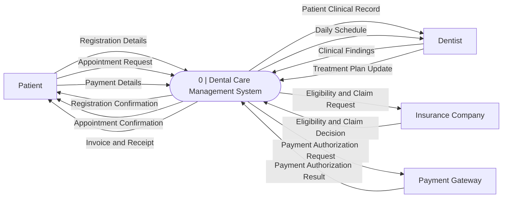
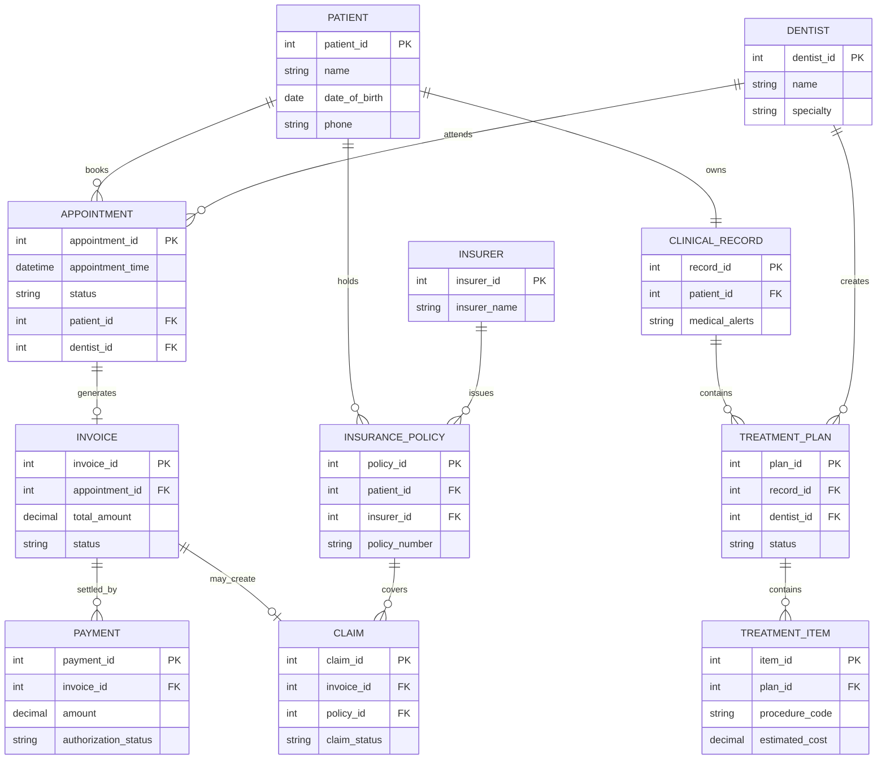
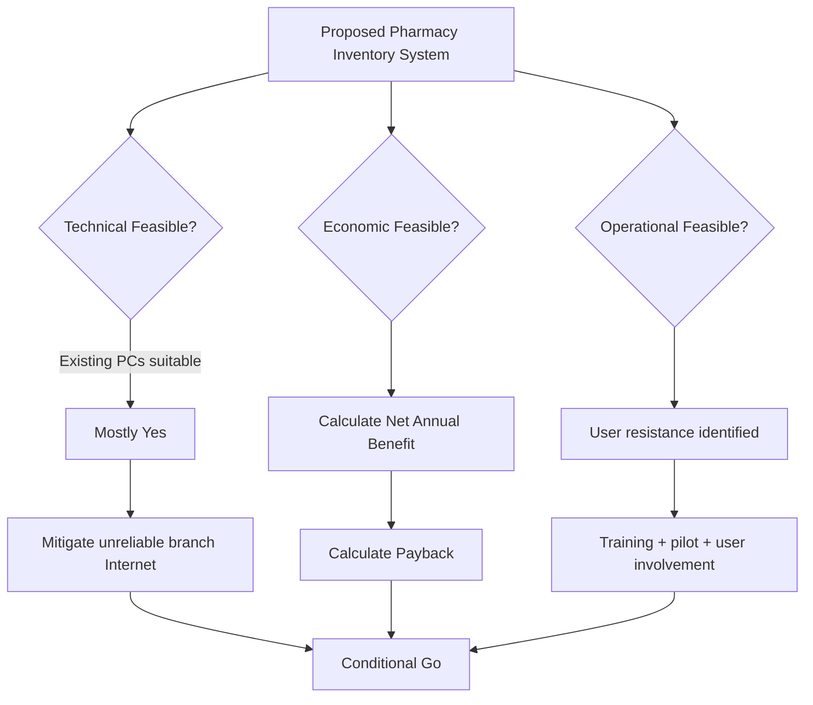
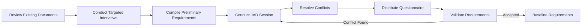
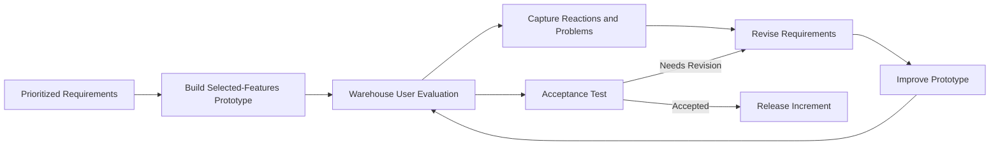
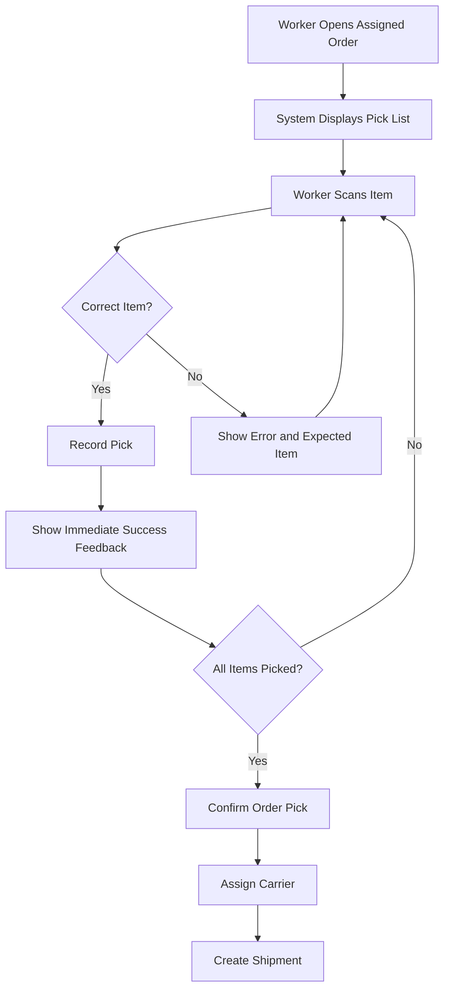

# Phase 1 — Questions 01–05

I reviewed all seven supplied chapters as one SAD syllabus rather than treating them separately. The material gives especially strong examination weight to organizational/system modeling, context DFDs, ERDs and use cases in Chapter 2; project initiation, feasibility and cost–benefit analysis in Chapter 3; interviews, JAD and questionnaires in Chapter 4; prototyping and Agile in Chapter 6; logical/physical DFD decomposition and CRUD in Chapter 7; HCI/interface design in Chapter 14; and QA, testing, architecture, training, security and implementation in Chapter 16.       

One notation warning before the answers: in the handwritten exam, use the exact Gane & Sarson symbols your faculty requires—rounded process rectangles with the process number/identifier separated from the Verb + Noun process name, open-ended rectangles for stores, rectangular external entities, and noun-phrase arrows. Chapter 7 likewise stresses numbered processes, noun-named stores, context Process 0, Diagram 0 decomposition, child balancing, and avoidance of illegal direct entity/store connections.  Mermaid does not natively provide the exact divided Gane & Sarson process symbol or open-ended store symbol, so the Mermaid blocks below preserve the **semantics, numbering, labels and flow direction**, while the structured mapping tells you exactly how to hand-draw the formal notation.

---

# Question 01 — Dental Care Management System: Context DFD, Level 0 and Level 1

**Marks: 25**

### Scenario

A dental clinic wants a **Dental Care Management System (DCMS)**. A patient registers, requests an appointment and pays outstanding charges. A dentist receives the daily appointment schedule, reviews the patient's clinical record, records findings and updates a treatment plan. When treatment is billable, the system communicates with an insurance company for eligibility/claim processing and with a payment gateway for patient payments.

Construct:

1. A Context DFD.
2. A Level 0 DFD.
3. A Level 1 decomposition of **2.0 Manage Appointments**.
4. A balancing check.
5. A CRUD matrix.
6. Identify possible miracle, black-hole and gray-hole errors.

Chapter 7 explicitly treats the Context Diagram as the highest level with one Process 0, Diagram 0 as its explosion, and child diagrams as balanced decompositions of parent processes. 

## Model Answer

## Step 1 — Scenario Decomposition

| Element                     | Correct extraction                                                                                                                                                                                                                                                              |
| --------------------------- | ------------------------------------------------------------------------------------------------------------------------------------------------------------------------------------------------------------------------------------------------------------------------------- |
| External entities           | Patient, Dentist, Insurance Company, Payment Gateway                                                                                                                                                                                                                            |
| Primary actors              | Patient, Dentist                                                                                                                                                                                                                                                                |
| Secondary/supporting actors | Insurance Company, Payment Gateway                                                                                                                                                                                                                                              |
| Process 1.0                 | Manage Patient Records                                                                                                                                                                                                                                                          |
| Process 2.0                 | Manage Appointments                                                                                                                                                                                                                                                             |
| Process 3.0                 | Manage Clinical Care                                                                                                                                                                                                                                                            |
| Process 4.0                 | Manage Billing and Insurance                                                                                                                                                                                                                                                    |
| D1                          | Patient Master                                                                                                                                                                                                                                                                  |
| D2                          | Appointment File                                                                                                                                                                                                                                                                |
| D3                          | Clinical Record                                                                                                                                                                                                                                                                 |
| D4                          | Treatment Plan                                                                                                                                                                                                                                                                  |
| D5                          | Billing and Claims                                                                                                                                                                                                                                                              |
| Major rules                 | Only a registered patient may obtain an appointment; appointment slots cannot be double-booked; clinical findings are entered by an authorized dentist; claims require patient/insurance information; payments are recorded only after payment authorization result is received |

The naming is important. **Processes are Verb + Noun**, such as *Manage Appointments*. Stores and flows are nouns or noun phrases, such as *Appointment File* and *Appointment Request*. Chapter 7 specifically requires entities and stores to be noun-named and detailed processes to express transformation/work. 

---

## Step 2 — Diagram Representation

### A. Context DFD

### Formal structured mapping

```text
[Patient]
    -- Registration Details ------------------------>
    -- Appointment Request ------------------------->
    -- Payment Details ----------------------------->
                  ┌───────────────────────────────┐
                  │ 0                             │
                  │ Dental Care Management System │
                  └───────────────────────────────┘
    <--------------- Registration Confirmation ----
    <--------------- Appointment Confirmation -----
    <--------------- Invoice and Receipt ----------

[Dentist]
    -- Clinical Findings --------------------------->
    -- Treatment Plan Update ----------------------->
                  PROCESS 0
    <--------------- Patient Clinical Record -------
    <--------------- Daily Schedule ----------------

[Insurance Company]
    <--------------- Eligibility and Claim Request -
    -- Eligibility and Claim Decision ------------->

[Payment Gateway]
    <--------------- Payment Authorization Request -
    -- Payment Authorization Result --------------->
```

**Context rule:** no data stores appear here.

### Mermaid semantic rendering



---

### B. Level 0 / Diagram 0

The Context Process 0 is now exploded into four major processes.

### Structured process-flow mapping

| Source            | Flow                           | Destination                      |
| ----------------- | ------------------------------ | -------------------------------- |
| Patient           | Registration Details           | 1.0 Manage Patient Records       |
| 1.0               | Patient Information            | D1 Patient Master                |
| 1.0               | Registration Confirmation      | Patient                          |
| Patient           | Appointment Request            | 2.0 Manage Appointments          |
| D1                | Patient Data                   | 2.0                              |
| D2                | Appointment Schedule           | 2.0                              |
| 2.0               | Appointment Data               | D2                               |
| 2.0               | Appointment Confirmation       | Patient                          |
| 2.0               | Daily Schedule                 | Dentist                          |
| Dentist           | Clinical Findings              | 3.0 Manage Clinical Care         |
| Dentist           | Treatment Plan Update          | 3.0                              |
| D1                | Patient Data                   | 3.0                              |
| D3                | Existing Clinical Data         | 3.0                              |
| 3.0               | Updated Clinical Data          | D3                               |
| D4                | Existing Treatment Plan        | 3.0                              |
| 3.0               | Updated Treatment Plan         | D4                               |
| 3.0               | Patient Clinical Record        | Dentist                          |
| Patient           | Payment Details                | 4.0 Manage Billing and Insurance |
| D1                | Patient/Billing Identity       | 4.0                              |
| D3                | Completed Treatment Data       | 4.0                              |
| 4.0               | Billing and Claim Data         | D5                               |
| 4.0               | Eligibility and Claim Request  | Insurance Company                |
| Insurance Company | Eligibility and Claim Decision | 4.0                              |
| 4.0               | Payment Authorization Request  | Payment Gateway                  |
| Payment Gateway   | Payment Authorization Result   | 4.0                              |
| 4.0               | Invoice and Receipt            | Patient                          |

### Mermaid



```mermaid
flowchart LR
    PAT[Patient]
    DEN[Dentist]
    INS[Insurance Company]
    PG[Payment Gateway]

    P1(["1.0 | Manage Patient Records"])
    P2(["2.0 | Manage Appointments"])
    P3(["3.0 | Manage Clinical Care"])
    P4(["4.0 | Manage Billing and Insurance"])

    D1[["D1 | Patient Master"]]
    D2[["D2 | Appointment File"]]
    D3[["D3 | Clinical Record"]]
    D4[["D4 | Treatment Plan"]]
    D5[["D5 | Billing and Claims"]]

    PAT -->|Registration Details| P1
    P1 -->|Registration Confirmation| PAT
    P1 -->|Patient Information| D1

    PAT -->|Appointment Request| P2
    D1 -->|Patient Data| P2
    D2 -->|Appointment Schedule| P2
    P2 -->|Appointment Data| D2
    P2 -->|Appointment Confirmation| PAT
    P2 -->|Daily Schedule| DEN

    DEN -->|Clinical Findings| P3
    DEN -->|Treatment Plan Update| P3
    D1 -->|Patient Data| P3
    D3 -->|Existing Clinical Data| P3
    P3 -->|Updated Clinical Data| D3
    D4 -->|Existing Treatment Plan| P3
    P3 -->|Updated Treatment Plan| D4
    P3 -->|Patient Clinical Record| DEN

    PAT -->|Payment Details| P4
    D1 -->|Patient Billing Identity| P4
    D3 -->|Completed Treatment Data| P4
    P4 -->|Billing and Claim Data| D5
    D5 -->|Outstanding Billing Data| P4

    P4 -->|Eligibility and Claim Request| INS
    INS -->|Eligibility and Claim Decision| P4

    P4 -->|Payment Authorization Request| PG
    PG -->|Payment Authorization Result| P4

    P4 -->|Invoice and Receipt| PAT
```

### Integrity check

There is **no Patient → D1 direct flow**, **no Insurance Company → D5 direct flow**, and **no Payment Gateway → Patient direct flow**. Every external/store interaction occurs through a process.

That is exactly the sort of error Chapter 7 warns about: external entities and stores must not be directly connected, and all objects must participate properly in the system. 

---

### C. Level 1 decomposition of 2.0 Manage Appointments

The parent process has the following boundary connections:

**Inputs**

* Appointment Request
* Patient Data from D1
* Appointment Schedule from D2

**Outputs**

* Appointment Confirmation
* Daily Schedule
* Appointment Data to D2

Therefore the child may **not suddenly introduce Insurance Data, Payment Data or Clinical Findings**.

### Child processes

| Child ID | Process                        |
| -------- | ------------------------------ |
| 2.1      | Validate Patient Request       |
| 2.2      | Check Appointment Availability |
| 2.3      | Reserve Appointment Slot       |
| 2.4      | Produce Daily Schedule         |

### Structured Level 1 mapping

```text
Appointment Request
        |
        v
┌──────────────────────────┐       Patient Data
│ 2.1 Validate Patient     │ <--------- D1
│     Request              │
└──────────────────────────┘
        |
        | Validated Appointment Request
        v
┌──────────────────────────┐       Appointment Schedule
│ 2.2 Check Appointment    │ <--------- D2
│     Availability         │
└──────────────────────────┘
        |
        | Available Appointment Slot
        v
┌──────────────────────────┐
│ 2.3 Reserve Appointment  │ -------> D2 Appointment Data
│     Slot                 │
└──────────────────────────┘
        |
        +-------> Appointment Confirmation

D2 Appointment Schedule
        |
        v
┌──────────────────────────┐
│ 2.4 Produce Daily        │
│     Schedule             │
└──────────────────────────┘
        |
        +-------> Daily Schedule
```

### Mermaid



```mermaid
flowchart LR
    IN[Parent Boundary: Appointment Request]
    OUT1[Parent Boundary: Appointment Confirmation]
    OUT2[Parent Boundary: Daily Schedule]

    D1[["D1 | Patient Master"]]
    D2[["D2 | Appointment File"]]

    P21(["2.1 | Validate Patient Request"])
    P22(["2.2 | Check Appointment Availability"])
    P23(["2.3 | Reserve Appointment Slot"])
    P24(["2.4 | Produce Daily Schedule"])

    IN -->|Appointment Request| P21
    D1 -->|Patient Data| P21

    P21 -->|Validated Appointment Request| P22
    D2 -->|Appointment Schedule| P22

    P22 -->|Available Appointment Slot| P23
    P23 -->|Appointment Data| D2
    P23 -->|Appointment Confirmation| OUT1

    D2 -->|Appointment Schedule| P24
    P24 -->|Daily Schedule| OUT2
```

Below Diagram 0, external entities are normally omitted; Chapter 7 explicitly notes that child diagrams generally do not repeat them, while parent-connected stores can reappear. 

---

## Step 3 — Technical Explanation, Balancing and CRUD Matrix

### Parent-child balancing

| Parent 2.0 boundary flow     | Present in Diagram 2? | Status   |
| ---------------------------- | --------------------: | -------- |
| Appointment Request          |                   Yes | Balanced |
| Patient Data from D1         |                   Yes | Balanced |
| Appointment Schedule from D2 |                   Yes | Balanced |
| Appointment Data to D2       |                   Yes | Balanced |
| Appointment Confirmation     |                   Yes | Balanced |
| Daily Schedule               |                   Yes | Balanced |

There is no new external output such as **Payment Receipt** in the child. That would make the decomposition unbalanced. Chapter 7 identifies unbalanced child explosions as a formal DFD error. 

### Miracle / black-hole / gray-hole audit

**Miracle:** a process produces output without sufficient input.

Bad example:

```text
2.3 Reserve Appointment Slot
NO INPUT ---> Appointment Confirmation
```

This is a miracle.

**Black hole:** data enters, but nothing meaningful leaves.

Bad example:

```text
Appointment Request ---> 2.2 Check Availability
                         [no output]
```

**Gray hole:** output cannot logically be produced from the given input.

Bad example:

```text
Patient ID ---> 4.0 Manage Billing
             ---> Insurance Claim + Final Payment Receipt
```

A Patient ID alone is insufficient. Billing also requires treatment/billing information and payment/claim results.

### CRUD Matrix

Chapter 7 explicitly defines CRUD as Create, Read, Update and Delete and recommends the matrix for locating these activities for master files. 

| Process                          | D1 Patient | D2 Appointment | D3 Clinical | D4 Treatment Plan | D5 Billing/Claims |
| -------------------------------- | ---------- | -------------- | ----------- | ----------------- | ----------------- |
| 1.0 Manage Patient Records       | C/R/U      | —              | —           | —                 | —                 |
| 2.0 Manage Appointments          | R          | C/R/U          | —           | —                 | —                 |
| 3.0 Manage Clinical Care         | R          | R              | C/R/U       | C/R/U             | —                 |
| 4.0 Manage Billing and Insurance | R          | —              | R           | R                 | C/R/U             |

For a real healthcare system, deleting legal/clinical history would normally be tightly controlled; therefore cancellation is better represented as an **Update of status**, not casual deletion.

---

## Step 4 — Faculty Traps and Mark Deductions

| Mistake                                    | Why examiner deducts                                                            |
| ------------------------------------------ | ------------------------------------------------------------------------------- |
| Putting D1–D5 on Context Diagram           | Context shows system boundary and external entities, not internal stores        |
| Writing process name “Appointment”         | Noun only; a process must describe transformation, e.g. **Manage Appointments** |
| Writing data flow “Process Appointment”    | Flow should be data, e.g. **Appointment Request**                               |
| Patient connected directly to D2           | Illegal external entity → data store connection                                 |
| D3 connected directly to D5                | Store → store is invalid without a process                                      |
| Level 1 has Payment Data                   | Parent 2.0 never receives Payment Data; decomposition is unbalanced             |
| Process receives data but outputs nothing  | Black hole                                                                      |
| Process outputs confirmation without input | Miracle                                                                         |
| Claim created from Patient ID alone        | Gray hole                                                                       |
| Renumbering child as 5.1, 5.2              | Children of Process 2.0 must be 2.1, 2.2, etc.                                  |

---

# Question 02 — Dental Care Management System: UML Use Case Model + ERD

**Marks: 20**

### Scenario

Extend the same dental clinic. Patients may register, book appointments and pay bills. Receptionists assist with registration, appointments and claims. Dentists review electronic health records, record clinical findings and create treatment plans. Insurance companies verify coverage and process claims. An external payment gateway authorizes card payments.

Produce a formal **Use Case Model**, one complete **Use Case Scenario**, an **ERD with multiplicities/cardinalities**, and a CRUD matrix.

Chapter 2 treats use cases as logical descriptions of **what the system does rather than how it does it**, with actors outside the system and behavioral relationships such as include and extend.   

## Model Answer

## Step 1 — Scenario Decomposition

### Actors

| Actor             | Type      | Main responsibility                                      |
| ----------------- | --------- | -------------------------------------------------------- |
| Patient           | Primary   | Register, book appointment, make payment                 |
| Dentist           | Primary   | Review record, record findings, maintain plan            |
| Receptionist      | Primary   | Register patient, assist booking, generate billing/claim |
| Insurance Company | Secondary | Validate coverage, receive/process claim                 |
| Payment Gateway   | Secondary | Authorize electronic payment                             |

### Core processes/use cases

* Register Patient
* Book Appointment
* Check Availability
* View Clinical Record
* Record Clinical Findings
* Maintain Treatment Plan
* Request Prior Authorization
* Generate Invoice
* Calculate Charges
* Submit Insurance Claim
* Verify Coverage
* Process Payment
* Authorize Payment

### Logical data stores/entities

* Patient
* Dentist
* Appointment
* Clinical Record
* Treatment Plan
* Treatment Item
* Invoice
* Payment
* Insurance Policy
* Insurance Company
* Claim

### Business rules

1. Appointment booking requires a registered patient.
2. A booked appointment is assigned to one dentist.
3. A patient may have many appointments.
4. A dentist may treat many patients across appointments.
5. A patient owns one principal electronic clinical record.
6. A clinical record may contain multiple treatment plans over time.
7. An invoice may have zero or one insurance claim.
8. An invoice may require multiple payments.
9. Every claim must reference a valid insurance policy.
10. Prior authorization is conditional, not mandatory for all treatment.

---

## Step 2 — Diagram Representation

### A. Formal Use Case mapping

```text
Patient
   |
   +------ (Register Patient)
   |
   +------ (Book Appointment)
                |
                +---- <<include>> ----> (Check Availability)
   |
   +------ (Process Payment)
                |
                +---- <<include>> ----> (Authorize Payment)

Dentist
   |
   +------ (View Clinical Record)
   +------ (Record Clinical Findings)
   +------ (Maintain Treatment Plan)
                      ^
                      |
       <<extend>> (Request Prior Authorization)

Receptionist
   |
   +------ (Register Patient)
   +------ (Book Appointment)
   +------ (Generate Invoice)
                  |
                  +---- <<include>> ---> (Calculate Charges)
   +------ (Submit Insurance Claim)
                  |
                  +---- <<include>> ---> (Verify Coverage)

Insurance Company ------- (Verify Coverage)
Insurance Company ------- (Submit Insurance Claim)

Payment Gateway ---------- (Authorize Payment)
```

### Correct UML relationship logic

**`<<include>>`** means reusable behavior that is obligatorily incorporated.

Therefore:

* Book Appointment `<<include>>` Check Availability.
* Generate Invoice `<<include>>` Calculate Charges.
* Submit Insurance Claim `<<include>>` Verify Coverage.
* Process Payment `<<include>>` Authorize Payment.

Chapter 2 defines an include relationship as common behavior contained in another use case. 

**`<<extend>>`** represents optional/conditional behavior.

Therefore:

* Request Prior Authorization `<<extend>>` Maintain Treatment Plan.

It executes only when insurance rules require prior authorization. Chapter 2 similarly describes extend as variation or exception behavior added to a basic use case. 

### Mermaid use-case rendering


In your handwritten answer, actors should be **stick figures**, use cases **ellipses**, and all use cases must lie inside the system boundary.

---

### B. Complete Use Case Scenario — Book Appointment

Chapter 2's scenario format includes description, trigger, main path, preconditions, postconditions, guarantees, issues, priority and risk.  

| Field             | Model answer                                                                            |
| ----------------- | --------------------------------------------------------------------------------------- |
| Use Case Name     | Book Appointment                                                                        |
| Unique ID         | DC-UC-02                                                                                |
| Area              | Appointment Management                                                                  |
| Primary Actor     | Patient                                                                                 |
| Stakeholders      | Patient, Dentist, Receptionist                                                          |
| Description       | Enables a registered patient to obtain an available dental appointment                  |
| Trigger           | Patient selects “Book Appointment”                                                      |
| Trigger Type      | External                                                                                |
| Precondition      | Patient has an active registration                                                      |
| Main Path 1       | Patient identifies/selects preferred dentist                                            |
| Main Path 2       | Patient selects date/time preference                                                    |
| Main Path 3       | System performs **Check Availability**                                                  |
| Main Path 4       | System displays available slots                                                         |
| Main Path 5       | Patient selects a slot                                                                  |
| Main Path 6       | System verifies that slot remains available                                             |
| Main Path 7       | System creates appointment record                                                       |
| Main Path 8       | System returns appointment confirmation                                                 |
| Alternative A1    | No requested slot available → system presents alternatives; no appointment is created   |
| Alternative A2    | Slot becomes unavailable before confirmation → user returns to available-slot selection |
| Postcondition     | Confirmed appointment exists                                                            |
| Success Guarantee | Exactly one appointment slot is reserved and confirmation is produced                   |
| Minimum Guarantee | No invalid/duplicate appointment is created                                             |
| Outstanding Issue | Whether a cancellation fee applies                                                      |
| Priority          | High                                                                                    |
| Risk              | Medium                                                                                  |

---

### C. ERD

### Cardinalities

| Relationship                       | Cardinality |
| ---------------------------------- | ----------- |
| Patient–Appointment                | 1:M         |
| Dentist–Appointment                | 1:M         |
| Patient–Clinical Record            | 1:1         |
| Clinical Record–Treatment Plan     | 1:M         |
| Dentist–Treatment Plan             | 1:M         |
| Treatment Plan–Treatment Item      | 1:M         |
| Appointment–Invoice                | 1:0..1      |
| Invoice–Payment                    | 1:M         |
| Patient–Insurance Policy           | 1:M         |
| Insurance Company–Insurance Policy | 1:M         |
| Invoice–Claim                      | 1:0..1      |
| Insurance Policy–Claim             | 1:M         |

Chapter 2 directs the analyst to identify organizational entities, narrow the scope to key entities, select the primary entity and validate the model through data gathering. 

### Mermaid ERD



---

## Step 3 — Technical Explanation and CRUD Matrix

The use case model answers **who interacts with which required behavior**. The ERD answers **what persistent business objects exist and how they relate**. Do not confuse the two.

For example, **Book Appointment** is behavior; **Appointment** is an entity. **Process Payment** is behavior; **Payment** is persistent data.

### CRUD matrix

| Use Case / Process       | Patient | Appointment | Clinical Record | Treatment Plan | Invoice | Claim | Payment |
| ------------------------ | ------- | ----------- | --------------- | -------------- | ------- | ----- | ------- |
| Register Patient         | C/R/U   | —           | C               | —              | —       | —     | —       |
| Book Appointment         | R       | C/R/U       | —               | —              | —       | —     | —       |
| Record Clinical Findings | R       | R           | C/R/U           | —              | —       | —     | —       |
| Maintain Treatment Plan  | R       | R           | R               | C/R/U          | —       | —     | —       |
| Generate Invoice         | R       | R           | R               | R              | C/R/U   | —     | —       |
| Submit Insurance Claim   | R       | —           | —               | —              | R       | C/R/U | —       |
| Process Payment          | R       | —           | —               | —              | R/U     | —     | C/R/U   |

---

## Step 4 — Faculty Traps and Deductions

| Error                                                                      | Deduction reason                                          |
| -------------------------------------------------------------------------- | --------------------------------------------------------- |
| Drawing Receptionist inside system boundary                                | Actor is external to the software system                  |
| Using `<<extend>>` for mandatory availability checking                     | Mandatory reused behavior requires `<<include>>`          |
| Arrowing `Maintain Treatment Plan → Request Prior Authorization` as extend | UML extend direction should be extension → base           |
| ERD says Patient M:N Appointment                                           | Each appointment is for one patient; M:N is unjustified   |
| Omitting associative resolution where M:N exists                           | Database design becomes ambiguous                         |
| Using “Appointment Management” as an entity                                | That is a process/subsystem, not persistent business data |
| Putting payment gateway in ERD as if it were a stored patient record       | External system ≠ automatically a database entity         |
| No precondition/postcondition in use case scenario                         | Incomplete specification                                  |
| Saying use case explains implementation                                    | Use case is primarily logical requirement modeling        |

---

# Question 03 — Pharmacy Inventory System: Feasibility and Economic Analysis

**Marks: 18**

### Scenario

A five-branch pharmacy chain currently maintains stock in separate spreadsheets. It experiences duplicate purchase entries, expired medicines, stock-outs and slow inventory reporting.

Management proposes a centralized browser-based Pharmacy Inventory System.

Facts:

* Current PCs in all branches can support the browser application.
* Four branches have reliable Internet; one branch has frequent outages.
* Barcode scanners must be purchased.
* Several senior pharmacists resist changing the spreadsheet procedure.
* Initial analyst/study cost = Tk 80,000
* Software/development = Tk 250,000
* Hardware/scanners = Tk 150,000
* Training = Tk 60,000
* Data migration = Tk 40,000
* Annual reduction in expiry losses = Tk 180,000
* Annual labor savings = Tk 120,000
* Annual reduction in emergency purchase cost = Tk 100,000
* Annual cloud/service cost = Tk 90,000
* Annual support cost = Tk 30,000
* Management accepts projects with payback ≤ 2.5 years.

Assess technical, economic and operational feasibility and recommend Go / Conditional Go / No-Go.

Chapter 3 defines feasibility around technical, economic and operational dimensions and treats payback, break-even, cash-flow and present-value analysis as cost–benefit techniques.  

## Model Answer

## Step 1 — Scenario Decomposition

| Element           | Extraction                                                                                                                                                                 |
| ----------------- | -------------------------------------------------------------------------------------------------------------------------------------------------------------------------- |
| External entities | Pharmacist, Supplier, Manager                                                                                                                                              |
| Primary actors    | Pharmacist, Store Manager                                                                                                                                                  |
| Secondary actors  | Supplier, System Administrator                                                                                                                                             |
| Processes         | Record Stock Transaction; Monitor Reorder Level; Monitor Expiry; Create Purchase Order; Receive Medicine; Produce Inventory Report                                         |
| D1                | Drug Master                                                                                                                                                                |
| D2                | Inventory Ledger                                                                                                                                                           |
| D3                | Batch and Expiry File                                                                                                                                                      |
| D4                | Supplier Master                                                                                                                                                            |
| D5                | Purchase Order File                                                                                                                                                        |
| Rules             | No negative stock; each received medicine must have batch and expiry; reorder occurs at/below reorder level; expired stock cannot be sold; high-value POs require approval |

---

## Step 2 — Feasibility Decision Representation

### Structured feasibility table

| Dimension   | Evidence                                  | Assessment           |
| ----------- | ----------------------------------------- | -------------------- |
| Technical   | Existing PCs are adequate                 | Positive             |
| Technical   | Barcode devices must be acquired          | Manageable           |
| Technical   | One branch has unreliable Internet        | Significant risk     |
| Technical   | Browser/cloud solution technically exists | Positive             |
| Economic    | Initial cost Tk 580,000                   | Known                |
| Economic    | Annual gross tangible benefit Tk 400,000  | Positive             |
| Economic    | Annual recurring cost Tk 120,000          | Known                |
| Operational | Users currently understand stock process  | Positive             |
| Operational | Senior pharmacists resist new system      | Risk                 |
| Operational | Training budget exists                    | Mitigation available |

### Mermaid



---

## Step 3 — Technical Explanation, Cost Calculation and CRUD

### A. Technical feasibility

Chapter 3 asks whether existing technology can be upgraded to meet the requirement or whether appropriate technology exists. 

Existing PCs support the proposed browser system, so processing hardware does not require replacement. Barcode scanners are commercially available and therefore do not threaten feasibility.

The principal technical risk is the unreliable Internet connection at one branch.

A faculty-grade answer should therefore say:

**Technically feasible subject to connectivity mitigation**, for example:

* Secondary ISP/mobile link.
* Local transaction queue with later synchronization.
* Monitoring of network availability.
* Backup/recovery procedures.
* Capacity testing against current and projected workload.

Do not simply write “technically feasible because computers exist.”

---

### B. Economic feasibility

Chapter 3 distinguishes tangible measurable benefits from intangible benefits and costs. 

#### Initial investment

| Cost                   |          Tk |
| ---------------------- | ----------: |
| Analyst/study          |      80,000 |
| Software/development   |     250,000 |
| Hardware/scanners      |     150,000 |
| Training               |      60,000 |
| Migration              |      40,000 |
| **Total initial cost** | **580,000** |

#### Annual tangible benefits

| Benefit                   |     Tk/year |
| ------------------------- | ----------: |
| Lower expiry losses       |     180,000 |
| Labor savings             |     120,000 |
| Fewer emergency purchases |     100,000 |
| **Gross annual benefit**  | **400,000** |

#### Annual recurring cost

Cloud = 90,000
Support = 30,000

**Total recurring cost = Tk 120,000/year**

Therefore:

$$
\text{Net Annual Benefit}
=400,000-120,000
=\boxed{Tk\ 280,000}
$$

Payback:

$$
\text{Payback Period}
=
\frac{580,000}{280,000}
=
2.0714\text{ years}
$$

Therefore:

$$
\boxed{\text{Payback}\approx2.07\text{ years}}
$$

Management limit = 2.5 years.

Therefore:

$$
2.07 < 2.5
$$

**Economic feasibility: PASS.**

Chapter 3 specifically recommends payback where tangible improvements make a convincing argument. 

Three-year simple cash position:

$$
-580,000+(280,000\times3)
=
\boxed{Tk\ 260,000}
$$

So after three years the project has generated a positive cumulative simple cash result of Tk 260,000, ignoring time value of money.

---

### C. Intangible benefits

A high-mark answer should also identify:

* Faster management decision-making.
* Improved customer trust.
* More reliable medicine availability.
* Better pharmacist satisfaction after stabilization.
* More accurate supplier planning.
* Better auditability.

These matter even though they are difficult to price precisely.

---

### D. Operational feasibility

Operational feasibility concerns whether people can and will use the installed system; Chapter 3 explicitly warns that users who reject a new system can undermine operational feasibility. 

The senior-pharmacist resistance therefore cannot be ignored.

Required mitigation:

* Involve pharmacists during requirements analysis.
* Pilot one branch first.
* Provide role-specific training.
* Run old/new procedures in parallel for a short controlled period if required.
* Provide on-site support during launch.
* Publish clear SOPs.
* Assign a respected pharmacist as change champion.

**Operational verdict: feasible with change-management controls.**

---

### Final recommendation

$$
\boxed{\text{CONDITIONAL GO}}
$$

Reason:

* Economic feasibility passes.
* Core technology is available.
* Two major risks remain: unreliable connectivity and user acceptance.
* Both have practical mitigation strategies.

### CRUD Matrix

| Process               | D1 Drug | D2 Inventory | D3 Batch/Expiry | D4 Supplier | D5 PO |
| --------------------- | ------- | ------------ | --------------- | ----------- | ----- |
| Maintain Drug Master  | C/R/U   | —            | —               | —           | —     |
| Receive Medicine      | R       | C/U          | C/U             | R           | R/U   |
| Record Sale           | R       | C/U          | R/U             | —           | —     |
| Monitor Reorder       | R       | R            | —               | R           | C     |
| Create Purchase Order | R       | R            | —               | R           | C/U   |
| Monitor Expiry        | R       | R            | R/U             | —           | —     |

---

## Step 4 — Faculty Traps and Deductions

| Mistake                                                                 | Why wrong                                                  |
| ----------------------------------------------------------------------- | ---------------------------------------------------------- |
| Saying only “feasible” without separating T/E/O                         | Misses Chapter 3 feasibility framework                     |
| Counting Tk 400,000 as net annual benefit                               | Annual operating costs must be deducted                    |
| Payback = 580,000 / 400,000                                             | Incorrect because recurring cost ignored                   |
| Ignoring Internet reliability                                           | Technical feasibility incomplete                           |
| Treating resistance as technical issue                                  | It is primarily operational                                |
| Treating improved reputation as a precise cash benefit without evidence | Intangible ≠ automatically monetized                       |
| Recommending No-Go solely because one branch has poor Internet          | Risk can be mitigated                                      |
| Recommending immediate full deployment                                  | Operational resistance argues for controlled rollout/pilot |

---

# Question 04 — University Registration Portal: Fact-Finding and Requirements Elicitation

**Marks: 15**

### Scenario

A university wants to replace its fragmented course-registration process.

Students complain that prerequisite checks are inconsistent. Advisors maintain separate spreadsheets. The Registrar maintains official curriculum rules. Finance sends fee/hold data from another system. Department administrators sometimes approve prerequisite or credit-limit exceptions.

As systems analyst, design a professional information-gathering strategy using:

* Interviews.
* Open/closed/probing questions.
* An appropriate interview structure.
* JAD.
* Questionnaires.
* Requirement validation.

Chapter 4 identifies interviewing, JAD and questionnaires as the principal interactive information-gathering methods.  JAD can replace repeated individual interviews by conducting requirements analysis and interface discussion with users in a group setting. 

## Model Answer

## Step 1 — Scenario Decomposition

| Element           | Extraction                                                                                                                                                                                                                              |
| ----------------- | --------------------------------------------------------------------------------------------------------------------------------------------------------------------------------------------------------------------------------------- |
| External entities | Student, Academic Advisor, Registrar, Department Administrator, Finance System                                                                                                                                                          |
| Primary actors    | Student, Advisor, Registrar                                                                                                                                                                                                             |
| Secondary actors  | Department Administrator, Finance System                                                                                                                                                                                                |
| Processes         | Verify Student Eligibility; Check Prerequisite; Check Seat Availability; Register Course; Approve Override; Retrieve Financial Hold                                                                                                     |
| D1                | Student Master                                                                                                                                                                                                                          |
| D2                | Course/Curriculum Catalogue                                                                                                                                                                                                             |
| D3                | Enrollment File                                                                                                                                                                                                                         |
| D4                | Advising and Override File                                                                                                                                                                                                              |
| D5                | Financial Hold Snapshot                                                                                                                                                                                                                 |
| Core rules        | Valid prerequisite required unless authorized override; no registration above credit limit without approval; no enrollment in full section; active financial hold may block registration; official curriculum rules come from Registrar |

---

## Step 2 — Information-Gathering Design

### A. Interview preparation

Chapter 4 recommends:

* Reading background material.
* Establishing interview objectives.
* Deciding whom to interview.
* Preparing interviewees.
* Choosing question types and interview structure. 

Therefore, before interviewing anyone, obtain:

* Registration policy.
* Curriculum/prerequisite tables.
* Current registration form/screens.
* Advisor spreadsheet samples.
* Override forms.
* Registration error logs.
* Finance-hold interface specification.

### Interview objective

Determine:

1. Official rules.
2. Actual current practice.
3. Exceptions.
4. Information needed at each decision point.
5. Pain points and HCI problems.
6. Source of authoritative data.

---

### B. Recommended question structure — Diamond

A **Diamond Structure** is best because the analyst needs both precise factual details and broader explanation before finishing with confirmation. Chapter 4 describes it as specific → general → specific and states that it combines strengths of pyramid and funnel structures. 

### Sample interview plan

| Sequence | Type   | Question                                                                                                          |
| -------- | ------ | ----------------------------------------------------------------------------------------------------------------- |
| 1        | Closed | “Is prerequisite information stored in the official curriculum database?”                                         |
| 2        | Closed | “Can an advisor currently override a prerequisite failure?”                                                       |
| 3        | Probe  | “Who records that override, and where is it stored?”                                                              |
| 4        | Open   | “Please describe what normally happens from the time a student selects a course until registration is confirmed.” |
| 5        | Open   | “Which part of the current procedure causes the greatest difficulty?”                                             |
| 6        | Probe  | “Can you give an example where a valid student was incorrectly blocked?”                                          |
| 7        | Closed | “Must every credit-limit exception have department approval?”                                                     |
| 8        | Closed | “Should a financial hold prevent final registration?”                                                             |

Open-ended questions are appropriate where breadth and depth are needed, whereas closed questions produce precise and easily analyzed answers.  Probes are used to clarify or expand a previous point. 

---

### C. JAD Session

The JAD session should include representatives of all major decision perspectives:

* Registrar or sponsor.
* Systems analyst/facilitator.
* Student representative.
* Academic advisor.
* Department administrator.
* Finance-interface representative.
* IT/development representative.
* Recorder/documenter.

Agenda:

```text
1. Confirm system scope.
2. Agree authoritative data sources.
3. Walk through normal registration.
4. Walk through exception paths.
5. Resolve prerequisite-rule conflicts.
6. Resolve financial-hold logic.
7. Define override authority.
8. Prioritize requirements.
9. Review candidate interface/prototype.
10. Sign off unresolved issues.
```

Chapter 4 recommends minimizing distractions, scheduling so participants can attend, using an agenda and holding an orientation meeting for JAD. 

### Mermaid elicitation workflow



---

### D. Questionnaire

A questionnaire is especially useful because there may be thousands of students and widely dispersed university members. Chapter 4 specifically identifies widely dispersed users, large populations and exploratory work as reasons for questionnaires. 

Sample items:

| Item                                                      | Format                                          |
| --------------------------------------------------------- | ----------------------------------------------- |
| “How often has the portal incorrectly rejected a course?” | Never / Rarely / Sometimes / Often / Very Often |
| “The prerequisite error messages are easy to understand.” | 1–5 agreement scale                             |
| “How many minutes does registration usually take?”        | Numeric range                                   |
| “Which registration problem affects you most?”            | Multiple choice                                 |
| “Describe one improvement you would prioritize.”          | Open-ended                                      |

Questionnaires should not replace interviews with policy owners. Students know the **experience**; the Registrar knows the **official rule**.

---

## Step 3 — Requirement Logic and CRUD Matrix

### Requirement traceability example

| Elicited statement                                 | Source              | Derived requirement                                                     |
| -------------------------------------------------- | ------------------- | ----------------------------------------------------------------------- |
| Registrar: prerequisites are centrally maintained  | Interview           | System shall read prerequisites from official curriculum source         |
| Advisor: overrides require justification           | Interview/JAD       | Every override shall record approver, reason and time                   |
| Students: errors are unclear                       | Questionnaire       | Rejection message shall state the failed rule                           |
| Finance: hold data refreshed nightly               | Interface interview | Registration shall check latest available hold snapshot                 |
| Department: max-credit exception requires approval | JAD                 | System shall block over-limit registration unless valid override exists |

### CRUD Matrix

| Process                    | D1 Student | D2 Course | D3 Enrollment | D4 Override | D5 Hold |
| -------------------------- | ---------- | --------- | ------------- | ----------- | ------- |
| Verify Student Eligibility | R          | —         | R             | R           | R       |
| Check Prerequisite         | R          | R         | R             | R           | —       |
| Check Seat Availability    | —          | R         | R             | —           | —       |
| Register Course            | R          | R         | C/U           | R           | R       |
| Approve Override           | R          | R         | —             | C/U         | —       |
| Drop Course                | R          | R         | U             | —           | —       |

---

## Step 4 — Faculty Traps and Deductions

| Mistake                                                                     | Deduction                                                |
| --------------------------------------------------------------------------- | -------------------------------------------------------- |
| Interviewing students only                                                  | Students cannot authoritatively define university policy |
| Interviewing Registrar only                                                 | Misses operational pain and user requirements            |
| Asking only yes/no questions                                                | Poor depth                                               |
| Asking only open questions                                                  | Difficult comparison and excessive interview time        |
| Leading question: “Don't you agree the old system is terrible?”             | Biased elicitation                                       |
| Conducting JAD without preparation                                          | Chapter 4 warns poor preparation can cause failure       |
| Treating all stakeholder statements as equally authoritative business rules | Must distinguish policy owner from user opinion          |
| No requirement validation                                                   | Conflicts remain unresolved                              |
| Asking “Do you like the portal?”                                            | Too vague to produce implementable requirement           |
| Recording “system should be user-friendly”                                  | Not measurable or testable                               |

---

# Question 05 — E-Commerce Logistics System: Prototyping, Agile and HCI

**Marks: 20**

### Scenario

An e-commerce company wants a new logistics module for:

* Warehouse order picking.
* Carrier assignment.
* Shipment tracking.
* Delivery-exception handling.
* Customer return initiation.

Requirements are changing rapidly. Warehouse staff use phones/tablets while moving around the warehouse. Users complain that the existing application requires too much typing, gives poor feedback after barcode scans, and uses inconsistent controls.

Management wants something that users can test quickly rather than waiting until the entire system is completed.

Recommend a prototype strategy, Agile approach and HCI design. Include a system decomposition, prototype cycle, interface rules and CRUD matrix.

Chapter 6 defines prototyping as an information-gathering mechanism for obtaining user reactions, suggestions, innovations and revision plans, and distinguishes patched-up, nonoperational, first-of-a-series and selected-features prototypes.  Chapter 14 stresses matching the interface to the task, efficiency, feedback, usable queries and user productivity. 

## Model Answer

## Step 1 — Scenario Decomposition

| Element           | Extraction                                                                                                                                                                                                                             |
| ----------------- | -------------------------------------------------------------------------------------------------------------------------------------------------------------------------------------------------------------------------------------- |
| External entities | Warehouse Worker, Customer, Carrier Service, Customer-Service Agent                                                                                                                                                                    |
| Primary actors    | Warehouse Worker, Customer-Service Agent, Customer                                                                                                                                                                                     |
| Secondary actor   | Carrier Service                                                                                                                                                                                                                        |
| Processes         | Pick Order; Assign Carrier; Dispatch Shipment; Update Tracking; Handle Delivery Exception; Initiate Return                                                                                                                             |
| D1                | Order File                                                                                                                                                                                                                             |
| D2                | Shipment File                                                                                                                                                                                                                          |
| D3                | Tracking Event File                                                                                                                                                                                                                    |
| D4                | Return File                                                                                                                                                                                                                            |
| D5                | User/Role File                                                                                                                                                                                                                         |
| Rules             | Only paid/approved orders may be picked; each dispatched shipment has carrier/tracking ID; barcode scan must identify correct order/item; return must reference delivered order; only authorized staff may override shipment exception |

---

## Step 2 — Prototype and Agile Representation

### A. Correct prototype type

The strongest answer is:

$$
\boxed{\text{Selected-Features Prototype}}
$$

Why?

Because the company wants a **working operational portion of the real system**, such as:

* Scan/pick order.
* Assign carrier.
* Show tracking status.
* Initiate return.

A selected-features prototype is operational but contains only part of the final feature set, and Chapter 6 describes it as modular and potentially part of the actual system. 

A **nonoperational prototype** would be weaker because the problem is not just screen appearance; users must evaluate real scanning and workflow behavior.

A **patched-up prototype** is also weaker because it contains all features but inefficiently—unnecessary at this stage.

A **first-of-a-series prototype** becomes appropriate later if a completed solution is piloted at one warehouse before rolling out to many warehouses. Chapter 6 explicitly connects first-of-a-series with pilot deployment at one or two locations. 

---

### B. Prototype iteration

Chapter 6 recommends manageable modules, rapid development, successive modification and strong attention to the user interface. 



This cycle is preferable to designing every module completely before users see anything.

---

### C. Agile execution

Chapter 6 emphasizes:

* Deliver working software.
* Accept change.
* Deliver incrementally and frequently.
* Encourage continuous customer/analyst collaboration.
* Trust motivated team members. 

A suitable backlog might be:

```text
Iteration 1
- Login / warehouse role
- Scan order
- Scan item
- Confirm pick

Iteration 2
- Carrier assignment
- Shipping label
- Dispatch confirmation

Iteration 3
- Tracking event view
- Delivery exception

Iteration 4
- Return initiation
- Return status
```

Each increment should produce demonstrable working behavior.

---

### D. HCI design for the warehouse user

Chapter 14 identifies meaningful communication, minimal user action and consistent operation as core dialog principles. 

#### Screen: Pick Order

```text
---------------------------------------
ORDER #ECO-45821
---------------------------------------
Customer: [hidden unless required]
Items Remaining: 3

[ SCAN ITEM BARCODE ]

Last Scan:
✓ SKU 77102 accepted
Quantity: 1 / 2

[Confirm Pick]      [Report Problem]
---------------------------------------
```

Design decisions:

**1. Minimal user action**

Do not force worker to type:

* Order number.
* SKU.
* Product description.
* Quantity when barcode uniquely identifies item.

Scanning should populate them.

**2. Immediate feedback**

Successful scan:

> ✓ Item accepted — 2 items remaining

Wrong item:

> ✕ Wrong item. Expected SKU 77102.

Duplicate scan:

> ⚠ Required quantity already completed.

Chapter 14 treats acknowledgement, correct/incorrect input notification, delay notification and completion acknowledgement as core forms of feedback. 

**3. Consistency**

* Same “Back” position.
* Same “Confirm” location.
* Same error format.
* Same terminology.
* Same icons for scanning/problems.
* Same navigation structure.

**4. Touch-oriented design**

Chapter 14 explicitly recognizes tapping, swiping and pinching as mobile/touch interactions. 

For warehouse work:

* Large tap targets.
* Avoid tiny links.
* One-handed operation where possible.
* Scanning prioritized over keyboard input.
* Do not depend only on color to express an error.
* Keep critical controls visible.

---

### E. Prototype module flow



This workflow has no ambiguous dead end: every incorrect scan returns the user to a recoverable state.

---

## Step 3 — Technical Explanation and CRUD Matrix

The prototype must test not only aesthetics but **information requirements and operational workflow**.

The analyst should observe:

* Scan error frequency.
* Average picks per minute.
* Number of taps per completed order.
* Time to recover from wrong scan.
* User confusion.
* Whether feedback is noticed.
* Whether users can complete the workflow without help.

Chapter 14 evaluates interfaces partly by short training time, few design-induced errors, quick recovery and the ability of infrequent users to relearn the system. 

### CRUD Matrix

| Process           | D1 Order | D2 Shipment | D3 Tracking | D4 Return | D5 User |
| ----------------- | -------- | ----------- | ----------- | --------- | ------- |
| Pick Order        | R/U      | —           | —           | —         | R       |
| Assign Carrier    | R        | C/U         | —           | —         | R       |
| Dispatch Shipment | R/U      | C/U         | C           | —         | R       |
| Update Tracking   | R        | R/U         | C/U         | —         | —       |
| Handle Exception  | R        | R/U         | C/U         | —         | R       |
| Initiate Return   | R        | R           | R           | C/U       | R       |

### Why this design is better than “build everything first”

It creates an early feedback loop:

$$
\text{Working Module}
\rightarrow
\text{User Reaction}
\rightarrow
\text{Requirement Correction}
\rightarrow
\text{Improved Module}
$$

That directly implements Chapter 6's view of prototyping as a mechanism for user reaction and iterative revision. 

---

## Step 4 — Faculty Traps and Deductions

| Mistake                                                  | Why examiner deducts                                                              |
| -------------------------------------------------------- | --------------------------------------------------------------------------------- |
| Selecting nonoperational prototype without justification | Users must evaluate real workflow/scanning                                        |
| Building all logistics features before feedback          | Contradicts incremental prototyping/Agile                                         |
| Treating prototype as finished production software       | Chapter 6 explicitly warns users/analysts may make this mistake                   |
| No user evaluation after iteration                       | Removes core feedback mechanism                                                   |
| Tiny mobile controls                                     | Poor fit with touch environment                                                   |
| Requiring SKU typing after barcode scan                  | Violates minimal user action                                                      |
| No feedback after scan                                   | User cannot know whether input was accepted                                       |
| Red error text with no icon/text meaning                 | Accessibility and usability problem                                               |
| Different “Confirm” position on every screen             | Violates consistency                                                              |
| Automatically deleting failed shipment transactions      | Weak auditability                                                                 |
| Calling GUI appearance alone “HCI”                       | HCI concerns user, task, context, technology and environment, not cosmetics alone |

Chapter 6 also specifically warns that prototyping can be difficult to manage and that users may mistake a prototype for the finished system. 

**End of Phase 1: Questions 01–05.**
