# Phase 1 — Questions 01–05

I reviewed all seven supplied chapters as one SAD syllabus rather than treating them separately. The material gives especially strong examination weight to organizational/system modeling, context DFDs, ERDs and use cases in Chapter 2; project initiation, feasibility and cost–benefit analysis in Chapter 3; interviews, JAD and questionnaires in Chapter 4; prototyping and Agile in Chapter 6; logical/physical DFD decomposition and CRUD in Chapter 7; HCI/interface design in Chapter 14; and QA, testing, architecture, training, security and implementation in Chapter 16.       

One notation warning before the answers: in the handwritten exam, use the exact Gane & Sarson symbols your faculty requires—rounded process rectangles with the process number/identifier separated from the Verb + Noun process name, open-ended rectangles for stores, rectangular external entities, and noun-phrase arrows. Chapter 7 likewise stresses numbered processes, noun-named stores, context Process 0, Diagram 0 decomposition, child balancing, and avoidance of illegal direct entity/store connections.  Mermaid does not natively provide the exact divided Gane & Sarson process symbol or open-ended store symbol, so the Mermaid blocks below preserve the **semantics, numbering, labels and flow direction**, while the structured mapping tells you exactly how to hand-draw the formal notation.

---

# Question 01 — Dental Care Management System: Context DFD, Level 0 and Level 1

**Marks: 25**

### Scenario

A dental clinic wants a **Dental Care Management System (DCMS)**. A patient registers, requests an appointment and pays outstanding charges. A dentist receives the daily appointment schedule, reviews the patient's clinical record, records findings and updates a treatment plan. When treatment is billable, the system communicates with an insurance company for eligibility/claim processing and with a payment gateway for patient payments.

Construct:

1. A Context DFD.
2. A Level 0 DFD.
3. A Level 1 decomposition of **2.0 Manage Appointments**.
4. A balancing check.
5. A CRUD matrix.
6. Identify possible miracle, black-hole and gray-hole errors.

Chapter 7 explicitly treats the Context Diagram as the highest level with one Process 0, Diagram 0 as its explosion, and child diagrams as balanced decompositions of parent processes. 

## Model Answer

## Step 1 — Scenario Decomposition

| Element                     | Correct extraction                                                                                                                                                                                                                                                              |
| --------------------------- | ------------------------------------------------------------------------------------------------------------------------------------------------------------------------------------------------------------------------------------------------------------------------------- |
| External entities           | Patient, Dentist, Insurance Company, Payment Gateway                                                                                                                                                                                                                            |
| Primary actors              | Patient, Dentist                                                                                                                                                                                                                                                                |
| Secondary/supporting actors | Insurance Company, Payment Gateway                                                                                                                                                                                                                                              |
| Process 1.0                 | Manage Patient Records                                                                                                                                                                                                                                                          |
| Process 2.0                 | Manage Appointments                                                                                                                                                                                                                                                             |
| Process 3.0                 | Manage Clinical Care                                                                                                                                                                                                                                                            |
| Process 4.0                 | Manage Billing and Insurance                                                                                                                                                                                                                                                    |
| D1                          | Patient Master                                                                                                                                                                                                                                                                  |
| D2                          | Appointment File                                                                                                                                                                                                                                                                |
| D3                          | Clinical Record                                                                                                                                                                                                                                                                 |
| D4                          | Treatment Plan                                                                                                                                                                                                                                                                  |
| D5                          | Billing and Claims                                                                                                                                                                                                                                                              |
| Major rules                 | Only a registered patient may obtain an appointment; appointment slots cannot be double-booked; clinical findings are entered by an authorized dentist; claims require patient/insurance information; payments are recorded only after payment authorization result is received |

The naming is important. **Processes are Verb + Noun**, such as *Manage Appointments*. Stores and flows are nouns or noun phrases, such as *Appointment File* and *Appointment Request*. Chapter 7 specifically requires entities and stores to be noun-named and detailed processes to express transformation/work. 

---

## Step 2 — Diagram Representation

### A. Context DFD

### Formal structured mapping

```text
[Patient]
    -- Registration Details ------------------------>
    -- Appointment Request ------------------------->
    -- Payment Details ----------------------------->
                  ┌───────────────────────────────┐
                  │ 0                             │
                  │ Dental Care Management System │
                  └───────────────────────────────┘
    <--------------- Registration Confirmation ----
    <--------------- Appointment Confirmation -----
    <--------------- Invoice and Receipt ----------

[Dentist]
    -- Clinical Findings --------------------------->
    -- Treatment Plan Update ----------------------->
                  PROCESS 0
    <--------------- Patient Clinical Record -------
    <--------------- Daily Schedule ----------------

[Insurance Company]
    <--------------- Eligibility and Claim Request -
    -- Eligibility and Claim Decision ------------->

[Payment Gateway]
    <--------------- Payment Authorization Request -
    -- Payment Authorization Result --------------->
```

**Context rule:** no data stores appear here.

### Mermaid semantic rendering


---

### B. Level 0 / Diagram 0

The Context Process 0 is now exploded into four major processes.

### Structured process-flow mapping

| Source            | Flow                           | Destination                      |
| ----------------- | ------------------------------ | -------------------------------- |
| Patient           | Registration Details           | 1.0 Manage Patient Records       |
| 1.0               | Patient Information            | D1 Patient Master                |
| 1.0               | Registration Confirmation      | Patient                          |
| Patient           | Appointment Request            | 2.0 Manage Appointments          |
| D1                | Patient Data                   | 2.0                              |
| D2                | Appointment Schedule           | 2.0                              |
| 2.0               | Appointment Data               | D2                               |
| 2.0               | Appointment Confirmation       | Patient                          |
| 2.0               | Daily Schedule                 | Dentist                          |
| Dentist           | Clinical Findings              | 3.0 Manage Clinical Care         |
| Dentist           | Treatment Plan Update          | 3.0                              |
| D1                | Patient Data                   | 3.0                              |
| D3                | Existing Clinical Data         | 3.0                              |
| 3.0               | Updated Clinical Data          | D3                               |
| D4                | Existing Treatment Plan        | 3.0                              |
| 3.0               | Updated Treatment Plan         | D4                               |
| 3.0               | Patient Clinical Record        | Dentist                          |
| Patient           | Payment Details                | 4.0 Manage Billing and Insurance |
| D1                | Patient/Billing Identity       | 4.0                              |
| D3                | Completed Treatment Data       | 4.0                              |
| 4.0               | Billing and Claim Data         | D5                               |
| 4.0               | Eligibility and Claim Request  | Insurance Company                |
| Insurance Company | Eligibility and Claim Decision | 4.0                              |
| 4.0               | Payment Authorization Request  | Payment Gateway                  |
| Payment Gateway   | Payment Authorization Result   | 4.0                              |
| 4.0               | Invoice and Receipt            | Patient                          |

### Mermaid


### Integrity check

There is **no Patient → D1 direct flow**, **no Insurance Company → D5 direct flow**, and **no Payment Gateway → Patient direct flow**. Every external/store interaction occurs through a process.

That is exactly the sort of error Chapter 7 warns about: external entities and stores must not be directly connected, and all objects must participate properly in the system. 

---

### C. Level 1 decomposition of 2.0 Manage Appointments

The parent process has the following boundary connections:

**Inputs**

* Appointment Request
* Patient Data from D1
* Appointment Schedule from D2

**Outputs**

* Appointment Confirmation
* Daily Schedule
* Appointment Data to D2

Therefore the child may **not suddenly introduce Insurance Data, Payment Data or Clinical Findings**.

### Child processes

| Child ID | Process                        |
| -------- | ------------------------------ |
| 2.1      | Validate Patient Request       |
| 2.2      | Check Appointment Availability |
| 2.3      | Reserve Appointment Slot       |
| 2.4      | Produce Daily Schedule         |

### Structured Level 1 mapping

```text
Appointment Request
        |
        v
┌──────────────────────────┐       Patient Data
│ 2.1 Validate Patient     │ <--------- D1
│     Request              │
└──────────────────────────┘
        |
        | Validated Appointment Request
        v
┌──────────────────────────┐       Appointment Schedule
│ 2.2 Check Appointment    │ <--------- D2
│     Availability         │
└──────────────────────────┘
        |
        | Available Appointment Slot
        v
┌──────────────────────────┐
│ 2.3 Reserve Appointment  │ -------> D2 Appointment Data
│     Slot                 │
└──────────────────────────┘
        |
        +-------> Appointment Confirmation

D2 Appointment Schedule
        |
        v
┌──────────────────────────┐
│ 2.4 Produce Daily        │
│     Schedule             │
└──────────────────────────┘
        |
        +-------> Daily Schedule
```

### Mermaid


Below Diagram 0, external entities are normally omitted; Chapter 7 explicitly notes that child diagrams generally do not repeat them, while parent-connected stores can reappear. 

---

## Step 3 — Technical Explanation, Balancing and CRUD Matrix

### Parent-child balancing

| Parent 2.0 boundary flow     | Present in Diagram 2? | Status   |
| ---------------------------- | --------------------: | -------- |
| Appointment Request          |                   Yes | Balanced |
| Patient Data from D1         |                   Yes | Balanced |
| Appointment Schedule from D2 |                   Yes | Balanced |
| Appointment Data to D2       |                   Yes | Balanced |
| Appointment Confirmation     |                   Yes | Balanced |
| Daily Schedule               |                   Yes | Balanced |

There is no new external output such as **Payment Receipt** in the child. That would make the decomposition unbalanced. Chapter 7 identifies unbalanced child explosions as a formal DFD error. 

### Miracle / black-hole / gray-hole audit

**Miracle:** a process produces output without sufficient input.

Bad example:

```text
2.3 Reserve Appointment Slot
NO INPUT ---> Appointment Confirmation
```

This is a miracle.

**Black hole:** data enters, but nothing meaningful leaves.

Bad example:

```text
Appointment Request ---> 2.2 Check Availability
                         [no output]
```

**Gray hole:** output cannot logically be produced from the given input.

Bad example:

```text
Patient ID ---> 4.0 Manage Billing
             ---> Insurance Claim + Final Payment Receipt
```

A Patient ID alone is insufficient. Billing also requires treatment/billing information and payment/claim results.

### CRUD Matrix

Chapter 7 explicitly defines CRUD as Create, Read, Update and Delete and recommends the matrix for locating these activities for master files. 

| Process                          | D1 Patient | D2 Appointment | D3 Clinical | D4 Treatment Plan | D5 Billing/Claims |
| -------------------------------- | ---------- | -------------- | ----------- | ----------------- | ----------------- |
| 1.0 Manage Patient Records       | C/R/U      | —              | —           | —                 | —                 |
| 2.0 Manage Appointments          | R          | C/R/U          | —           | —                 | —                 |
| 3.0 Manage Clinical Care         | R          | R              | C/R/U       | C/R/U             | —                 |
| 4.0 Manage Billing and Insurance | R          | —              | R           | R                 | C/R/U             |

For a real healthcare system, deleting legal/clinical history would normally be tightly controlled; therefore cancellation is better represented as an **Update of status**, not casual deletion.

---

## Step 4 — Faculty Traps and Mark Deductions

| Mistake                                    | Why examiner deducts                                                            |
| ------------------------------------------ | ------------------------------------------------------------------------------- |
| Putting D1–D5 on Context Diagram           | Context shows system boundary and external entities, not internal stores        |
| Writing process name “Appointment”         | Noun only; a process must describe transformation, e.g. **Manage Appointments** |
| Writing data flow “Process Appointment”    | Flow should be data, e.g. **Appointment Request**                               |
| Patient connected directly to D2           | Illegal external entity → data store connection                                 |
| D3 connected directly to D5                | Store → store is invalid without a process                                      |
| Level 1 has Payment Data                   | Parent 2.0 never receives Payment Data; decomposition is unbalanced             |
| Process receives data but outputs nothing  | Black hole                                                                      |
| Process outputs confirmation without input | Miracle                                                                         |
| Claim created from Patient ID alone        | Gray hole                                                                       |
| Renumbering child as 5.1, 5.2              | Children of Process 2.0 must be 2.1, 2.2, etc.                                  |

---

# Question 02 — Dental Care Management System: UML Use Case Model + ERD

**Marks: 20**

### Scenario

Extend the same dental clinic. Patients may register, book appointments and pay bills. Receptionists assist with registration, appointments and claims. Dentists review electronic health records, record clinical findings and create treatment plans. Insurance companies verify coverage and process claims. An external payment gateway authorizes card payments.

Produce a formal **Use Case Model**, one complete **Use Case Scenario**, an **ERD with multiplicities/cardinalities**, and a CRUD matrix.

Chapter 2 treats use cases as logical descriptions of **what the system does rather than how it does it**, with actors outside the system and behavioral relationships such as include and extend.   

## Model Answer

## Step 1 — Scenario Decomposition

### Actors

| Actor             | Type      | Main responsibility                                      |
| ----------------- | --------- | -------------------------------------------------------- |
| Patient           | Primary   | Register, book appointment, make payment                 |
| Dentist           | Primary   | Review record, record findings, maintain plan            |
| Receptionist      | Primary   | Register patient, assist booking, generate billing/claim |
| Insurance Company | Secondary | Validate coverage, receive/process claim                 |
| Payment Gateway   | Secondary | Authorize electronic payment                             |

### Core processes/use cases

* Register Patient
* Book Appointment
* Check Availability
* View Clinical Record
* Record Clinical Findings
* Maintain Treatment Plan
* Request Prior Authorization
* Generate Invoice
* Calculate Charges
* Submit Insurance Claim
* Verify Coverage
* Process Payment
* Authorize Payment

### Logical data stores/entities

* Patient
* Dentist
* Appointment
* Clinical Record
* Treatment Plan
* Treatment Item
* Invoice
* Payment
* Insurance Policy
* Insurance Company
* Claim

### Business rules

1. Appointment booking requires a registered patient.
2. A booked appointment is assigned to one dentist.
3. A patient may have many appointments.
4. A dentist may treat many patients across appointments.
5. A patient owns one principal electronic clinical record.
6. A clinical record may contain multiple treatment plans over time.
7. An invoice may have zero or one insurance claim.
8. An invoice may require multiple payments.
9. Every claim must reference a valid insurance policy.
10. Prior authorization is conditional, not mandatory for all treatment.

---

## Step 2 — Diagram Representation

### A. Formal Use Case mapping

```text
Patient
   |
   +------ (Register Patient)
   |
   +------ (Book Appointment)
                |
                +---- <<include>> ----> (Check Availability)
   |
   +------ (Process Payment)
                |
                +---- <<include>> ----> (Authorize Payment)

Dentist
   |
   +------ (View Clinical Record)
   +------ (Record Clinical Findings)
   +------ (Maintain Treatment Plan)
                      ^
                      |
       <<extend>> (Request Prior Authorization)

Receptionist
   |
   +------ (Register Patient)
   +------ (Book Appointment)
   +------ (Generate Invoice)
                  |
                  +---- <<include>> ---> (Calculate Charges)
   +------ (Submit Insurance Claim)
                  |
                  +---- <<include>> ---> (Verify Coverage)

Insurance Company ------- (Verify Coverage)
Insurance Company ------- (Submit Insurance Claim)

Payment Gateway ---------- (Authorize Payment)
```

### Correct UML relationship logic

**`<<include>>`** means reusable behavior that is obligatorily incorporated.

Therefore:

* Book Appointment `<<include>>` Check Availability.
* Generate Invoice `<<include>>` Calculate Charges.
* Submit Insurance Claim `<<include>>` Verify Coverage.
* Process Payment `<<include>>` Authorize Payment.

Chapter 2 defines an include relationship as common behavior contained in another use case. 

**`<<extend>>`** represents optional/conditional behavior.

Therefore:

* Request Prior Authorization `<<extend>>` Maintain Treatment Plan.

It executes only when insurance rules require prior authorization. Chapter 2 similarly describes extend as variation or exception behavior added to a basic use case. 

### Mermaid use-case rendering

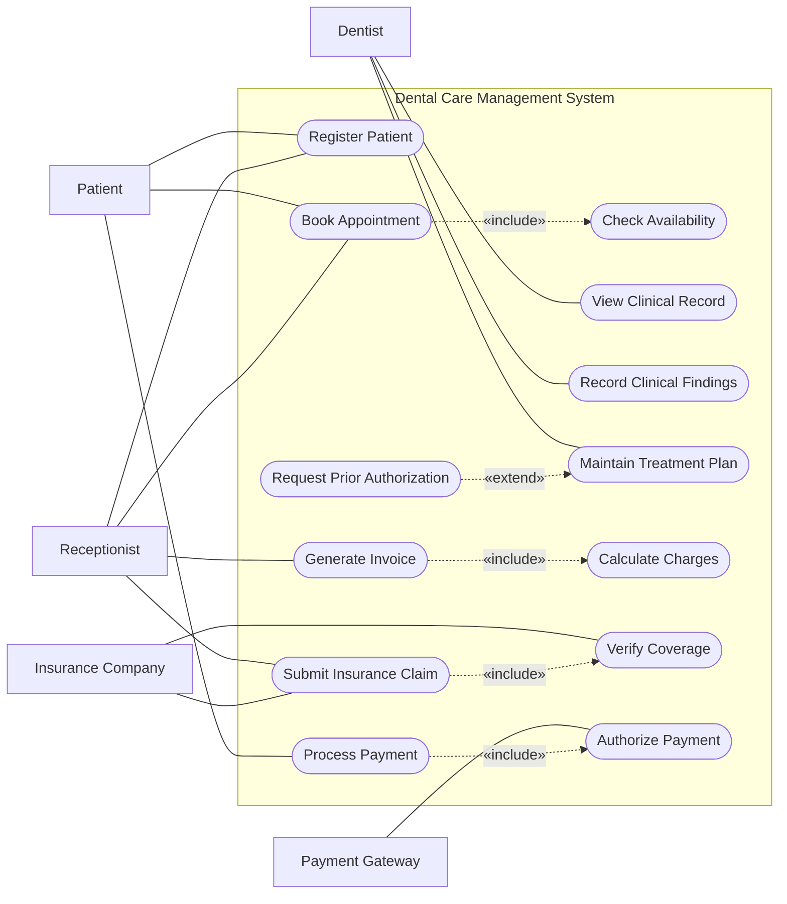

In your handwritten answer, actors should be **stick figures**, use cases **ellipses**, and all use cases must lie inside the system boundary.

---

### B. Complete Use Case Scenario — Book Appointment

Chapter 2's scenario format includes description, trigger, main path, preconditions, postconditions, guarantees, issues, priority and risk.  

| Field             | Model answer                                                                            |
| ----------------- | --------------------------------------------------------------------------------------- |
| Use Case Name     | Book Appointment                                                                        |
| Unique ID         | DC-UC-02                                                                                |
| Area              | Appointment Management                                                                  |
| Primary Actor     | Patient                                                                                 |
| Stakeholders      | Patient, Dentist, Receptionist                                                          |
| Description       | Enables a registered patient to obtain an available dental appointment                  |
| Trigger           | Patient selects “Book Appointment”                                                      |
| Trigger Type      | External                                                                                |
| Precondition      | Patient has an active registration                                                      |
| Main Path 1       | Patient identifies/selects preferred dentist                                            |
| Main Path 2       | Patient selects date/time preference                                                    |
| Main Path 3       | System performs **Check Availability**                                                  |
| Main Path 4       | System displays available slots                                                         |
| Main Path 5       | Patient selects a slot                                                                  |
| Main Path 6       | System verifies that slot remains available                                             |
| Main Path 7       | System creates appointment record                                                       |
| Main Path 8       | System returns appointment confirmation                                                 |
| Alternative A1    | No requested slot available → system presents alternatives; no appointment is created   |
| Alternative A2    | Slot becomes unavailable before confirmation → user returns to available-slot selection |
| Postcondition     | Confirmed appointment exists                                                            |
| Success Guarantee | Exactly one appointment slot is reserved and confirmation is produced                   |
| Minimum Guarantee | No invalid/duplicate appointment is created                                             |
| Outstanding Issue | Whether a cancellation fee applies                                                      |
| Priority          | High                                                                                    |
| Risk              | Medium                                                                                  |

---

### C. ERD

### Cardinalities

| Relationship                       | Cardinality |
| ---------------------------------- | ----------- |
| Patient–Appointment                | 1:M         |
| Dentist–Appointment                | 1:M         |
| Patient–Clinical Record            | 1:1         |
| Clinical Record–Treatment Plan     | 1:M         |
| Dentist–Treatment Plan             | 1:M         |
| Treatment Plan–Treatment Item      | 1:M         |
| Appointment–Invoice                | 1:0..1      |
| Invoice–Payment                    | 1:M         |
| Patient–Insurance Policy           | 1:M         |
| Insurance Company–Insurance Policy | 1:M         |
| Invoice–Claim                      | 1:0..1      |
| Insurance Policy–Claim             | 1:M         |

Chapter 2 directs the analyst to identify organizational entities, narrow the scope to key entities, select the primary entity and validate the model through data gathering. 

### Mermaid ERD

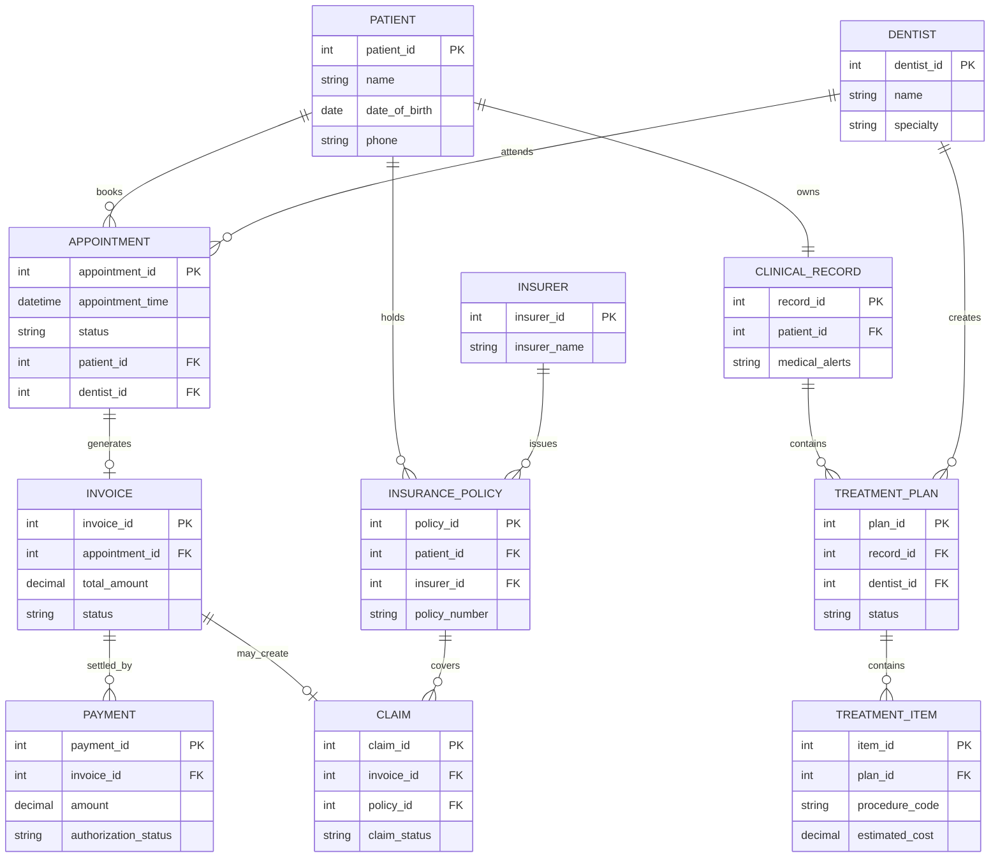

---

## Step 3 — Technical Explanation and CRUD Matrix

The use case model answers **who interacts with which required behavior**. The ERD answers **what persistent business objects exist and how they relate**. Do not confuse the two.

For example, **Book Appointment** is behavior; **Appointment** is an entity. **Process Payment** is behavior; **Payment** is persistent data.

### CRUD matrix

| Use Case / Process       | Patient | Appointment | Clinical Record | Treatment Plan | Invoice | Claim | Payment |
| ------------------------ | ------- | ----------- | --------------- | -------------- | ------- | ----- | ------- |
| Register Patient         | C/R/U   | —           | C               | —              | —       | —     | —       |
| Book Appointment         | R       | C/R/U       | —               | —              | —       | —     | —       |
| Record Clinical Findings | R       | R           | C/R/U           | —              | —       | —     | —       |
| Maintain Treatment Plan  | R       | R           | R               | C/R/U          | —       | —     | —       |
| Generate Invoice         | R       | R           | R               | R              | C/R/U   | —     | —       |
| Submit Insurance Claim   | R       | —           | —               | —              | R       | C/R/U | —       |
| Process Payment          | R       | —           | —               | —              | R/U     | —     | C/R/U   |

---

## Step 4 — Faculty Traps and Deductions

| Error                                                                      | Deduction reason                                          |
| -------------------------------------------------------------------------- | --------------------------------------------------------- |
| Drawing Receptionist inside system boundary                                | Actor is external to the software system                  |
| Using `<<extend>>` for mandatory availability checking                     | Mandatory reused behavior requires `<<include>>`          |
| Arrowing `Maintain Treatment Plan → Request Prior Authorization` as extend | UML extend direction should be extension → base           |
| ERD says Patient M:N Appointment                                           | Each appointment is for one patient; M:N is unjustified   |
| Omitting associative resolution where M:N exists                           | Database design becomes ambiguous                         |
| Using “Appointment Management” as an entity                                | That is a process/subsystem, not persistent business data |
| Putting payment gateway in ERD as if it were a stored patient record       | External system ≠ automatically a database entity         |
| No precondition/postcondition in use case scenario                         | Incomplete specification                                  |
| Saying use case explains implementation                                    | Use case is primarily logical requirement modeling        |

---

# Question 03 — Pharmacy Inventory System: Feasibility and Economic Analysis

**Marks: 18**

### Scenario

A five-branch pharmacy chain currently maintains stock in separate spreadsheets. It experiences duplicate purchase entries, expired medicines, stock-outs and slow inventory reporting.

Management proposes a centralized browser-based Pharmacy Inventory System.

Facts:

* Current PCs in all branches can support the browser application.
* Four branches have reliable Internet; one branch has frequent outages.
* Barcode scanners must be purchased.
* Several senior pharmacists resist changing the spreadsheet procedure.
* Initial analyst/study cost = Tk 80,000
* Software/development = Tk 250,000
* Hardware/scanners = Tk 150,000
* Training = Tk 60,000
* Data migration = Tk 40,000
* Annual reduction in expiry losses = Tk 180,000
* Annual labor savings = Tk 120,000
* Annual reduction in emergency purchase cost = Tk 100,000
* Annual cloud/service cost = Tk 90,000
* Annual support cost = Tk 30,000
* Management accepts projects with payback ≤ 2.5 years.

Assess technical, economic and operational feasibility and recommend Go / Conditional Go / No-Go.

Chapter 3 defines feasibility around technical, economic and operational dimensions and treats payback, break-even, cash-flow and present-value analysis as cost–benefit techniques.  

## Model Answer

## Step 1 — Scenario Decomposition

| Element           | Extraction                                                                                                                                                                 |
| ----------------- | -------------------------------------------------------------------------------------------------------------------------------------------------------------------------- |
| External entities | Pharmacist, Supplier, Manager                                                                                                                                              |
| Primary actors    | Pharmacist, Store Manager                                                                                                                                                  |
| Secondary actors  | Supplier, System Administrator                                                                                                                                             |
| Processes         | Record Stock Transaction; Monitor Reorder Level; Monitor Expiry; Create Purchase Order; Receive Medicine; Produce Inventory Report                                         |
| D1                | Drug Master                                                                                                                                                                |
| D2                | Inventory Ledger                                                                                                                                                           |
| D3                | Batch and Expiry File                                                                                                                                                      |
| D4                | Supplier Master                                                                                                                                                            |
| D5                | Purchase Order File                                                                                                                                                        |
| Rules             | No negative stock; each received medicine must have batch and expiry; reorder occurs at/below reorder level; expired stock cannot be sold; high-value POs require approval |

---

## Step 2 — Feasibility Decision Representation

### Structured feasibility table

| Dimension   | Evidence                                  | Assessment           |
| ----------- | ----------------------------------------- | -------------------- |
| Technical   | Existing PCs are adequate                 | Positive             |
| Technical   | Barcode devices must be acquired          | Manageable           |
| Technical   | One branch has unreliable Internet        | Significant risk     |
| Technical   | Browser/cloud solution technically exists | Positive             |
| Economic    | Initial cost Tk 580,000                   | Known                |
| Economic    | Annual gross tangible benefit Tk 400,000  | Positive             |
| Economic    | Annual recurring cost Tk 120,000          | Known                |
| Operational | Users currently understand stock process  | Positive             |
| Operational | Senior pharmacists resist new system      | Risk                 |
| Operational | Training budget exists                    | Mitigation available |

### Mermaid

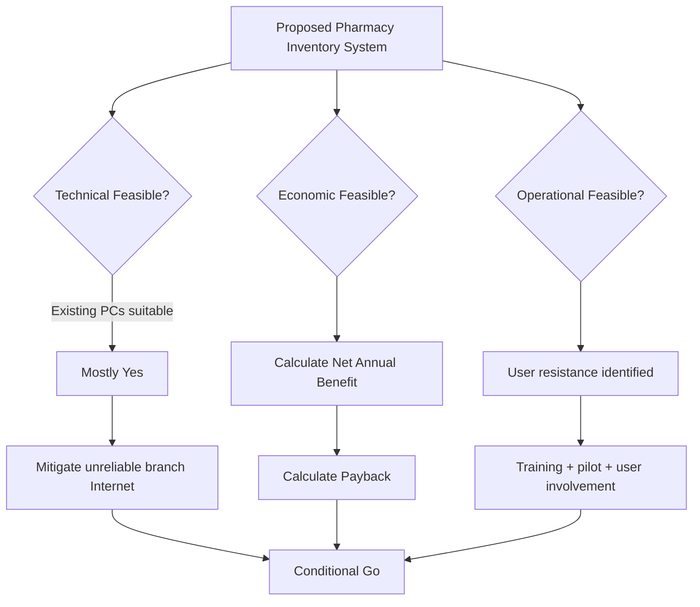

---

## Step 3 — Technical Explanation, Cost Calculation and CRUD

### A. Technical feasibility

Chapter 3 asks whether existing technology can be upgraded to meet the requirement or whether appropriate technology exists. 

Existing PCs support the proposed browser system, so processing hardware does not require replacement. Barcode scanners are commercially available and therefore do not threaten feasibility.

The principal technical risk is the unreliable Internet connection at one branch.

A faculty-grade answer should therefore say:

**Technically feasible subject to connectivity mitigation**, for example:

* Secondary ISP/mobile link.
* Local transaction queue with later synchronization.
* Monitoring of network availability.
* Backup/recovery procedures.
* Capacity testing against current and projected workload.

Do not simply write “technically feasible because computers exist.”

---

### B. Economic feasibility

Chapter 3 distinguishes tangible measurable benefits from intangible benefits and costs. 

#### Initial investment

| Cost                   |          Tk |
| ---------------------- | ----------: |
| Analyst/study          |      80,000 |
| Software/development   |     250,000 |
| Hardware/scanners      |     150,000 |
| Training               |      60,000 |
| Migration              |      40,000 |
| **Total initial cost** | **580,000** |

#### Annual tangible benefits

| Benefit                   |     Tk/year |
| ------------------------- | ----------: |
| Lower expiry losses       |     180,000 |
| Labor savings             |     120,000 |
| Fewer emergency purchases |     100,000 |
| **Gross annual benefit**  | **400,000** |

#### Annual recurring cost

Cloud = 90,000
Support = 30,000

**Total recurring cost = Tk 120,000/year**

Therefore:

$$
\text{Net Annual Benefit}
=400,000-120,000
=\boxed{Tk\ 280,000}
$$

Payback:

$$
\text{Payback Period}
=
\frac{580,000}{280,000}
=
2.0714\text{ years}
$$

Therefore:

$$
\boxed{\text{Payback}\approx2.07\text{ years}}
$$

Management limit = 2.5 years.

Therefore:

$$
2.07 < 2.5
$$

**Economic feasibility: PASS.**

Chapter 3 specifically recommends payback where tangible improvements make a convincing argument. 

Three-year simple cash position:

$$
-580,000+(280,000\times3)
=
\boxed{Tk\ 260,000}
$$

So after three years the project has generated a positive cumulative simple cash result of Tk 260,000, ignoring time value of money.

---

### C. Intangible benefits

A high-mark answer should also identify:

* Faster management decision-making.
* Improved customer trust.
* More reliable medicine availability.
* Better pharmacist satisfaction after stabilization.
* More accurate supplier planning.
* Better auditability.

These matter even though they are difficult to price precisely.

---

### D. Operational feasibility

Operational feasibility concerns whether people can and will use the installed system; Chapter 3 explicitly warns that users who reject a new system can undermine operational feasibility. 

The senior-pharmacist resistance therefore cannot be ignored.

Required mitigation:

* Involve pharmacists during requirements analysis.
* Pilot one branch first.
* Provide role-specific training.
* Run old/new procedures in parallel for a short controlled period if required.
* Provide on-site support during launch.
* Publish clear SOPs.
* Assign a respected pharmacist as change champion.

**Operational verdict: feasible with change-management controls.**

---

### Final recommendation

$$
\boxed{\text{CONDITIONAL GO}}
$$

Reason:

* Economic feasibility passes.
* Core technology is available.
* Two major risks remain: unreliable connectivity and user acceptance.
* Both have practical mitigation strategies.

### CRUD Matrix

| Process               | D1 Drug | D2 Inventory | D3 Batch/Expiry | D4 Supplier | D5 PO |
| --------------------- | ------- | ------------ | --------------- | ----------- | ----- |
| Maintain Drug Master  | C/R/U   | —            | —               | —           | —     |
| Receive Medicine      | R       | C/U          | C/U             | R           | R/U   |
| Record Sale           | R       | C/U          | R/U             | —           | —     |
| Monitor Reorder       | R       | R            | —               | R           | C     |
| Create Purchase Order | R       | R            | —               | R           | C/U   |
| Monitor Expiry        | R       | R            | R/U             | —           | —     |

---

## Step 4 — Faculty Traps and Deductions

| Mistake                                                                 | Why wrong                                                  |
| ----------------------------------------------------------------------- | ---------------------------------------------------------- |
| Saying only “feasible” without separating T/E/O                         | Misses Chapter 3 feasibility framework                     |
| Counting Tk 400,000 as net annual benefit                               | Annual operating costs must be deducted                    |
| Payback = 580,000 / 400,000                                             | Incorrect because recurring cost ignored                   |
| Ignoring Internet reliability                                           | Technical feasibility incomplete                           |
| Treating resistance as technical issue                                  | It is primarily operational                                |
| Treating improved reputation as a precise cash benefit without evidence | Intangible ≠ automatically monetized                       |
| Recommending No-Go solely because one branch has poor Internet          | Risk can be mitigated                                      |
| Recommending immediate full deployment                                  | Operational resistance argues for controlled rollout/pilot |

---

# Question 04 — University Registration Portal: Fact-Finding and Requirements Elicitation

**Marks: 15**

### Scenario

A university wants to replace its fragmented course-registration process.

Students complain that prerequisite checks are inconsistent. Advisors maintain separate spreadsheets. The Registrar maintains official curriculum rules. Finance sends fee/hold data from another system. Department administrators sometimes approve prerequisite or credit-limit exceptions.

As systems analyst, design a professional information-gathering strategy using:

* Interviews.
* Open/closed/probing questions.
* An appropriate interview structure.
* JAD.
* Questionnaires.
* Requirement validation.

Chapter 4 identifies interviewing, JAD and questionnaires as the principal interactive information-gathering methods.  JAD can replace repeated individual interviews by conducting requirements analysis and interface discussion with users in a group setting. 

## Model Answer

## Step 1 — Scenario Decomposition

| Element           | Extraction                                                                                                                                                                                                                              |
| ----------------- | --------------------------------------------------------------------------------------------------------------------------------------------------------------------------------------------------------------------------------------- |
| External entities | Student, Academic Advisor, Registrar, Department Administrator, Finance System                                                                                                                                                          |
| Primary actors    | Student, Advisor, Registrar                                                                                                                                                                                                             |
| Secondary actors  | Department Administrator, Finance System                                                                                                                                                                                                |
| Processes         | Verify Student Eligibility; Check Prerequisite; Check Seat Availability; Register Course; Approve Override; Retrieve Financial Hold                                                                                                     |
| D1                | Student Master                                                                                                                                                                                                                          |
| D2                | Course/Curriculum Catalogue                                                                                                                                                                                                             |
| D3                | Enrollment File                                                                                                                                                                                                                         |
| D4                | Advising and Override File                                                                                                                                                                                                              |
| D5                | Financial Hold Snapshot                                                                                                                                                                                                                 |
| Core rules        | Valid prerequisite required unless authorized override; no registration above credit limit without approval; no enrollment in full section; active financial hold may block registration; official curriculum rules come from Registrar |

---

## Step 2 — Information-Gathering Design

### A. Interview preparation

Chapter 4 recommends:

* Reading background material.
* Establishing interview objectives.
* Deciding whom to interview.
* Preparing interviewees.
* Choosing question types and interview structure. 

Therefore, before interviewing anyone, obtain:

* Registration policy.
* Curriculum/prerequisite tables.
* Current registration form/screens.
* Advisor spreadsheet samples.
* Override forms.
* Registration error logs.
* Finance-hold interface specification.

### Interview objective

Determine:

1. Official rules.
2. Actual current practice.
3. Exceptions.
4. Information needed at each decision point.
5. Pain points and HCI problems.
6. Source of authoritative data.

---

### B. Recommended question structure — Diamond

A **Diamond Structure** is best because the analyst needs both precise factual details and broader explanation before finishing with confirmation. Chapter 4 describes it as specific → general → specific and states that it combines strengths of pyramid and funnel structures. 

### Sample interview plan

| Sequence | Type   | Question                                                                                                          |
| -------- | ------ | ----------------------------------------------------------------------------------------------------------------- |
| 1        | Closed | “Is prerequisite information stored in the official curriculum database?”                                         |
| 2        | Closed | “Can an advisor currently override a prerequisite failure?”                                                       |
| 3        | Probe  | “Who records that override, and where is it stored?”                                                              |
| 4        | Open   | “Please describe what normally happens from the time a student selects a course until registration is confirmed.” |
| 5        | Open   | “Which part of the current procedure causes the greatest difficulty?”                                             |
| 6        | Probe  | “Can you give an example where a valid student was incorrectly blocked?”                                          |
| 7        | Closed | “Must every credit-limit exception have department approval?”                                                     |
| 8        | Closed | “Should a financial hold prevent final registration?”                                                             |

Open-ended questions are appropriate where breadth and depth are needed, whereas closed questions produce precise and easily analyzed answers.  Probes are used to clarify or expand a previous point. 

---

### C. JAD Session

The JAD session should include representatives of all major decision perspectives:

* Registrar or sponsor.
* Systems analyst/facilitator.
* Student representative.
* Academic advisor.
* Department administrator.
* Finance-interface representative.
* IT/development representative.
* Recorder/documenter.

Agenda:

```text
1. Confirm system scope.
2. Agree authoritative data sources.
3. Walk through normal registration.
4. Walk through exception paths.
5. Resolve prerequisite-rule conflicts.
6. Resolve financial-hold logic.
7. Define override authority.
8. Prioritize requirements.
9. Review candidate interface/prototype.
10. Sign off unresolved issues.
```

Chapter 4 recommends minimizing distractions, scheduling so participants can attend, using an agenda and holding an orientation meeting for JAD. 

### Mermaid elicitation workflow

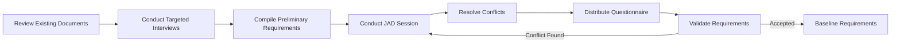

---

### D. Questionnaire

A questionnaire is especially useful because there may be thousands of students and widely dispersed university members. Chapter 4 specifically identifies widely dispersed users, large populations and exploratory work as reasons for questionnaires. 

Sample items:

| Item                                                      | Format                                          |
| --------------------------------------------------------- | ----------------------------------------------- |
| “How often has the portal incorrectly rejected a course?” | Never / Rarely / Sometimes / Often / Very Often |
| “The prerequisite error messages are easy to understand.” | 1–5 agreement scale                             |
| “How many minutes does registration usually take?”        | Numeric range                                   |
| “Which registration problem affects you most?”            | Multiple choice                                 |
| “Describe one improvement you would prioritize.”          | Open-ended                                      |

Questionnaires should not replace interviews with policy owners. Students know the **experience**; the Registrar knows the **official rule**.

---

## Step 3 — Requirement Logic and CRUD Matrix

### Requirement traceability example

| Elicited statement                                 | Source              | Derived requirement                                                     |
| -------------------------------------------------- | ------------------- | ----------------------------------------------------------------------- |
| Registrar: prerequisites are centrally maintained  | Interview           | System shall read prerequisites from official curriculum source         |
| Advisor: overrides require justification           | Interview/JAD       | Every override shall record approver, reason and time                   |
| Students: errors are unclear                       | Questionnaire       | Rejection message shall state the failed rule                           |
| Finance: hold data refreshed nightly               | Interface interview | Registration shall check latest available hold snapshot                 |
| Department: max-credit exception requires approval | JAD                 | System shall block over-limit registration unless valid override exists |

### CRUD Matrix

| Process                    | D1 Student | D2 Course | D3 Enrollment | D4 Override | D5 Hold |
| -------------------------- | ---------- | --------- | ------------- | ----------- | ------- |
| Verify Student Eligibility | R          | —         | R             | R           | R       |
| Check Prerequisite         | R          | R         | R             | R           | —       |
| Check Seat Availability    | —          | R         | R             | —           | —       |
| Register Course            | R          | R         | C/U           | R           | R       |
| Approve Override           | R          | R         | —             | C/U         | —       |
| Drop Course                | R          | R         | U             | —           | —       |

---

## Step 4 — Faculty Traps and Deductions

| Mistake                                                                     | Deduction                                                |
| --------------------------------------------------------------------------- | -------------------------------------------------------- |
| Interviewing students only                                                  | Students cannot authoritatively define university policy |
| Interviewing Registrar only                                                 | Misses operational pain and user requirements            |
| Asking only yes/no questions                                                | Poor depth                                               |
| Asking only open questions                                                  | Difficult comparison and excessive interview time        |
| Leading question: “Don't you agree the old system is terrible?”             | Biased elicitation                                       |
| Conducting JAD without preparation                                          | Chapter 4 warns poor preparation can cause failure       |
| Treating all stakeholder statements as equally authoritative business rules | Must distinguish policy owner from user opinion          |
| No requirement validation                                                   | Conflicts remain unresolved                              |
| Asking “Do you like the portal?”                                            | Too vague to produce implementable requirement           |
| Recording “system should be user-friendly”                                  | Not measurable or testable                               |

---

# Question 05 — E-Commerce Logistics System: Prototyping, Agile and HCI

**Marks: 20**

### Scenario

An e-commerce company wants a new logistics module for:

* Warehouse order picking.
* Carrier assignment.
* Shipment tracking.
* Delivery-exception handling.
* Customer return initiation.

Requirements are changing rapidly. Warehouse staff use phones/tablets while moving around the warehouse. Users complain that the existing application requires too much typing, gives poor feedback after barcode scans, and uses inconsistent controls.

Management wants something that users can test quickly rather than waiting until the entire system is completed.

Recommend a prototype strategy, Agile approach and HCI design. Include a system decomposition, prototype cycle, interface rules and CRUD matrix.

Chapter 6 defines prototyping as an information-gathering mechanism for obtaining user reactions, suggestions, innovations and revision plans, and distinguishes patched-up, nonoperational, first-of-a-series and selected-features prototypes.  Chapter 14 stresses matching the interface to the task, efficiency, feedback, usable queries and user productivity. 

## Model Answer

## Step 1 — Scenario Decomposition

| Element           | Extraction                                                                                                                                                                                                                             |
| ----------------- | -------------------------------------------------------------------------------------------------------------------------------------------------------------------------------------------------------------------------------------- |
| External entities | Warehouse Worker, Customer, Carrier Service, Customer-Service Agent                                                                                                                                                                    |
| Primary actors    | Warehouse Worker, Customer-Service Agent, Customer                                                                                                                                                                                     |
| Secondary actor   | Carrier Service                                                                                                                                                                                                                        |
| Processes         | Pick Order; Assign Carrier; Dispatch Shipment; Update Tracking; Handle Delivery Exception; Initiate Return                                                                                                                             |
| D1                | Order File                                                                                                                                                                                                                             |
| D2                | Shipment File                                                                                                                                                                                                                          |
| D3                | Tracking Event File                                                                                                                                                                                                                    |
| D4                | Return File                                                                                                                                                                                                                            |
| D5                | User/Role File                                                                                                                                                                                                                         |
| Rules             | Only paid/approved orders may be picked; each dispatched shipment has carrier/tracking ID; barcode scan must identify correct order/item; return must reference delivered order; only authorized staff may override shipment exception |

---

## Step 2 — Prototype and Agile Representation

### A. Correct prototype type

The strongest answer is:

$$
\boxed{\text{Selected-Features Prototype}}
$$

Why?

Because the company wants a **working operational portion of the real system**, such as:

* Scan/pick order.
* Assign carrier.
* Show tracking status.
* Initiate return.

A selected-features prototype is operational but contains only part of the final feature set, and Chapter 6 describes it as modular and potentially part of the actual system. 

A **nonoperational prototype** would be weaker because the problem is not just screen appearance; users must evaluate real scanning and workflow behavior.

A **patched-up prototype** is also weaker because it contains all features but inefficiently—unnecessary at this stage.

A **first-of-a-series prototype** becomes appropriate later if a completed solution is piloted at one warehouse before rolling out to many warehouses. Chapter 6 explicitly connects first-of-a-series with pilot deployment at one or two locations. 

---

### B. Prototype iteration

Chapter 6 recommends manageable modules, rapid development, successive modification and strong attention to the user interface. 

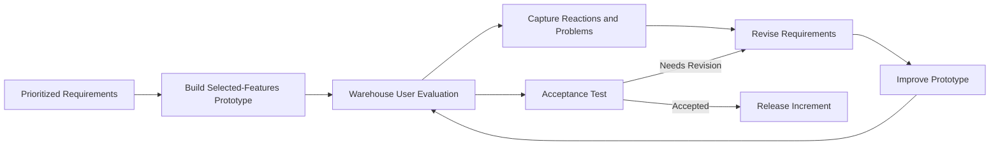

This cycle is preferable to designing every module completely before users see anything.

---

### C. Agile execution

Chapter 6 emphasizes:

* Deliver working software.
* Accept change.
* Deliver incrementally and frequently.
* Encourage continuous customer/analyst collaboration.
* Trust motivated team members. 

A suitable backlog might be:

```text
Iteration 1
- Login / warehouse role
- Scan order
- Scan item
- Confirm pick

Iteration 2
- Carrier assignment
- Shipping label
- Dispatch confirmation

Iteration 3
- Tracking event view
- Delivery exception

Iteration 4
- Return initiation
- Return status
```

Each increment should produce demonstrable working behavior.

---

### D. HCI design for the warehouse user

Chapter 14 identifies meaningful communication, minimal user action and consistent operation as core dialog principles. 

#### Screen: Pick Order

```text
---------------------------------------
ORDER #ECO-45821
---------------------------------------
Customer: [hidden unless required]
Items Remaining: 3

[ SCAN ITEM BARCODE ]

Last Scan:
✓ SKU 77102 accepted
Quantity: 1 / 2

[Confirm Pick]      [Report Problem]
---------------------------------------
```

Design decisions:

**1. Minimal user action**

Do not force worker to type:

* Order number.
* SKU.
* Product description.
* Quantity when barcode uniquely identifies item.

Scanning should populate them.

**2. Immediate feedback**

Successful scan:

> ✓ Item accepted — 2 items remaining

Wrong item:

> ✕ Wrong item. Expected SKU 77102.

Duplicate scan:

> ⚠ Required quantity already completed.

Chapter 14 treats acknowledgement, correct/incorrect input notification, delay notification and completion acknowledgement as core forms of feedback. 

**3. Consistency**

* Same “Back” position.
* Same “Confirm” location.
* Same error format.
* Same terminology.
* Same icons for scanning/problems.
* Same navigation structure.

**4. Touch-oriented design**

Chapter 14 explicitly recognizes tapping, swiping and pinching as mobile/touch interactions. 

For warehouse work:

* Large tap targets.
* Avoid tiny links.
* One-handed operation where possible.
* Scanning prioritized over keyboard input.
* Do not depend only on color to express an error.
* Keep critical controls visible.

---

### E. Prototype module flow

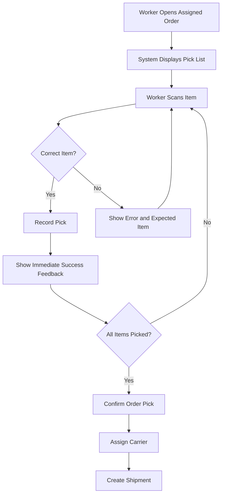

This workflow has no ambiguous dead end: every incorrect scan returns the user to a recoverable state.

---

## Step 3 — Technical Explanation and CRUD Matrix

The prototype must test not only aesthetics but **information requirements and operational workflow**.

The analyst should observe:

* Scan error frequency.
* Average picks per minute.
* Number of taps per completed order.
* Time to recover from wrong scan.
* User confusion.
* Whether feedback is noticed.
* Whether users can complete the workflow without help.

Chapter 14 evaluates interfaces partly by short training time, few design-induced errors, quick recovery and the ability of infrequent users to relearn the system. 

### CRUD Matrix

| Process           | D1 Order | D2 Shipment | D3 Tracking | D4 Return | D5 User |
| ----------------- | -------- | ----------- | ----------- | --------- | ------- |
| Pick Order        | R/U      | —           | —           | —         | R       |
| Assign Carrier    | R        | C/U         | —           | —         | R       |
| Dispatch Shipment | R/U      | C/U         | C           | —         | R       |
| Update Tracking   | R        | R/U         | C/U         | —         | —       |
| Handle Exception  | R        | R/U         | C/U         | —         | R       |
| Initiate Return   | R        | R           | R           | C/U       | R       |

### Why this design is better than “build everything first”

It creates an early feedback loop:

$$
\text{Working Module}
\rightarrow
\text{User Reaction}
\rightarrow
\text{Requirement Correction}
\rightarrow
\text{Improved Module}
$$

That directly implements Chapter 6's view of prototyping as a mechanism for user reaction and iterative revision. 

---

## Step 4 — Faculty Traps and Deductions

| Mistake                                                  | Why examiner deducts                                                              |
| -------------------------------------------------------- | --------------------------------------------------------------------------------- |
| Selecting nonoperational prototype without justification | Users must evaluate real workflow/scanning                                        |
| Building all logistics features before feedback          | Contradicts incremental prototyping/Agile                                         |
| Treating prototype as finished production software       | Chapter 6 explicitly warns users/analysts may make this mistake                   |
| No user evaluation after iteration                       | Removes core feedback mechanism                                                   |
| Tiny mobile controls                                     | Poor fit with touch environment                                                   |
| Requiring SKU typing after barcode scan                  | Violates minimal user action                                                      |
| No feedback after scan                                   | User cannot know whether input was accepted                                       |
| Red error text with no icon/text meaning                 | Accessibility and usability problem                                               |
| Different “Confirm” position on every screen             | Violates consistency                                                              |
| Automatically deleting failed shipment transactions      | Weak auditability                                                                 |
| Calling GUI appearance alone “HCI”                       | HCI concerns user, task, context, technology and environment, not cosmetics alone |

Chapter 6 also specifically warns that prototyping can be difficult to manage and that users may mistake a prototype for the finished system. 

**End of Phase 1: Questions 01–05.**

# Phase 2 — Questions 06–10

Phase 2 increases the difficulty from pure requirements modeling into **logical-to-physical design, UML behavioral/static modeling, project scheduling, implementation/testing, and end-to-end architecture**.

One notation reminder: for every DFD below, your handwritten exam answer must use exact **Gane & Sarson** symbols. Mermaid is only a clean semantic rendering because Mermaid does not natively reproduce the exact divided Gane & Sarson process box or open-ended data-store symbol.

---

# Question 06 — Banking Fund Transfer System: Logical DFD → Physical DFD → Partitioning

**Marks: 20**

### Scenario

A commercial bank is replacing its legacy fund-transfer system.

A customer logs in through the mobile/web channel and submits a transfer containing source account, beneficiary, amount and transfer type. The system authenticates the customer, verifies the beneficiary and account balance, checks transaction limits and risk rules, authorizes the transaction, posts the transfer and produces confirmation.

If the beneficiary belongs to another bank, the transfer is routed through a national payment network. Every completed or rejected transaction must be auditable.

Construct:

1. Logical Level 0 DFD.
2. Corresponding Physical DFD.
3. Appropriate physical partitions.
4. Explain the logical–physical difference.
5. Prepare a CRUD matrix.

Chapter 7 distinguishes the two directly: a **logical DFD focuses on the business events and the data required/produced**, without specifying construction; a **physical DFD shows how the system will actually be implemented**.  

---

## Step 1 — Scenario Decomposition

| Category               | Extracted elements                                                                                                                                                                                                                                                                        |
| ---------------------- | ----------------------------------------------------------------------------------------------------------------------------------------------------------------------------------------------------------------------------------------------------------------------------------------- |
| External entities      | Customer, National Payment Network                                                                                                                                                                                                                                                        |
| Primary actor          | Customer                                                                                                                                                                                                                                                                                  |
| Secondary actor/system | National Payment Network                                                                                                                                                                                                                                                                  |
| 1.0                    | Authenticate Customer                                                                                                                                                                                                                                                                     |
| 2.0                    | Validate Transfer                                                                                                                                                                                                                                                                         |
| 3.0                    | Authorize Transfer                                                                                                                                                                                                                                                                        |
| 4.0                    | Execute Transfer                                                                                                                                                                                                                                                                          |
| 5.0                    | Issue Transfer Confirmation                                                                                                                                                                                                                                                               |
| D1                     | Account Master                                                                                                                                                                                                                                                                            |
| D2                     | Beneficiary File                                                                                                                                                                                                                                                                          |
| D3                     | Transfer Ledger                                                                                                                                                                                                                                                                           |
| D4                     | Audit Log                                                                                                                                                                                                                                                                                 |
| Major rules            | Customer must be authenticated; source account must be active; beneficiary must be valid; available balance must cover transfer; amount must satisfy limits/risk rules; transfer is posted atomically; interbank transfers require external settlement result; all outcomes are auditable |

### Gane & Sarson naming discipline

Correct:

* `1.0 Authenticate Customer`
* `2.0 Validate Transfer`
* `Transfer Instruction`
* `Account Data`
* `D3 Transfer Ledger`

Incorrect:

* Process: `Customer`
* Process: `Transfer`
* Flow: `Check transfer`
* Store: `Save transaction`

Processes describe **work/transformation**, whereas entities, flows and stores use nouns/noun phrases. Chapter 7 similarly specifies noun labels for flows/stores and transformation-oriented process labels. 

---

# Step 2 — Diagram Representation

## A. Logical Level 0 DFD

### Structured mapping

| Source                   | Data flow                       | Destination                     |
| ------------------------ | ------------------------------- | ------------------------------- |
| Customer                 | Authentication Data             | 1.0 Authenticate Customer       |
| D1 Account Master        | Customer Authentication Record  | 1.0                             |
| 1.0                      | Authenticated Customer Identity | 2.0 Validate Transfer           |
| Customer                 | Transfer Instruction            | 2.0                             |
| D1                       | Account Data                    | 2.0                             |
| D2 Beneficiary File      | Beneficiary Data                | 2.0                             |
| 2.0                      | Validated Transfer Request      | 3.0 Authorize Transfer          |
| 3.0                      | Authorization Decision          | D4 Audit Log                    |
| 3.0                      | Authorized Transfer             | 4.0 Execute Transfer            |
| D1                       | Current Account Data            | 4.0                             |
| 4.0                      | Updated Account Data            | D1                              |
| 4.0                      | Transfer Record                 | D3 Transfer Ledger              |
| 4.0                      | Interbank Settlement Request    | National Payment Network        |
| National Payment Network | Settlement Result               | 4.0                             |
| 4.0                      | Completed Transfer Data         | 5.0 Issue Transfer Confirmation |
| 5.0                      | Transaction Audit Entry         | D4                              |
| 5.0                      | Transfer Confirmation           | Customer                        |

### Gane & Sarson-style ASCII

```text
[Customer]
    |
    | Authentication Data
    v
┌─────────────────────────┐
│ 1.0                     │
│ Authenticate Customer   │
└─────────────────────────┘
          ^       |
          |       | Authenticated Customer Identity
   D1 Account     v
      Master  ┌─────────────────────────┐
              │ 2.0                     │ <--- Transfer Instruction
              │ Validate Transfer       │ <--- D2 Beneficiary Data
              └─────────────────────────┘
                         |
                         | Validated Transfer Request
                         v
              ┌─────────────────────────┐
              │ 3.0                     │
              │ Authorize Transfer      │
              └─────────────────────────┘
                  |              |
                  |              +----> D4 Audit Log
                  |
                  | Authorized Transfer
                  v
              ┌─────────────────────────┐
              │ 4.0                     │
              │ Execute Transfer        │
              └─────────────────────────┘
               ^      |        |
               |      |        +----> D3 Transfer Ledger
               |      |
           D1 Account |
             Master   +----> [National Payment Network]
                              ^
                              |
                       Settlement Result

                         |
                         | Completed Transfer Data
                         v
              ┌─────────────────────────┐
              │ 5.0                     │
              │ Issue Transfer          │
              │ Confirmation            │
              └─────────────────────────┘
                    |             |
                    v             v
                [Customer]    D4 Audit Log
```

### Mermaid

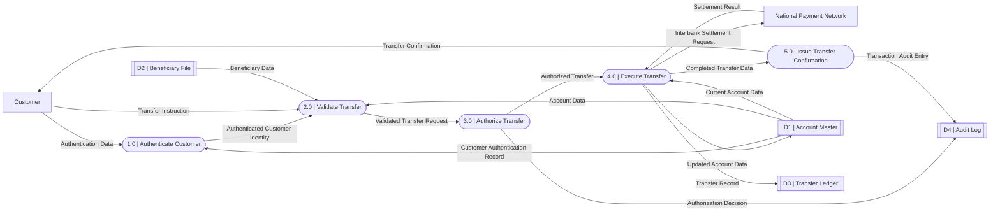

### Integrity audit

There is no:

```text
Customer --------> D1
D1 --------------> D3
National Network -> D3
```

All data movement involving a store or external entity passes through a process.

---

# B. Physical DFD

The physical model now answers:

> **Who/what program performs the work, what database/file is used, and what implementation components are involved?**

Chapter 7 notes that physical DFDs can contain manual activities, data-entry and verification processes, record maintenance, validation, sequencing, intermediate stores, actual files and control/error mechanisms not normally shown in a logical DFD. 

### Physical components

| Logical process       | Physical implementation         |
| --------------------- | ------------------------------- |
| Authenticate Customer | IAM authentication service      |
| Validate Transfer     | Transfer API                    |
| Authorize Transfer    | Limit/Risk Authorization Engine |
| Execute Transfer      | Payment Posting Service         |
| Confirm Transfer      | Notification Service            |
| Account Master        | `CoreBank.ACCOUNT`              |
| Beneficiary File      | `CustomerDB.BENEFICIARY`        |
| Transfer Ledger       | `PaymentsDB.TRANSFER_TXN`       |
| Audit Log             | `AuditDB.SECURITY_EVENT`        |
| Intermediate store    | Outbound Settlement Queue       |

### Physical DFD Mermaid

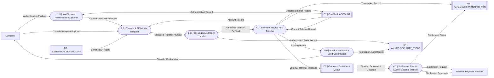

Notice that **D5 Outbound Settlement Queue** did not appear in the logical DFD. That is acceptable because it is an implementation/intermediate store rather than a business requirement.

---

# C. Physical Partitioning

Chapter 7 defines partitioning as deciding how the physical DFD should be divided among **manual procedures and computer programs**. A dashed boundary may indicate processes that belong to one program. 

Partitioning considerations include different user groups, simultaneous processes, similar tasks, efficient batch grouping and security separation. 

### Recommended partitions

| Partition                | Components                         | Reason                                |
| ------------------------ | ---------------------------------- | ------------------------------------- |
| A — Access Security      | Authentication                     | Separate security responsibility      |
| B — Transfer Processing  | Validate + Authorize               | Closely related synchronous functions |
| C — Posting & Settlement | Post + external settlement adapter | Transaction integrity                 |
| D — Notification/Audit   | Confirmation + audit               | Can be partly asynchronous            |

### Mermaid partition representation

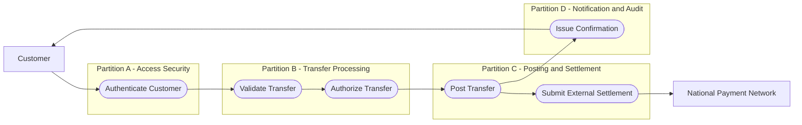

This is a **partition/architecture view**, not a replacement for the formal DFD.

---

# Step 3 — Technical Explanation & CRUD Matrix

### Logical versus physical

| Logical DFD                | Physical DFD                                    |
| -------------------------- | ----------------------------------------------- |
| What business work occurs? | How is it implemented?                          |
| Technology-independent     | Technology-specific                             |
| `Authorize Transfer`       | `Risk Engine Authorize Transfer`                |
| `Transfer Ledger`          | `PaymentsDB.TRANSFER_TXN`                       |
| Business data              | Payloads, files, queues, implementation details |
| Useful for requirements    | Useful for design/programming                   |

The progression from logical toward physical modeling is an explicit Chapter 7 design activity. 

### CRUD Matrix

| Process                   | D1 Account | D2 Beneficiary | D3 Transfer | D4 Audit |
| ------------------------- | ---------- | -------------- | ----------- | -------- |
| 1.0 Authenticate Customer | R          | —              | —           | C        |
| 2.0 Validate Transfer     | R          | R              | —           | —        |
| 3.0 Authorize Transfer    | R          | —              | —           | C        |
| 4.0 Execute Transfer      | R/U        | —              | C/U         | C        |
| 5.0 Issue Confirmation    | —          | —              | R           | C        |

### Critical transaction rule

Posting should logically satisfy:

```text
Debit source account
+
Credit/route destination transfer
+
Create transaction record
=
one controlled business transaction
```

A failure must not leave the source account debited with no corresponding transaction outcome.

---

# Step 4 — Faculty Traps & Deductions

| Mistake                                                                       | Why marks are lost                                        |
| ----------------------------------------------------------------------------- | --------------------------------------------------------- |
| Logical DFD contains Java, SQL, REST API names                                | Implementation leaked into logical model                  |
| Physical DFD is identical to logical DFD                                      | No implementation detail added                            |
| Customer connects directly to Account DB                                      | Illegal DFD connection                                    |
| Payment network connects directly to Transfer Ledger                          | External entity cannot maintain internal store directly   |
| Process “Account”                                                             | Noun, not transformation                                  |
| Data flow “Validate Transfer”                                                 | Verb phrase; it should be data such as `Transfer Request` |
| No audit data for rejected/approved transfer                                  | Business rule omitted                                     |
| Putting an intermediate queue into logical requirements without justification | Mixes implementation with logical model                   |
| Grouping authentication and posting into one unrestricted program             | Poor security partition                                   |
| Calling partition diagram a Level 1 DFD                                       | Different modeling purpose                                |

---

# Question 07 — Dental Care Management System: UML Sequence Diagram + Class Diagram

**Marks: 20**

### Scenario

A dentist reviews a patient's clinical record and prepares a treatment plan containing one or more procedures. The system checks the patient's insurance policy.

If prior authorization is required, the system sends the proposed treatment to the insurer and records the insurer's decision. The patient then reviews and accepts or rejects the treatment plan.

Produce:

1. Sequence Diagram.
2. Class Diagram.
3. Correct multiplicities.
4. Explain `alt`/optional behavior.
5. CRUD matrix.

**Source-boundary note:** your supplied Chapter 2 directly covers use cases and ER modeling, not detailed UML sequence/class notation. The diagrams below are therefore a **standards-based UML extension required by your exam-preparation instructions**, rather than content I am attributing to those slides.

---

# Step 1 — Scenario Decomposition

| Category          | Elements                                                                                                                                                                                      |
| ----------------- | --------------------------------------------------------------------------------------------------------------------------------------------------------------------------------------------- |
| External entities | Patient, Dentist, Insurance Company                                                                                                                                                           |
| Primary actors    | Dentist, Patient                                                                                                                                                                              |
| Secondary actor   | Insurance Company                                                                                                                                                                             |
| Processes         | Review Clinical Record; Create Treatment Plan; Add Treatment Item; Determine Authorization Requirement; Request Prior Authorization; Record Authorization Decision; Record Patient Acceptance |
| D1                | Patient Record                                                                                                                                                                                |
| D2                | Treatment Plan                                                                                                                                                                                |
| D3                | Insurance Policy                                                                                                                                                                              |
| D4                | Authorization Record                                                                                                                                                                          |
| Business rule 1   | Dentist must access an existing patient record                                                                                                                                                |
| Business rule 2   | A plan contains at least one proposed treatment item before submission                                                                                                                        |
| Business rule 3   | Authorization is requested only when required                                                                                                                                                 |
| Business rule 4   | Insurer decision must be recorded                                                                                                                                                             |
| Business rule 5   | Patient cannot accept a plan not yet available for review                                                                                                                                     |
| Business rule 6   | Plan status must reflect Draft, Pending Authorization, Authorized, Rejected, Accepted, etc.                                                                                                   |

---

# Step 2 — Diagram Representation

## A. Sequence Diagram

### Lifelines

| Lifeline                   | UML role                  |
| -------------------------- | ------------------------- |
| Dentist                    | Actor                     |
| Treatment Plan UI          | Boundary                  |
| Treatment Plan Controller  | Control                   |
| Clinical Record Repository | Entity/data access        |
| Treatment Plan Repository  | Entity/data access        |
| Insurance Gateway          | External-system interface |
| Patient                    | Actor                     |

### Structured message sequence

|  # | Sender            | Message                       | Receiver            |
| -: | ----------------- | ----------------------------- | ------------------- |
|  1 | Dentist           | openPatient(patientId)        | UI                  |
|  2 | UI                | loadClinicalRecord(patientId) | Controller          |
|  3 | Controller        | findRecord(patientId)         | Clinical Repository |
|  4 | Repository        | clinicalRecord                | Controller          |
|  5 | Controller        | clinicalRecord                | UI                  |
|  6 | Dentist           | submitPlan(planData)          | UI                  |
|  7 | UI                | createPlan(planData)          | Controller          |
|  8 | Controller        | saveDraft(plan)               | Plan Repository     |
|  9 | Controller        | determineAuthorization(plan)  | Controller          |
| 10 | Controller        | requestAuthorization(plan)    | Insurance Gateway   |
| 11 | Insurance Gateway | authorizationDecision         | Controller          |
| 12 | Controller        | updateAuthorizationStatus     | Plan Repository     |
| 13 | Patient           | reviewPlan(planId)            | UI                  |
| 14 | UI                | loadPlan(planId)              | Controller          |
| 15 | Controller        | findPlan(planId)              | Repository          |
| 16 | Repository        | planDetails                   | Controller          |
| 17 | Controller        | planDetails                   | UI                  |
| 18 | Patient           | accept/reject                 | UI                  |
| 19 | UI                | recordDecision                | Controller          |
| 20 | Controller        | updatePlanStatus              | Repository          |

### ASCII sequence

```text
Dentist      UI       Controller      ClinicalRepo      PlanRepo      Insurer      Patient
   |          |            |                |               |            |            |
   |--open--->|            |                |               |            |            |
   |          |--load----->|                |               |            |            |
   |          |            |--find--------->|               |            |            |
   |          |            |<--record-------|               |            |            |
   |          |<--record---|                |               |            |            |
   |          |            |                |               |            |            |
   |--plan--->|--create--->|------------------------------->|            |            |
   |          |            |                                |            |            |
   |          |            | [if authorization required]    |            |            |
   |          |            |--------------------------------------------->|            |
   |          |            |<---------------------------------------------|            |
   |          |            |------------------------------->|            |            |
   |          |            |                                |            |            |
   |          |            |                                |            |<--review----|
   |          |<----------------------------------------------------------|            |
   |          |            |                                |            |<--accept----|
   |          |--decision->|------------------------------->|            |            |
```

### Mermaid UML Sequence Diagram

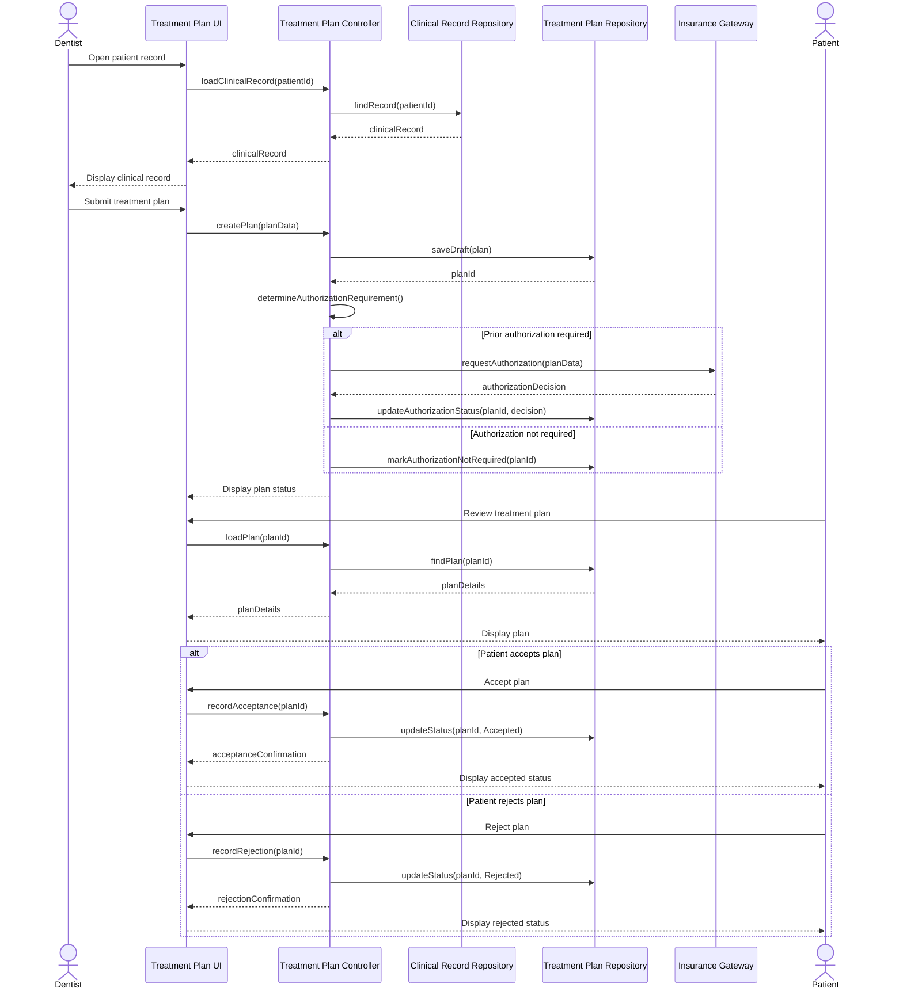

### Why `alt` is correct

Authorization has mutually exclusive alternatives:

```text
[authorization required]
OR
[authorization not required]
```

Similarly:

```text
[patient accepts]
OR
[patient rejects]
```

Therefore an `alt` combined fragment is technically stronger than drawing both paths as though they always occur.

---

# B. UML Class Diagram

## Class inventory

| Class              | Important attributes            | Representative operations     |
| ------------------ | ------------------------------- | ----------------------------- |
| Patient            | patientId, name, DOB            | reviewPlan(), acceptPlan()    |
| Dentist            | dentistId, name, specialty      | createPlan(), recordFinding() |
| ClinicalRecord     | recordId, alerts                | addFinding(), getHistory()    |
| TreatmentPlan      | planId, status, createdDate     | addItem(), changeStatus()     |
| TreatmentItem      | itemId, procedureCode, cost     | updateProcedure()             |
| InsurancePolicy    | policyId, policyNumber          | isActive()                    |
| PriorAuthorization | authorizationId, status         | recordDecision()              |
| Appointment        | appointmentId, dateTime, status | confirm(), cancel()           |

### Formal multiplicities

```text
Patient 1 -------- 1 ClinicalRecord
Patient 1 -------- 0..* Appointment
Dentist 1 -------- 0..* Appointment

ClinicalRecord 1 *------ 0..* TreatmentPlan
Dentist 1 -------------- 0..* TreatmentPlan

TreatmentPlan 1 *------- 1..* TreatmentItem

Patient 1 -------------- 0..* InsurancePolicy
TreatmentPlan 1 -------- 0..1 PriorAuthorization
InsurancePolicy 1 ------ 0..* PriorAuthorization
```

`TreatmentItem` is strongly owned by its TreatmentPlan, making composition defensible.

### Mermaid class diagram

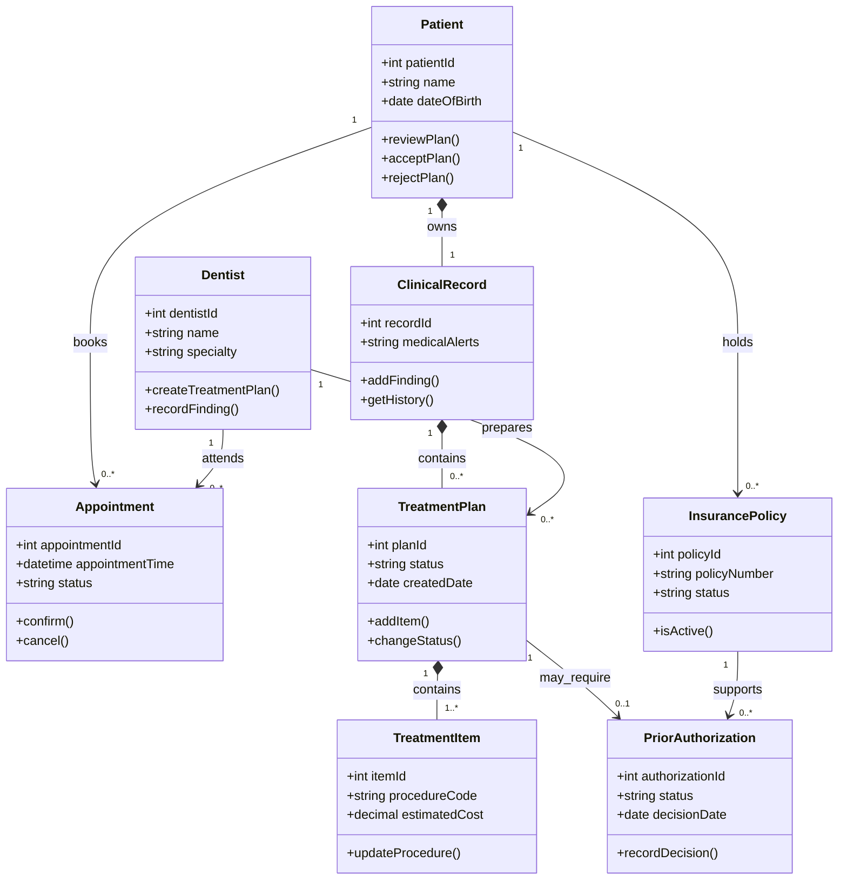

---

# Step 3 — Technical Explanation & CRUD Matrix

### Class diagram versus ERD

A common exam trap is to treat these as identical.

**ERD asks primarily:**

> What data entities exist and what database relationships exist?

**Class diagram asks:**

> What object types exist, what attributes and behavior do they own, and what UML relationships/multiplicities connect them?

Hence:

```text
ERD:
TreatmentPlan(plan_id, status)

Class:
TreatmentPlan
----------------
planId
status
----------------
addItem()
changeStatus()
```

### CRUD Matrix

| Operation               | Clinical Record | Treatment Plan | Treatment Item | Insurance Policy | Authorization |
| ----------------------- | --------------- | -------------- | -------------- | ---------------- | ------------- |
| Review Clinical Record  | R               | —              | —              | —                | —             |
| Create Treatment Plan   | R               | C              | —              | R                | —             |
| Add Treatment Item      | —               | R/U            | C              | —                | —             |
| Check Insurance         | —               | R              | —              | R                | —             |
| Request Authorization   | —               | R/U            | R              | R                | C             |
| Record Insurer Decision | —               | U              | —              | R                | U             |
| Record Patient Decision | —               | U              | R              | —                | R             |

---

# Step 4 — Faculty Traps & Deductions

| Mistake                                                                                   | Examiner objection                                    |
| ----------------------------------------------------------------------------------------- | ----------------------------------------------------- |
| Database table drawn as an actor in sequence diagram                                      | Repository/data object is not a human/external actor  |
| Message arrows in random order                                                            | Sequence diagram represents time from top to bottom   |
| Both approval-required and not-required paths always execute                              | Missing conditional fragment                          |
| `Patient 1..* Appointment`                                                                | A newly registered patient may have zero appointments |
| `TreatmentPlan 0..* TreatmentItem` while business rule requires an item before submission | Multiplicity contradicts rule                         |
| Association and composition used randomly                                                 | Composition implies strong lifecycle ownership        |
| No operation methods in class diagram                                                     | Looks like ERD rather than class model                |
| Writing FK fields only and calling it a class diagram                                     | Object behavior missing                               |
| Insurance Company shown as a class merely because it is an external system                | Class inclusion requires domain-model justification   |
| Sequence messages do not correspond to class responsibilities                             | Static and dynamic UML models are inconsistent        |

---

# Question 08 — E-Commerce Returns Portal: WBS, Gantt Chart, PERT, Critical Path and Slack

**Marks: 18**

### Scenario

An e-commerce firm will develop a Returns and Refund Portal. Customers will request returns, the system will verify eligibility, generate a return authorization, integrate with a courier, receive the returned item and initiate a refund.

The project manager estimates the following activities:

| ID | Activity                | Duration | Predecessor |
| -- | ----------------------- | -------: | ----------- |
| A  | Gather Requirements     |   2 days | —           |
| B  | Design UI Prototype     |   3 days | A           |
| C  | Design Data Model       |   2 days | A           |
| D  | Build Return API        |   4 days | C           |
| E  | Build Customer Portal   |   5 days | B           |
| F  | Integrate Courier API   |   3 days | D           |
| G  | Integration Testing     |   2 days | E, F        |
| H  | User Acceptance Testing |   2 days | G           |
| I  | Production Deployment   |    1 day | H           |

Determine:

1. WBS/dependency structure.
2. Gantt schedule.
3. PERT network.
4. Critical path.
5. Slack.
6. Which activities should be expedited if management must shorten the project.

Chapter 3 describes a WBS as breaking a project into smaller tasks/activities.  It also stresses that PERT makes precedence, the critical path and slack easier to identify. 

---

# Step 1 — Scenario Decomposition

### Business-system decomposition

| Category          | Elements                                                                                                                                                               |
| ----------------- | ---------------------------------------------------------------------------------------------------------------------------------------------------------------------- |
| External entities | Customer, Courier, Payment Gateway, Warehouse Staff                                                                                                                    |
| Primary actors    | Customer, Warehouse Staff                                                                                                                                              |
| Secondary actors  | Courier, Payment Gateway                                                                                                                                               |
| Processes         | Request Return; Verify Eligibility; Generate Return Authorization; Arrange Pickup; Receive Returned Item; Approve Refund; Process Refund                               |
| D1                | Order File                                                                                                                                                             |
| D2                | Return File                                                                                                                                                            |
| D3                | Shipment/Collection File                                                                                                                                               |
| D4                | Refund File                                                                                                                                                            |
| Rules             | Return must reference completed order; return period must be valid; approved return receives authorization number; refund starts only after required return validation |

---

# Step 2 — Diagram Representation

## A. PERT dependency network

### ASCII

```text
                    +--> B(3) --> E(5) --+
                    |                    |
START --> A(2) -----+                    +--> G(2) --> H(2) --> I(1) --> END
                    |                    |
                    +--> C(2) --> D(4) --> F(3) --+
```

Two principal branches:

```text
Path 1:
A → B → E → G → H → I

Path 2:
A → C → D → F → G → H → I
```

### Mermaid

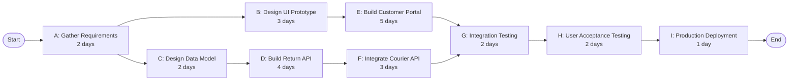

---

# B. Gantt schedule

Based on earliest starts:

| Activity | Start day | Finish day |
| -------- | --------: | ---------: |
| A        |         0 |          2 |
| B        |         2 |          5 |
| C        |         2 |          4 |
| D        |         4 |          8 |
| E        |         5 |         10 |
| F        |         8 |         11 |
| G        |        11 |         13 |
| H        |        13 |         15 |
| I        |        15 |         16 |

Chapter 3 illustrates Gantt charts as a practical way to show work performed in parallel. 

### Mermaid Gantt

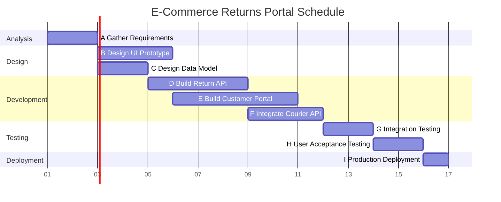

The dates simply map the calculated project days onto calendar dates for visualization.

---

# Step 3 — Critical Path, Slack & CRUD Matrix

## A. Forward pass

Formula:

$$
EF = ES + Duration
$$

For an activity with several predecessors:

$$
ES = \max(EF_{predecessors})
$$

| Activity |            ES | Duration | EF |
| -------- | ------------: | -------: | -: |
| A        |             0 |        2 |  2 |
| B        |             2 |        3 |  5 |
| C        |             2 |        2 |  4 |
| D        |             4 |        4 |  8 |
| E        |             5 |        5 | 10 |
| F        |             8 |        3 | 11 |
| G        | max(10,11)=11 |        2 | 13 |
| H        |            13 |        2 | 15 |
| I        |            15 |        1 | 16 |

Therefore:

$$
\boxed{\text{Project Duration}=16\text{ days}}
$$

---

## B. Path comparison

### Path 1

$$
A+B+E+G+H+I
$$

$$
=2+3+5+2+2+1
$$

$$
=\boxed{15}
$$

### Path 2

$$
A+C+D+F+G+H+I
$$

$$
=2+2+4+3+2+2+1
$$

$$
=\boxed{16}
$$

Therefore:

$$
\boxed{\text{Critical Path}=A-C-D-F-G-H-I}
$$

---

## C. Backward pass and slack

Slack:

$$
Slack=LS-ES
$$

| Activity | ES | LS | Slack | Critical? |
| -------- | -: | -: | ----: | --------- |
| A        |  0 |  0 |     0 | Yes       |
| B        |  2 |  3 |     1 | No        |
| C        |  2 |  2 |     0 | Yes       |
| D        |  4 |  4 |     0 | Yes       |
| E        |  5 |  6 |     1 | No        |
| F        |  8 |  8 |     0 | Yes       |
| G        | 11 | 11 |     0 | Yes       |
| H        | 13 | 13 |     0 | Yes       |
| I        | 15 | 15 |     0 | Yes       |

So B and E each have:

$$
\boxed{1\text{ day slack}}
$$

---

## D. Which activity should be expedited?

Chapter 3 explicitly states that expediting only reduces the overall project duration when the expedited activity is **on the critical path**. 

Therefore speeding up B or E by one day initially does **not** shorten the 16-day completion time.

Potential candidates:

* C
* D
* F
* G
* H
* I

Management should select a critical activity where acceleration is technically possible and economically justified.

---

## E. CRUD Matrix for the Returns Portal

| Process                | D1 Order | D2 Return | D3 Collection | D4 Refund |
| ---------------------- | -------- | --------- | ------------- | --------- |
| Request Return         | R        | C         | —             | —         |
| Verify Eligibility     | R        | R/U       | —             | —         |
| Generate Authorization | R        | R/U       | —             | —         |
| Arrange Pickup         | R        | R         | C/U           | —         |
| Receive Return         | R        | U         | R/U           | —         |
| Approve Refund         | R        | R         | R             | C         |
| Process Refund         | R        | R         | —             | C/U       |

---

# Step 4 — Faculty Traps & Deductions

| Mistake                                   | Why wrong                                               |
| ----------------------------------------- | ------------------------------------------------------- |
| Add durations of all activities           | Parallel tasks mean total ≠ simple sum                  |
| Start G after E only                      | G requires both E and F                                 |
| Critical path chosen as shortest path     | Critical path is the longest-duration dependency path   |
| Give B zero slack                         | B branch finishes one day before critical branch        |
| Expedite B to shorten project             | It initially has slack                                  |
| Treat every activity as sequential        | Contradicts dependency network                          |
| Draw arrows against precedence direction  | PERT logic becomes invalid                              |
| Forget to recalculate path after crashing | A second path may become critical                       |
| Confuse WBS with DFD                      | WBS represents project work, not business data movement |

---

# Question 09 — University Registration Portal: Testing, Training and Conversion Strategy

**Marks: 20**

### Scenario

A university has completed a new registration portal used at three campuses.

The system integrates:

* Student records.
* Course offerings.
* Prerequisite validation.
* Financial holds.
* Registration.
* Advising overrides.

Registration is mission-critical. A conversion failure during semester enrollment could affect thousands of students.

Design:

1. QA/testing strategy.
2. Training program.
3. Conversion strategy.
4. Rollback/control plan.
5. CRUD matrix.

Chapter 16 places testing, training and physical conversion among core implementation responsibilities. 

---

# Step 1 — Scenario Decomposition

| Category          | Elements                                                                                                                                                                                                                                                      |
| ----------------- | ------------------------------------------------------------------------------------------------------------------------------------------------------------------------------------------------------------------------------------------------------------- |
| External entities | Student, Advisor, Registrar, Finance System                                                                                                                                                                                                                   |
| Primary actors    | Student, Advisor, Registrar                                                                                                                                                                                                                                   |
| Secondary system  | Finance System                                                                                                                                                                                                                                                |
| Processes         | Authenticate Student; Validate Eligibility; Check Prerequisite; Check Hold; Register Course; Approve Override; Drop Course                                                                                                                                    |
| D1                | Student Master                                                                                                                                                                                                                                                |
| D2                | Course Catalogue                                                                                                                                                                                                                                              |
| D3                | Enrollment File                                                                                                                                                                                                                                               |
| D4                | Override File                                                                                                                                                                                                                                                 |
| D5                | Financial Hold Data                                                                                                                                                                                                                                           |
| D6                | Audit Log                                                                                                                                                                                                                                                     |
| Business rules    | No duplicate enrollment; prerequisite must pass unless authorized override exists; active hold blocks registration where policy requires; section capacity cannot be exceeded; every override has approver/reason; registration transaction must be auditable |

---

# Step 2 — Testing and Implementation Representation

## A. Testing hierarchy

Chapter 16 gives this sequence:

1. Program testing with test data.
2. Link/string testing with test data.
3. Full-system testing with test data.
4. Full-system testing with limited live data. 

### Testing flow

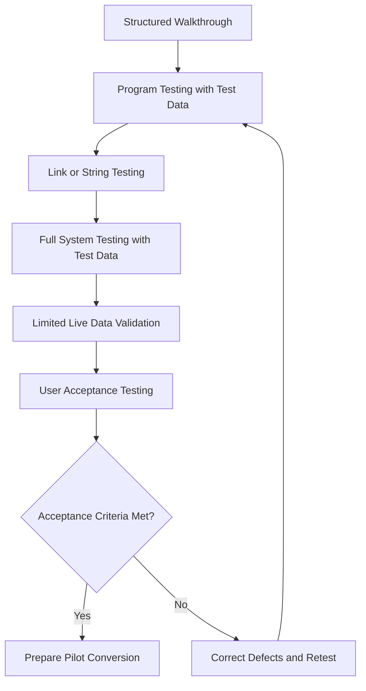

Structured walkthroughs are a Chapter 16 quality mechanism in which peers identify problems so analysts/programmers can correct them. 

---

## B. Test matrix

| Test level              | Example                                                                   |
| ----------------------- | ------------------------------------------------------------------------- |
| Program test            | Prerequisite function correctly evaluates one course                      |
| Program test            | Capacity function rejects enrollment when available seats = 0             |
| Link/string test        | Registration service correctly obtains hold status from Finance interface |
| Link/string test        | Override service communicates with Enrollment service                     |
| System test             | Student registers for multiple eligible courses                           |
| System negative test    | Student with active blocking hold attempts registration                   |
| System concurrency test | Two students attempt the final seat simultaneously                        |
| Security test           | Student attempts advisor-only override action                             |
| UAT                     | Registrar verifies official rule implementation                           |

Chapter 16 describes link or string testing as checking whether interdependent programs actually operate together, including normal and invalid transactions. 

### Live data rule

Do **not** begin by experimenting with the entire production registration database.

The chapter recommends using only small amounts of live data and comparing outputs against known correct results. 

---

# C. Conversion strategy

Chapter 16 identifies five major strategies:

* Direct changeover.
* Parallel conversion.
* Gradual/phased conversion.
* Modular prototype conversion.
* Distributed conversion. 

### Recommended approach

For this scenario:

$$
\boxed{\text{Distributed rollout + temporary parallel operation at the pilot campus}}
$$

### Why not direct changeover?

Direct conversion means:

```text
OLD SYSTEM STOP
       ↓
NEW SYSTEM START
```

The chapter labels this risky, requiring extensive testing, with no adequate old/new comparison. 

That is unsuitable immediately before a university-wide registration event.

### Why use a pilot/distributed rollout?

```text
Campus A
   ↓
Pilot new system
   ↓
Evaluate
   ↓
Campus B
   ↓
Evaluate
   ↓
Campus C
```

Distributed conversion is specifically suitable where the same system is installed at multiple locations; problems at the first site can be detected and contained. 

### Why short parallel operation?

At the pilot location:

```text
OLD PORTAL ───┐
              ├── Compare critical outputs
NEW PORTAL ───┘
```

Parallel conversion permits comparison of new results with old results, though it doubles workload. 

Therefore use it only for a controlled period, not indefinitely.

---

# D. Conversion Mermaid

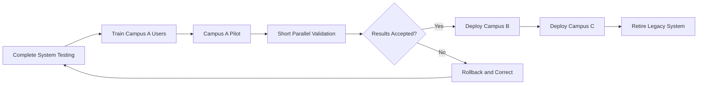

---

# Step 3 — Training, Controls & CRUD Matrix

## A. Training plan

Chapter 16 frames training around:

* Who is trained.
* Who trains them.
* Objectives.
* Methods.
* Sites.
* Materials. 

### Role-based training

| User group | Training objective                    | Recommended method               |
| ---------- | ------------------------------------- | -------------------------------- |
| Students   | Search/register/drop courses          | Video + guided demo + FAQ        |
| Advisors   | Review advisees and override workflow | Workshop with scenarios          |
| Registrar  | Curriculum/control functions          | Instructor-led advanced training |
| Help Desk  | Error diagnosis and escalation        | Hands-on sandbox exercises       |
| IT Support | Monitoring, recovery, interfaces      | Technical runbook lab            |

Possible trainers include vendors, analysts, external trainers, internal trainers and experienced system users. 

### Why role-based?

Do not make a Registrar attend the same shallow tutorial as a student.

Different roles have:

* Different privileges.
* Different tasks.
* Different exception responsibilities.
* Different failure consequences.

---

## B. Rollback controls

Before pilot go-live:

```text
1. Freeze configuration baseline.
2. Back up production data.
3. Record migration totals/checksums.
4. Define rollback trigger.
5. Keep old system available during pilot comparison.
6. Log every migration/conversion error.
7. Reconcile enrollment totals.
8. Obtain Registrar sign-off.
```

A good rollback trigger could be:

```text
Critical prerequisite/financial-hold defect
OR
unacceptable enrollment inconsistency
OR
major integration outage
→ suspend pilot and restore prior operational state
```

---

## C. CRUD Matrix

| Process              | D1 Student | D2 Course | D3 Enrollment | D4 Override | D5 Hold | D6 Audit |
| -------------------- | ---------- | --------- | ------------- | ----------- | ------- | -------- |
| Authenticate Student | R          | —         | —             | —           | —       | C        |
| Validate Eligibility | R          | R         | R             | R           | R       | —        |
| Check Prerequisite   | R          | R         | R             | R           | —       | —        |
| Register Course      | R          | R         | C/U           | R           | R       | C        |
| Approve Override     | R          | R         | R             | C/U         | —       | C        |
| Drop Course          | R          | R         | U             | —           | —       | C        |

### High-value test derived from CRUD

For `Register Course`:

**Before transaction**

```text
Seat capacity = 1
Student A not registered
Student B not registered
```

Both try simultaneously.

Correct result:

```text
Exactly one successful C/U operation on Enrollment.
Exactly one rejection.
Capacity must never become negative.
```

That is much stronger than merely checking whether the registration screen opens.

---

# Step 4 — Faculty Traps & Deductions

| Mistake                                                         | Examiner deduction                          |
| --------------------------------------------------------------- | ------------------------------------------- |
| Start with production/live data testing                         | Unsafe testing sequence                     |
| Skip link testing                                               | Interfaces may fail despite working modules |
| Only test valid transactions                                    | Invalid/boundary data ignored               |
| Direct university-wide conversion the night before registration | Uncontrolled risk                           |
| Parallel conversion forever                                     | Doubled workload/cost                       |
| No rollback trigger                                             | Implementation plan incomplete              |
| Training every role identically                                 | Tasks and privileges differ                 |
| Testing UI but not prerequisite/hold business rules             | Core requirements unverified                |
| Testing individual modules but not concurrency                  | Real enrollment race conditions missed      |
| No reconciliation of old/new enrollment totals                  | Conversion accuracy not demonstrated        |

---

# Question 10 — Multi-Branch Pharmacy Platform: SOA, Cloud Architecture, Security and Disaster Recovery

**Marks: 25**

### Scenario

A pharmacy chain operates 20 branches and plans an integrated cloud-based system.

The platform must support:

* Electronic prescriptions.
* Patient profiles.
* Drug inventory by branch.
* Prescription dispensing.
* Supplier replenishment.
* Payments.
* Notifications.
* Audit trails.

External prescribers electronically send prescriptions. Pharmacists validate and dispense them. Suppliers receive purchase orders. Payment gateways authorize electronic payments.

Management wants a modular architecture that can later reuse services in a mobile application and other company systems.

Design an end-to-end architecture using **Service-Oriented Architecture (SOA)** principles and cloud computing. Include security, disaster recovery and CRUD responsibilities.

Chapter 16 describes SOA services as loosely coupled, action-focused and reusable across applications.  It further requires services to be modular, reusable, interoperable, identifiable, monitorable and standards-compliant. 

---

# Step 1 — Scenario Decomposition

| Category                 | Elements                                                                                                                                                                                                                           |
| ------------------------ | ---------------------------------------------------------------------------------------------------------------------------------------------------------------------------------------------------------------------------------- |
| External entities        | Patient, Pharmacist, Prescriber, Supplier, Payment Gateway                                                                                                                                                                         |
| Primary actors           | Pharmacist, Patient                                                                                                                                                                                                                |
| Secondary actors/systems | Prescriber, Supplier, Payment Gateway                                                                                                                                                                                              |
| Major processes/services | Authenticate User; Manage Prescription; Check Inventory; Dispense Medicine; Replenish Inventory; Manage Billing; Process Payment; Send Notification; Record Audit Event                                                            |
| D1                       | Patient and User Data                                                                                                                                                                                                              |
| D2                       | Prescription Data                                                                                                                                                                                                                  |
| D3                       | Inventory Data                                                                                                                                                                                                                     |
| D4                       | Dispensing Data                                                                                                                                                                                                                    |
| D5                       | Billing/Payment Data                                                                                                                                                                                                               |
| D6                       | Purchase/Supplier Data                                                                                                                                                                                                             |
| D7                       | Audit Data                                                                                                                                                                                                                         |
| Rules                    | Only authorized pharmacist can dispense; prescription must be active/valid; quantity dispensed cannot exceed allowed quantity; stock cannot become negative; payment result must be recorded; every controlled action is auditable |

---

# Step 2 — Architecture Representation

## A. Layered architecture

### Structured representation

```text
EXTERNAL ACTORS
-------------------------------------------------
Patient | Pharmacist | Prescriber | Supplier | Payment Gateway


CHANNEL / PRESENTATION LAYER
-------------------------------------------------
Patient Mobile/Web App
Pharmacy Counter Application
Prescriber Integration Interface


ACCESS / INTEGRATION LAYER
-------------------------------------------------
API Gateway
Identity / Access Service
Service Orchestrator


BUSINESS SERVICE LAYER
-------------------------------------------------
Prescription Service
Inventory Service
Dispensing Service
Purchase Service
Billing Service
Notification Service
Audit Service


DATA LAYER
-------------------------------------------------
D1 Patient/User
D2 Prescription
D3 Inventory
D4 Dispensing
D5 Billing
D6 Purchase
D7 Audit
```

### Mermaid architecture

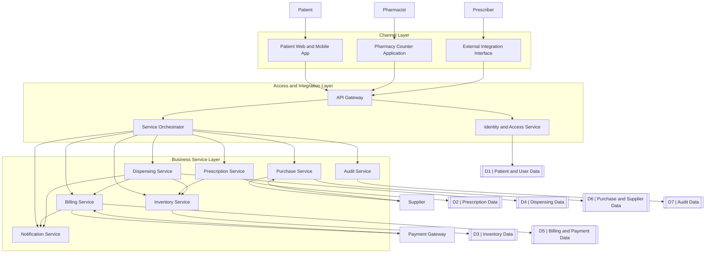

This is an **architecture diagram**, not a Gane & Sarson DFD. Do not label it “Level 0 DFD” in the exam.

---

# B. SOA orchestration example: Dispense Prescription

SOA orchestration means combining independent services into a meaningful business process. Chapter 16 explicitly calls this coordination **orchestration**. 

### Orchestration flow

```text
1. Authenticate pharmacist
        ↓
2. Retrieve prescription
        ↓
3. Validate prescription
        ↓
4. Check branch stock
        ↓
5. Record dispensing
        ↓
6. Reduce inventory
        ↓
7. Calculate patient charge
        ↓
8. Process payment if required
        ↓
9. Record audit event
        ↓
10. Send notification
```

### Mermaid

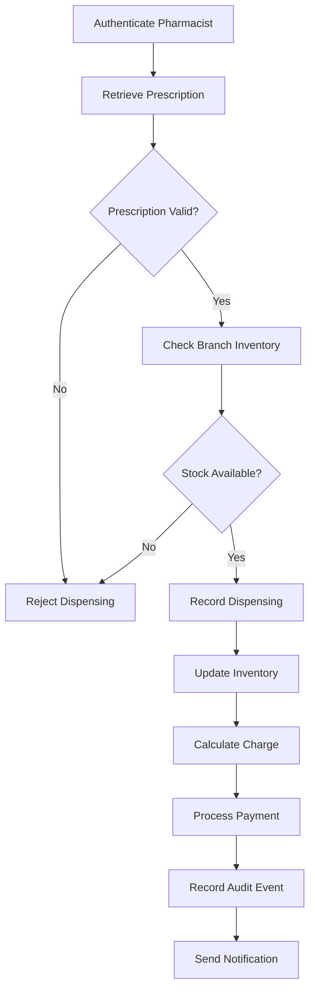

---

# Step 3 — Technical Explanation, Security, Disaster Recovery & CRUD

## A. Why SOA fits

Instead of one enormous pharmacy program:

```text
One tightly coupled application
```

use independent services:

```text
Prescription Service
Inventory Service
Billing Service
Notification Service
etc.
```

This provides modularity and reuse.

For example:

```text
Inventory Service
```

may later be reused by:

* Pharmacy POS.
* Customer mobile app.
* Warehouse portal.
* Management dashboard.

That directly reflects the chapter's emphasis on reusable and interoperable services. 

---

# B. Cloud deployment analysis

Chapter 16 describes cloud computing as access to web, database and application services over the Internet without each organization having to own all underlying hardware/software infrastructure. 

Potential advantages in this scenario:

* Central access for 20 branches.
* Easier scaling.
* Greater peak-load capacity.
* Centralized updates.
* Improved disaster-recovery possibilities.

The chapter specifically connects cloud computing with increased peak-load capacity and improved ability to perform disaster recovery. 

However, Chapter 3 warns of:

* Loss of direct control over cloud-stored data.
* Security threats.
* Dependence on Internet reliability. 

Therefore “use the cloud” is not a complete architecture answer. The risks must be mitigated.

---

# C. Security design

Chapter 16 divides security into:

$$
\boxed{\text{Physical + Logical + Behavioral}}
$$


### 1. Physical security

Examples:

* Secure pharmacist workstations.
* Restricted networking equipment.
* Device-lock policies.
* Controlled access to local infrastructure.
* Protection against device theft.

### 2. Logical security

Examples:

* Unique accounts.
* Role-based access.
* Multi-factor authentication for privileged users.
* Encryption in transit and at rest.
* Session timeout.
* Input validation.
* Audit logs.
* Authorization checks at the service layer.

Example:

```text
Patient:
View own prescription

Pharmacist:
View prescription
Dispense medicine

Branch Manager:
View branch inventory
Approve selected adjustments

System Administrator:
Technical administration

Supplier:
No direct access to patient records
```

### 3. Behavioral security

Examples:

* No password sharing.
* No shared pharmacist accounts.
* Mandatory logout.
* Incident reporting.
* Controlled privilege escalation.
* Staff security training.
* Separation of duties.

The slides describe behavioral security as enforcing procedures intended to prevent misuse of hardware/software. 

---

# D. Disaster recovery architecture

A production answer must answer:

> What happens if the main environment becomes unavailable?

### Recovery structure

```text
Primary Cloud Region
       |
       +---- Database backup / replication
       |
       v
Recovery Environment
       |
       +---- Restore critical pharmacy services
       |
       +---- Reconnect branches
```

### Recovery priorities

**Priority 1**

* Identity/access.
* Prescription lookup.
* Dispensing.
* Inventory.

**Priority 2**

* Payment/billing.
* Supplier purchasing.

**Priority 3**

* Analytics/reporting.

### Responsibilities

Chapter 16 stresses explicitly assigning responsibility for:

* Continuation of operations.
* Communications.
* Personnel location.
* Emergency arrangements.
* Restoration of computing/work environments. 

Therefore a disaster plan should name responsible roles rather than merely state “keep backups.”

### Minimum recovery controls

```text
Back up critical databases.
Test restores regularly.
Maintain recovery environment.
Document failover procedure.
Maintain alternative communication channels.
Assign recovery decision authority.
Preserve audit evidence.
Conduct disaster exercises.
```

---

# E. CRUD Matrix

| Service / Process    | D1 Patient/User | D2 Prescription | D3 Inventory | D4 Dispensing | D5 Billing | D6 Purchase | D7 Audit |
| -------------------- | --------------- | --------------- | ------------ | ------------- | ---------- | ----------- | -------- |
| Identity Service     | C/R/U           | —               | —            | —             | —          | —           | C        |
| Prescription Service | R               | C/R/U           | R            | —             | —          | —           | C        |
| Inventory Service    | —               | R               | C/R/U        | R             | —          | R           | C        |
| Dispensing Service   | R               | R/U             | R/U          | C/R/U         | —          | —           | C        |
| Billing Service      | R               | R               | —            | R             | C/R/U      | —           | C        |
| Purchase Service     | —               | —               | R/U          | —             | —          | C/R/U       | C        |
| Notification Service | R               | R               | —            | R             | R          | —           | C        |
| Audit Service        | R               | R               | R            | R             | R          | R           | C/R      |

---

# F. End-to-end data-flow explanation

Consider one prescription:

### 1. Prescriber submits prescription

```text
Prescriber
    ↓
Prescription Service
    ↓
D2 Prescription Data
```

### 2. Pharmacist dispenses

```text
Pharmacist
    ↓
Identity Service
    ↓
Prescription Service
    ↓
Inventory Service
    ↓
Dispensing Service
```

### 3. Inventory changes

```text
Dispensing Service
    ↓
Inventory Service
    ↓
D3 Inventory
```

### 4. Financial processing

```text
Dispensing Service
    ↓
Billing Service
    ↓
Payment Gateway
    ↓
Payment Result
    ↓
D5 Billing
```

### 5. Audit

Every sensitive state-changing service sends an audit event:

```text
Who
What
When
Result
Relevant business identifier
```

This eliminates the dangerous architecture:

```text
External actor ---> database
```

All controlled data access passes through an authorized service/process.

---

# Step 4 — Faculty Traps & Deductions

| Mistake                                                     | Why examiner deducts                                  |
| ----------------------------------------------------------- | ----------------------------------------------------- |
| Calling every module an SOA service                         | A service needs a clear reusable responsibility       |
| One “Pharmacy Service” performs every function              | High coupling; weak modularity                        |
| Services directly manipulate every other service's database | Tight coupling                                        |
| Patient connects directly to Prescription DB                | Bypasses service/security logic                       |
| Supplier sees patient data                                  | Violates least-access principle                       |
| Cloud described as automatically secure                     | Chapter explicitly notes cloud security/control risks |
| “Backup exists” used as entire disaster-recovery plan       | No ownership, restore procedure or continuity plan    |
| Security described only as passwords                        | Ignores physical and behavioral dimensions            |
| No audit service/log                                        | Weak accountability                                   |
| Inventory can be reduced without validation                 | Possible negative/incorrect stock                     |
| Payment failure still marks bill as paid                    | Inconsistent transaction state                        |
| Architecture diagram called a DFD                           | Architecture and DFD have different notation/purpose  |
| Services are tightly coupled to one another                 | Contradicts SOA principle                             |
| No monitoring of reusable services                          | Chapter SOA criteria include monitorability           |

---

## Phase 2 Coverage Check

Questions **06–10** added five non-duplicated high-yield application areas:

| Question | Main examination skill                                  |
| -------- | ------------------------------------------------------- |
| 06       | Logical vs Physical DFD + Partitioning                  |
| 07       | UML Sequence + Class Modeling                           |
| 08       | WBS + Gantt + PERT + Critical Path                      |
| 09       | QA + Testing + Training + Conversion                    |
| 10       | SOA + Cloud + Security + Disaster Recovery Architecture |

**End of Phase 2 — Questions 06–10.**

I will stop here as required and wait for: **“Proceed to the next set.”**
# Phase 3 — Questions 11–15

Phase 3 now moves into **examiner-style error correction, questionnaire engineering, Agile/Scrum application, advanced HCI redesign, and modular/structure-chart design with QA**.

For every DFD below, draw the handwritten version using exact **Gane & Sarson notation**. Mermaid is only a semantic rendering because Mermaid cannot reproduce the exact divided Gane & Sarson process symbol or true open-ended data-store symbol.

---

# Question 11 — Dental Billing & Insurance: Diagnose and Repair a Faulty DFD

**Marks: 25**

## Scenario

A junior analyst has drawn a Dental Billing and Insurance System with the following flows:

1. `Patient → D1 Patient File`
2. `D2 Treatment File → D3 Claim File`
3. Process `2.0 Generate Bill` receives only `Patient ID` but produces both `Final Invoice` and `Insurance Claim`.
4. Process `3.0 Record Payment` receives `Payment Details` but has no output.
5. Process `4.0 Insurance Decision` produces `Approved Claim` without receiving anything from the insurer.
6. The Level 1 decomposition of `3.0 Record Payment` introduces a new external entity, `Payment Gateway`, although the parent process has no Payment Gateway flow.

Identify every formal error, classify miracle/black-hole/gray-hole problems, redesign the model correctly, and demonstrate parent-child balancing.

Chapter 7 explicitly warns against direct external-entity/data-store connections, wrong flow direction, incorrect labeling, omitted flows, excessive process count and unbalanced child decomposition.   The chapter also requires each process to have input and output and requires stores to connect through processes. 

---

## Step 1 — Scenario Decomposition

### External Entities

| Entity                  | Role                                                    |
| ----------------------- | ------------------------------------------------------- |
| Patient                 | Receives invoice, submits insurance/payment information |
| Dental Treatment System | Supplies completed treatment information                |
| Insurance Company       | Checks coverage and decides claims                      |
| Payment Gateway         | Authorizes electronic payment                           |

### Primary Actors

* Patient
* Billing/Reception Staff

### Secondary Actors

* Insurance Company
* Payment Gateway

### Correct Major Processes

| ID  | Process                   |
| --- | ------------------------- |
| 1.0 | Capture Billing Data      |
| 2.0 | Calculate Patient Charges |
| 3.0 | Manage Insurance Claim    |
| 4.0 | Process Patient Payment   |
| 5.0 | Issue Billing Outcome     |

### Data Stores

| Store | Noun identifier         |
| ----- | ----------------------- |
| D1    | Patient Billing Profile |
| D2    | Treatment Charge File   |
| D3    | Insurance Claim File    |
| D4    | Payment File            |

### Business Rules

1. Invoice calculation requires completed treatment information.
2. An insurance claim cannot be produced from Patient ID alone.
3. Coverage must be checked before or during claim preparation.
4. Payment cannot be recorded until authorization result is received.
5. Claim status must come from the Insurance Company.
6. Payment status must come from the Payment Gateway.
7. No external entity may read/write a data store directly.
8. Level 1 boundary flows must match the parent process exactly.

---

# Step 2 — Diagram Representation

## A. Error Diagnosis

### Error 1

```text
Patient --------> D1 Patient File
```

**Violation:** External Entity → Data Store.

Correct pattern:

```text
Patient
   |
   | Patient Billing Information
   v
[Process]
   |
   | Validated Patient Data
   v
D1 Patient Billing Profile
```

---

### Error 2

```text
D2 Treatment File --------> D3 Claim File
```

**Violation:** Store → Store.

A process must transform or transfer the data:

```text
D2 Treatment Charge File
          |
          v
  3.0 Manage Insurance Claim
          |
          v
D3 Insurance Claim File
```

---

### Error 3 — Gray Hole

```text
Patient ID
    |
    v
2.0 Generate Bill
    |
    +----> Final Invoice
    +----> Insurance Claim
```

This is a **gray hole** because the available input is technically present, but logically insufficient to generate those outputs.

Patient ID alone cannot determine:

* Procedures performed
* Charges
* Insurance coverage
* Patient responsibility
* Claim amount

Correct additional information includes:

```text
Patient Data
Treatment Charge Data
Insurance Coverage Data
```

---

### Error 4 — Black Hole

```text
Payment Details
      |
      v
3.0 Record Payment
      |
      X
```

Input enters, but no output emerges.

This is a **black hole**.

Correct output must include at least:

* Payment record
* Authorization request/result processing
* Payment status
* Receipt information

---

### Error 5 — Miracle

```text
        no meaningful input
               |
               v
4.0 Insurance Decision
               |
               v
        Approved Claim
```

This is a **miracle** because output is created without sufficient input.

The insurance decision must originate from:

```text
Insurance Company
       |
       | Claim Decision
       v
3.0 Manage Insurance Claim
```

---

### Error 6 — Unbalanced Child Diagram

Parent:

```text
3.0 Record Payment
Inputs:
- Payment Details

Outputs:
- Payment Status
```

Child suddenly contains:

```text
Payment Gateway
   ↑          ↓
Authorization Request
Authorization Result
```

If those flows do not appear at the parent boundary, the decomposition is **unbalanced**.

Chapter 7 states that child diagrams cannot introduce input/output that the parent does not receive or produce. 

---

# B. Correct Context Diagram

### Structured Mapping

```text
[Patient]
   -- Insurance Details ------------------>
   -- Payment Details -------------------->
                      ┌────────────────────────────┐
                      │ 0                          │
                      │ Dental Billing and         │
                      │ Insurance System           │
                      └────────────────────────────┘
   <--------------------- Invoice and Receipt

[Dental Treatment System]
   -- Completed Treatment Data ----------->
   <--------------------- Billing Status

[Insurance Company]
   <--------------------- Coverage / Claim Request
   -- Coverage / Claim Decision ---------->

[Payment Gateway]
   <--------------------- Payment Authorization Request
   -- Payment Authorization Result ------->
```

### Mermaid

```mermaid
flowchart LR
    PAT[Patient]
    DTS[Dental Treatment System]
    INS[Insurance Company]
    PG[Payment Gateway]

    P0(["0 | Dental Billing and Insurance System"])

    PAT -->|Insurance Details| P0
    PAT -->|Payment Details| P0
    P0 -->|Invoice and Receipt| PAT

    DTS -->|Completed Treatment Data| P0
    P0 -->|Billing Status| DTS

    P0 -->|Coverage and Claim Request| INS
    INS -->|Coverage and Claim Decision| P0

    P0 -->|Payment Authorization Request| PG
    PG -->|Payment Authorization Result| P0
```

### Context Rule

No internal data stores appear.

---

# C. Correct Level 0 / Diagram 0

### Structured Flow Mapping

| Source                  | Data flow                     | Destination                   |
| ----------------------- | ----------------------------- | ----------------------------- |
| Patient                 | Insurance Details             | 1.0 Capture Billing Data      |
| Dental Treatment System | Completed Treatment Data      | 1.0                           |
| 1.0                     | Patient Billing Data          | D1                            |
| 1.0                     | Treatment Charge Data         | D2                            |
| D1                      | Patient Billing Data          | 2.0 Calculate Patient Charges |
| D2                      | Treatment Charge Data         | 2.0                           |
| 2.0                     | Calculated Charge             | 3.0 Manage Insurance Claim    |
| Patient                 | Insurance Details             | 3.0                           |
| 3.0                     | Coverage / Claim Request      | Insurance Company             |
| Insurance Company       | Coverage / Claim Decision     | 3.0                           |
| 3.0                     | Claim Record                  | D3                            |
| 3.0                     | Patient Responsibility        | 4.0 Process Patient Payment   |
| Patient                 | Payment Details               | 4.0                           |
| 4.0                     | Payment Authorization Request | Payment Gateway               |
| Payment Gateway         | Payment Authorization Result  | 4.0                           |
| 4.0                     | Payment Record                | D4                            |
| 4.0                     | Payment Status                | 5.0 Issue Billing Outcome     |
| D3                      | Claim Status                  | 5.0                           |
| D4                      | Payment Status                | 5.0                           |
| 5.0                     | Invoice and Receipt           | Patient                       |
| 5.0                     | Billing Status                | Dental Treatment System       |

### Mermaid

```mermaid
flowchart LR
    PAT[Patient]
    DTS[Dental Treatment System]
    INS[Insurance Company]
    PG[Payment Gateway]

    P1(["1.0 | Capture Billing Data"])
    P2(["2.0 | Calculate Patient Charges"])
    P3(["3.0 | Manage Insurance Claim"])
    P4(["4.0 | Process Patient Payment"])
    P5(["5.0 | Issue Billing Outcome"])

    D1[["D1 | Patient Billing Profile"]]
    D2[["D2 | Treatment Charge File"]]
    D3[["D3 | Insurance Claim File"]]
    D4[["D4 | Payment File"]]

    PAT -->|Insurance Details| P1
    DTS -->|Completed Treatment Data| P1
    P1 -->|Patient Billing Data| D1
    P1 -->|Treatment Charge Data| D2

    D1 -->|Patient Billing Data| P2
    D2 -->|Treatment Charge Data| P2
    P2 -->|Calculated Charge| P3

    PAT -->|Insurance Details| P3
    P3 -->|Coverage and Claim Request| INS
    INS -->|Coverage and Claim Decision| P3
    P3 -->|Claim Record| D3
    P3 -->|Patient Responsibility| P4

    PAT -->|Payment Details| P4
    P4 -->|Payment Authorization Request| PG
    PG -->|Payment Authorization Result| P4
    P4 -->|Payment Record| D4
    P4 -->|Payment Status| P5

    D3 -->|Claim Status| P5
    D4 -->|Payment Status| P5
    P5 -->|Invoice and Receipt| PAT
    P5 -->|Billing Status| DTS
```

---

# D. Level 1 for Process 4.0 — Process Patient Payment

## Parent Boundary of 4.0

### Inputs

* Payment Details
* Patient Responsibility
* Payment Authorization Result

### Outputs

* Payment Authorization Request
* Payment Record
* Payment Status

Those exact boundary flows must reappear in Diagram 4.

---

### Child Processes

| ID  | Process                       |
| --- | ----------------------------- |
| 4.1 | Validate Payment Details      |
| 4.2 | Prepare Authorization Request |
| 4.3 | Evaluate Authorization Result |
| 4.4 | Record Payment Transaction    |

### ASCII

```text
Payment Details
      |
      v
┌──────────────────────────┐
│ 4.1 Validate Payment     │
│     Details              │
└──────────────────────────┘
       |
       | Validated Payment Data
       v
┌──────────────────────────┐
│ 4.2 Prepare Payment      │ <---- Patient Responsibility
│     Authorization        │
└──────────────────────────┘
       |
       | Payment Authorization Request
       +-------------------------------------> Parent Boundary / Gateway

Gateway Result
       |
       v
┌──────────────────────────┐
│ 4.3 Evaluate             │
│     Authorization Result │
└──────────────────────────┘
       |
       | Authorized Payment Data
       v
┌──────────────────────────┐
│ 4.4 Record Payment       │
│     Transaction          │
└──────────────────────────┘
       |                 |
       |                 +------> D4 Payment File
       |
       +------> Payment Status
```

### Mermaid

```mermaid
flowchart LR
    PAYIN[Parent Boundary: Payment Details]
    RESP[Parent Boundary: Patient Responsibility]
    AUTHIN[Parent Boundary: Payment Authorization Result]

    AUTHOUT[Parent Boundary: Payment Authorization Request]
    STATUS[Parent Boundary: Payment Status]

    P41(["4.1 | Validate Payment Details"])
    P42(["4.2 | Prepare Authorization Request"])
    P43(["4.3 | Evaluate Authorization Result"])
    P44(["4.4 | Record Payment Transaction"])

    D4[["D4 | Payment File"]]

    PAYIN -->|Payment Details| P41
    P41 -->|Validated Payment Data| P42
    RESP -->|Patient Responsibility| P42

    P42 -->|Payment Authorization Request| AUTHOUT

    AUTHIN -->|Payment Authorization Result| P43
    P43 -->|Authorized Payment Data| P44

    P44 -->|Payment Record| D4
    P44 -->|Payment Status| STATUS
```

---

# Step 3 — Technical Explanation & CRUD Matrix

## Balancing Matrix

| Parent 4.0 flow               | Child Diagram 4 | Balanced? |
| ----------------------------- | --------------: | --------- |
| Payment Details               |         Present | Yes       |
| Patient Responsibility        |         Present | Yes       |
| Payment Authorization Result  |         Present | Yes       |
| Payment Authorization Request |         Present | Yes       |
| Payment Record                |         Present | Yes       |
| Payment Status                |         Present | Yes       |

No new:

* Refund Request
* Credit Limit
* Insurance Claim
* Appointment Data

appears unexpectedly in the child.

Therefore the child is balanced.

---

## CRUD Matrix

| Process                       | D1 Patient Billing | D2 Treatment Charge | D3 Claim | D4 Payment |
| ----------------------------- | ------------------ | ------------------- | -------- | ---------- |
| 1.0 Capture Billing Data      | C/U                | C                   | —        | —          |
| 2.0 Calculate Patient Charges | R                  | R/U                 | —        | —          |
| 3.0 Manage Insurance Claim    | R                  | R                   | C/R/U    | —          |
| 4.0 Process Patient Payment   | R                  | R                   | R        | C/R/U      |
| 5.0 Issue Billing Outcome     | R                  | R                   | R        | R          |

---

## Formal DFD Integrity Checklist

Before finishing an exam DFD, inspect every process:

### Input/output test

```text
Input?  YES
Output? YES
```

If input = no → possible miracle.

If output = no → black hole.

If input exists but cannot logically produce output → gray hole.

### Connection test

Never draw:

```text
Entity --> Entity
Entity --> Store
Store --> Entity
Store --> Store
```

A process must intervene.

Chapter 7's DFD-error section explicitly highlights direct data-store/external-entity connections as incorrect. 

---

# Step 4 — Faculty Traps & Deductions

| Mistake                                                | Why marks are deducted                                   |
| ------------------------------------------------------ | -------------------------------------------------------- |
| Calling every bad process a black hole                 | Miracle, black hole and gray hole are logically distinct |
| Adding stores on Context DFD                           | Violates context-level scope                             |
| Correcting Store → Store by merely reversing the arrow | Still illegal                                            |
| Producing claim from Patient ID                        | Insufficient transformation input                        |
| Payment Gateway only in Level 1                        | Parent-child imbalance                                   |
| Changing `4.0` child numbers to `1.1`, `1.2`           | Wrong decomposition numbering                            |
| Naming process `Payment`                               | Noun; use `Process Patient Payment`                      |
| Naming flow `Authorize Payment`                        | Verb phrase; use `Payment Authorization Request`         |
| Leaving rejected authorization path unmodeled          | Payment process incomplete                               |
| Receipt produced before payment result                 | Logic/sequence error                                     |

---

# Question 12 — University Portal: Design a Valid, Reliable Questionnaire

**Marks: 15**

## Scenario

A university has introduced a new Student Registration Portal to 6,000 students, 250 academic advisors and 50 administrative staff.

Management wants to know:

* Whether prerequisite information is understandable.
* Whether registration errors are clear.
* Whether users can complete registration efficiently.
* Which functions need redesign.
* Whether different user groups experience different problems.

Design a professional questionnaire and information-processing model.

Chapter 4 treats questionnaires as an interactive information-gathering method and recommends them especially where many users are involved or members are widely dispersed.  Questionnaire wording should be simple, specific, short, unbiased, technically accurate and appropriate to respondents. 

---

# Step 1 — Scenario Decomposition

## External Entities / Respondent Groups

* Student
* Academic Advisor
* Registrar/Administrative Staff

## Primary Actors

* Student
* Advisor

## Secondary Actor

* Registrar

## Information-Gathering Processes

| ID  | Process                         |
| --- | ------------------------------- |
| 1.0 | Define Questionnaire            |
| 2.0 | Distribute Questionnaire        |
| 3.0 | Capture Survey Responses        |
| 4.0 | Analyze Survey Results          |
| 5.0 | Validate Candidate Requirements |

## Data Stores

| Store | Meaning                    |
| ----- | -------------------------- |
| D1    | Questionnaire Item Bank    |
| D2    | Survey Response Repository |
| D3    | Candidate Requirement File |
| D4    | Requirement Validation Log |

## Business Rules

1. Only knowledgeable respondents should answer role-specific questions.
2. Questions must not lead respondents.
3. User-group identity must be captured without requiring unnecessary personal information.
4. Questions must measure one concept at a time.
5. Questionnaire items must support the study objectives.
6. Findings should be validated before becoming system requirements.

---

# Step 2 — Diagram Representation

## A. Questionnaire Processing DFD

### ASCII

```text
[Student] --------\
[Advisor] ---------\
[Registrar] --------> 2.0 Distribute Questionnaire
                             |
                             v
                      3.0 Capture Responses
                             |
                             v
                    D2 Survey Response Repository
                             |
                             v
                     4.0 Analyze Results
                             |
                             v
                   D3 Candidate Requirements
                             |
                             v
                 5.0 Validate Requirements
                             |
                             v
                   D4 Validation Log
```

`1.0 Define Questionnaire` creates items in D1 and supplies the approved questionnaire to `2.0`.

---

### Mermaid

```mermaid
flowchart LR
    STU[Student]
    ADV[Academic Advisor]
    REG[Registrar]

    P1(["1.0 | Define Questionnaire"])
    P2(["2.0 | Distribute Questionnaire"])
    P3(["3.0 | Capture Survey Responses"])
    P4(["4.0 | Analyze Survey Results"])
    P5(["5.0 | Validate Candidate Requirements"])

    D1[["D1 | Questionnaire Item Bank"]]
    D2[["D2 | Survey Response Repository"]]
    D3[["D3 | Candidate Requirement File"]]
    D4[["D4 | Requirement Validation Log"]]

    P1 -->|Questionnaire Items| D1
    D1 -->|Approved Questionnaire| P2

    P2 -->|Questionnaire| STU
    P2 -->|Questionnaire| ADV
    P2 -->|Questionnaire| REG

    STU -->|Student Responses| P3
    ADV -->|Advisor Responses| P3
    REG -->|Registrar Responses| P3

    P3 -->|Validated Responses| D2
    D2 -->|Survey Data| P4
    P4 -->|Candidate Requirements| D3

    D3 -->|Requirement Candidates| P5
    P5 -->|Validation Results| D4
```

---

# B. Questionnaire Design

Chapter 4's questionnaire section covers questionnaire wording, measurement scales, validity/reliability, scale problems, visual design and administration. 

### Section A — Respondent Classification

**Q1. What is your role?**

* Student
* Academic Advisor
* Registrar/Administrative Staff

Type: **Nominal**

**Q2. Which campus do you primarily use?**

* Campus A
* Campus B
* Campus C

Type: **Nominal**

Chapter 4 identifies nominal and interval forms of measurement scales. 

---

### Section B — Task Performance

Use a consistent five-point response scale:

```text
1 = Strongly Disagree
2 = Disagree
3 = Neutral
4 = Agree
5 = Strongly Agree
```

**Q3.** “The portal clearly displays the prerequisite requirements for a selected course.”

**Q4.** “When registration fails, the error message explains the reason.”

**Q5.** “I can identify whether a course has available seats without unnecessary steps.”

**Q6.** “I can complete a normal registration task efficiently.”

**Q7.** “The location of registration controls is consistent across pages.”

**Q8.** “The portal provides enough feedback after I add or drop a course.”

---

### Section C — Frequency Questions

**Q9. During your most recent registration period, how often did you receive an error you could not understand?**

```text
Never
Rarely
Sometimes
Often
Very Often
```

**Q10. How often did you need assistance to complete registration?**

```text
Never
Rarely
Sometimes
Often
Very Often
```

---

### Section D — Specific Improvement

**Q11. Which area needs the greatest improvement?**

* Course search
* Prerequisite information
* Seat availability
* Error messages
* Advisor approval
* Financial-hold information
* Registration confirmation

**Q12. Describe one change that would make registration easier for you.**

Open-ended.

---

# C. Bad Question → Corrected Question

### Bad

> “Don't you agree that the confusing and badly designed prerequisite page should be improved?”

Problems:

* Leading.
* Emotionally loaded.
* Double judgment.
* Biased.

Correct:

> “How clear is the prerequisite information displayed for a selected course?”

---

### Bad

> “Is registration fast and user-friendly?”

Problem: **double-barreled**.

A respondent may think:

* Fast = yes
* User-friendly = no

Correct as two items:

> “The portal responds quickly during registration.”

> “The registration controls are easy to understand.”

---

### Bad

> “Do you experience prerequisite problems frequently?”

Problem: “frequently” is vague.

Better:

> “During the last registration period, how many times did a prerequisite-related error prevent registration?”

---

# D. Questionnaire Sequence

A sensible order:

```text
Role classification
       ↓
Easy factual questions
       ↓
Specific task-experience questions
       ↓
Satisfaction/perception questions
       ↓
Open improvement question
```

Do not begin with a long emotionally demanding open question.

---

# Step 3 — Validity, Reliability, Scale Control & CRUD Matrix

## Validity

Chapter 4 defines validity as whether a question actually measures what the analyst intends to measure. 

Example:

Requirement objective:

> Measure clarity of error messages.

Valid question:

> “The error message explains why registration failed.”

Weak question:

> “I like the portal.”

The second measures overall liking, not error-message clarity.

---

## Reliability

The chapter defines reliability as consistency—whether the scale would produce similar results under the same conditions. 

Improve reliability through:

* Consistent wording.
* Consistent response scales.
* Clear time frames.
* Avoiding vague terminology.
* Testing questionnaire items before full distribution.

---

## Scale Problems

Chapter 4 identifies:

* Leniency
* Central tendency
* Halo effect 

### Leniency

Respondents rate everything too positively.

### Central tendency

Respondents continually choose the middle option. The chapter notes that modifying descriptors or number of scale points can help. 

### Halo effect

A judgment on one question influences the next question. 

Mitigation:

Do not place multiple nearly identical global-satisfaction items consecutively.

---

## Visual Design

Chapter 4 recommends:

* Ample white space.
* Space for responses.
* Easy answer marking.
* Consistent style. 

---

## Administration Method

For 6,300 users, a **Web questionnaire** is appropriate.

The chapter lists:

* Group administration
* Personal administration
* Self-administration
* Mail
* Web/email administration 

Recommended:

```text
Students -> Web questionnaire
Advisors -> Web questionnaire + targeted interview follow-up
Registrar -> Interview/JAD + questionnaire where useful
```

The questionnaire should supplement—not replace—interviews with policy owners.

---

## CRUD Matrix

| Process                      | D1 Item Bank | D2 Responses | D3 Requirements | D4 Validation |
| ---------------------------- | ------------ | ------------ | --------------- | ------------- |
| 1.0 Define Questionnaire     | C/R/U        | —            | —               | —             |
| 2.0 Distribute Questionnaire | R            | —            | —               | —             |
| 3.0 Capture Responses        | R            | C            | —               | —             |
| 4.0 Analyze Results          | R            | R            | C/U             | —             |
| 5.0 Validate Requirements    | R            | R            | R/U             | C/U           |

---

# Step 4 — Faculty Traps & Deductions

| Mistake                                                            | Why wrong                              |
| ------------------------------------------------------------------ | -------------------------------------- |
| Asking only “Do you like the system?”                              | Not actionable                         |
| Leading questions                                                  | Biased results                         |
| Double-barreled questions                                          | Cannot interpret answer                |
| Changing scale direction repeatedly                                | Increases respondent error             |
| No respondent classification                                       | Cannot compare user groups             |
| Asking students to define official university policy               | Wrong authority/source                 |
| Treating questionnaire results as final requirements automatically | Findings need validation               |
| No validity discussion                                             | Instrument may measure wrong construct |
| No reliability discussion                                          | Results may be inconsistent            |
| Very crowded questionnaire                                         | Contradicts Chapter 4 design guidance  |
| Using only open questions for 6,000 students                       | Difficult/time-consuming to analyze    |

---

# Question 13 — Banking Mobile Loan System: Agile Modeling, User Stories and Scrum

**Marks: 20**

## Scenario

A bank wants a new Mobile Personal Loan System.

Customers must:

* Submit a loan application.
* Upload required documents.
* View application status.
* Receive an approval/rejection decision.
* Accept an approved offer.

Management gives the team **12 weeks**. Regulatory requirements may change during development. Quality cannot be reduced. Development cost is largely fixed, but low-priority scope may be postponed.

Design an Agile/Scrum delivery strategy using user stories, resource controls and incremental releases.

Chapter 6 describes Agile methods as user-centered development approaches. It emphasizes frequent functioning software, embracing change, close user/developer work and rapid feedback. 

---

# Step 1 — Scenario Decomposition

## External Entities

* Customer
* Credit Officer
* Compliance Officer
* Credit Bureau

## Primary Actors

* Customer
* Credit Officer

## Secondary Actors

* Compliance Officer
* Credit Bureau

## Processes

| ID  | Process                    |
| --- | -------------------------- |
| 1.0 | Capture Loan Application   |
| 2.0 | Verify Application Data    |
| 3.0 | Assess Creditworthiness    |
| 4.0 | Review Loan Decision       |
| 5.0 | Issue Loan Offer           |
| 6.0 | Record Customer Acceptance |

## Data Stores

| Store | Data                   |
| ----- | ---------------------- |
| D1    | Customer Master        |
| D2    | Loan Application File  |
| D3    | Document File          |
| D4    | Credit Assessment File |
| D5    | Loan Decision File     |
| D6    | Audit File             |

## Business Rules

1. Customer must be authenticated.
2. Mandatory information must exist before submission.
3. Credit decision requires validated application data.
4. Required regulatory checks cannot be skipped.
5. Rejected applications must record a decision outcome.
6. Approved offer must have an expiry date.
7. Customer acceptance applies only to a valid approved offer.

---

# Step 2 — Agile Representation

## A. User Stories

Chapter 6 states that writing user stories should arise from interaction between developers and users and should identify valuable business requirements while preventing misunderstanding. 

### Story 1 — Submit Application

```text
As a customer,
I want to submit my personal loan application online,
so that I do not need to visit a branch.
```

Acceptance criteria:

```text
Given an authenticated customer
And all mandatory fields are complete
When the customer selects Submit
Then the system creates a loan application
And returns an application reference number
```

---

### Story 2 — Missing Data

```text
As a customer,
I want the system to identify missing required information,
so that I can correct my application before submission.
```

Acceptance:

```text
Given mandatory information is missing
When Submit is selected
Then submission is blocked
And the missing field is clearly identified
```

---

### Story 3 — Credit Officer Review

```text
As a credit officer,
I want to see validated application and credit data,
so that I can make an informed decision.
```

---

### Story 4 — Application Status

```text
As a customer,
I want to view my current application status,
so that I know whether further action is required.
```

---

### Story 5 — Regulatory Change

```text
As a compliance officer,
I want required compliance checks to be configurable,
so that changed regulatory requirements can be incorporated.
```

---

# B. Product Backlog

| Priority | Story                        | Release target |
| -------- | ---------------------------- | -------------- |
| Must     | Customer authentication      | Release 1      |
| Must     | Create application           | Release 1      |
| Must     | Validate mandatory data      | Release 1      |
| Must     | Upload documents             | Release 1      |
| Must     | Credit assessment            | Release 2      |
| Must     | Compliance verification      | Release 2      |
| Must     | Credit officer decision      | Release 2      |
| Should   | Customer status tracking     | Release 2      |
| Must     | Generate approved offer      | Release 3      |
| Must     | Accept/reject offer          | Release 3      |
| Could    | Advanced analytics dashboard | Later          |
| Could    | Marketing cross-sell         | Later          |

---

# C. Scrum Flow

Chapter 6's Scrum material identifies:

* Product backlog
* Sprint backlog
* Sprint
* Daily scrum
* Demo 

### ASCII

```text
Product Backlog
      |
      v
Sprint Planning
      |
      v
Sprint Backlog
      |
      v
+----------------------+
| Time-boxed Sprint    |
| Coding               |
| Testing              |
| Listening            |
| Designing            |
+----------------------+
      |
      v
Working Increment
      |
      v
Demo / Customer Feedback
      |
      +----------> Product Backlog Reprioritized
```

Chapter 6 specifically identifies coding, testing, listening and designing as four basic Agile activities. 

### Mermaid

```mermaid
flowchart TD
    PB[Product Backlog]
    SP[Sprint Planning]
    SB[Sprint Backlog]
    DEV[Time-Boxed Sprint]
    CODE[Coding]
    TEST[Testing]
    LISTEN[Listening]
    DESIGN[Designing]
    DEMO[Demo and User Feedback]
    INC[Working Increment]
    CHANGE[Regulatory or User Change]

    PB --> SP
    SP --> SB
    SB --> DEV

    DEV --> CODE
    DEV --> TEST
    DEV --> LISTEN
    DEV --> DESIGN

    CODE --> INC
    TEST --> INC
    LISTEN --> INC
    DESIGN --> INC

    INC --> DEMO
    DEMO --> PB

    CHANGE --> PB
```

---

# D. 12-Week Release Strategy

A defensible exam plan:

### Weeks 1–4 — Release 1

* Authentication
* Create application
* Data validation
* Document upload
* Application reference number

### Weeks 5–8 — Release 2

* Credit bureau integration
* Assessment
* Compliance checks
* Credit officer decision
* Status view

### Weeks 9–12 — Release 3

* Offer generation
* Offer presentation
* Customer acceptance/rejection
* Audit completion
* Release hardening

Chapter 6 emphasizes short releases because they allow the system to evolve. 

---

# Step 3 — Resource Control, Technical Explanation & CRUD Matrix

## A. Agile Resource Variables

Chapter 6 lists:

* Time
* Cost
* Quality
* Scope 

Given:

```text
Time = fixed at 12 weeks
Cost = largely fixed
Quality = must not decrease
Scope = flexible
```

Therefore the variable to adjust is:

$$
\boxed{\text{Scope}}
$$

If a new regulatory requirement appears:

Do **not** respond by:

* Reducing testing.
* Ignoring validation.
* Extending working hours indefinitely.

Instead:

```text
Add regulatory requirement
        ↓
Reprioritize backlog
        ↓
Postpone low-value "Could" feature
        ↓
Keep quality and compliance intact
```

---

## B. Core Agile Practices

Chapter 6 lists four core practices:

* Short releases
* 40-hour work week
* Onsite customer
* Pair programming 

Applied here:

| Practice         | Banking application                                |
| ---------------- | -------------------------------------------------- |
| Short releases   | Demonstrate working loan flow every few weeks      |
| 40-hour week     | Avoid unsustainable development                    |
| Onsite customer  | Credit/compliance representative available to team |
| Pair programming | Pair on high-risk business-rule modules            |

---

## C. Agile Values

The chapter lists:

* Communication
* Simplicity
* Feedback
* Courage 

Application:

**Communication:** compliance officer and developers communicate frequently.

**Simplicity:** build only the rules/features currently required.

**Feedback:** show working functionality early.

**Courage:** revise or discard a weak design when feedback proves it wrong.

---

## D. Agile Development Logic

Chapter 6's process includes:

1. Listen for user stories.
2. Draw logical workflow.
3. Derive further stories.
4. Develop display prototypes.
5. Develop physical data model using feedback. 

For the loan system:

```text
Interview Credit Officer
       ↓
Story: Review Application
       ↓
Logical Loan Workflow
       ↓
Prototype Review Screen
       ↓
User Feedback
       ↓
Revised Data/Process Model
```

---

## E. CRUD Matrix

| Process                 | D1 Customer | D2 Application | D3 Document | D4 Assessment | D5 Decision | D6 Audit |
| ----------------------- | ----------- | -------------- | ----------- | ------------- | ----------- | -------- |
| Capture Application     | R           | C/U            | C           | —             | —           | C        |
| Verify Application      | R           | R/U            | R           | —             | —           | C        |
| Assess Creditworthiness | R           | R              | R           | C/U           | —           | C        |
| Review Decision         | R           | R              | R           | R             | C/U         | C        |
| Issue Loan Offer        | R           | R              | —           | R             | R/U         | C        |
| Record Acceptance       | R           | R/U            | —           | —             | R/U         | C        |

---

# Step 4 — Faculty Traps & Deductions

| Mistake                                            | Why wrong                                                           |
| -------------------------------------------------- | ------------------------------------------------------------------- |
| “Agile means no planning”                          | Scrum still uses backlog, sprint planning and controlled work       |
| “Agile means no documentation”                     | Unsupported oversimplification                                      |
| Accept every change immediately inside active work | Changes should be controlled/prioritized                            |
| Reduce testing when deadline is tight              | Quality is not the chosen flexible variable                         |
| Put all functionality in first sprint              | Contradicts incremental release                                     |
| No customer/compliance involvement                 | Weakens communication and feedback                                  |
| User story written as a technical task             | Story should represent user/business value                          |
| “Create SQL table” as user story                   | Technical task, not user requirement                                |
| No acceptance criteria                             | Story is difficult to verify                                        |
| Repeated overtime as Agile practice                | Chapter specifically highlights a 40-hour work week                 |
| Ignoring team/customer culture                     | Chapter identifies methodology-fit risk when adopting innovations.  |

---

# Question 14 — Dental Patient Portal: HCI, Dialog Design, Feedback and Query Design

**Marks: 20**

## Scenario

A dental clinic has launched a patient portal, but patients complain that:

* Appointment booking requires too much typing.
* Error messages say only “Invalid Input.”
* Insurance status appears as cryptic codes such as `PEND-INS-03`.
* The Cancel and Confirm buttons move between screens.
* The search page requires patients to know exact dentist names.
* A payment can take 10 seconds, but the screen shows nothing during processing.
* Important appointment reminders are displayed only using red color.

Redesign the interface according to HCI principles.

Chapter 14 defines HCI around the interplay of user, task, context, technology and environment.  Its interface objectives include matching interface to task, efficiency, suitable feedback, usable queries and improved productivity. 

---

# Step 1 — Scenario Decomposition

## Actors

* Patient
* Receptionist
* Dentist

## External/Secondary Systems

* Payment Gateway
* Insurance Service

## Processes

| ID  | Process                     |
| --- | --------------------------- |
| 1.0 | Search Dentist Availability |
| 2.0 | Book Appointment            |
| 3.0 | View Insurance Status       |
| 4.0 | Process Patient Payment     |
| 5.0 | Present Notifications       |

## Data Stores

| Store | Data                  |
| ----- | --------------------- |
| D1    | Patient Profile       |
| D2    | Dentist Schedule      |
| D3    | Appointment File      |
| D4    | Insurance Status File |
| D5    | Billing/Payment File  |

## HCI Business Rules

1. Reuse known patient information rather than re-entering it.
2. System messages must communicate meaningfully.
3. Controls must be consistently placed.
4. Long operations must show processing feedback.
5. Critical status must not depend only on color.
6. Search must tolerate users who do not know exact dentist names.
7. Interface should minimize required user action.

Chapter 14's dialog guidelines explicitly emphasize **meaningful communication, minimal user action and standard operation/consistency**. 

---

# Step 2 — Diagram Representation

## A. Redesigned Patient Appointment Flow

### ASCII

```text
Home
 |
 +--> Book Appointment
        |
        v
    Choose Need / Specialty
        |
        v
    View Available Dentists
        |
        v
    Choose Date / Time
        |
        v
    Review Appointment
        |
     +--+------------------+
     |                     |
 Confirm                Cancel
     |                     |
     v                     v
Save Appointment       Return Safely
     |
     v
Show Confirmation Number
```

### Mermaid

```mermaid
flowchart TD
    HOME[Patient Home]
    BOOK[Book Appointment]
    NEED[Choose Service or Specialty]
    SEARCH[Search Available Dentists]
    SLOT[Select Date and Time]
    REVIEW[Review Appointment]
    DEC{Confirm Appointment?}
    SAVE[Save Appointment]
    CONF[Display Confirmation Number]
    CANCEL[Return Without Saving]

    HOME --> BOOK
    BOOK --> NEED
    NEED --> SEARCH
    SEARCH --> SLOT
    SLOT --> REVIEW
    REVIEW --> DEC

    DEC -->|Yes| SAVE
    SAVE --> CONF

    DEC -->|No| CANCEL
    CANCEL --> HOME
```

---

# B. Appointment Screen Wireframe

```text
------------------------------------------------
BOOK A DENTAL APPOINTMENT
------------------------------------------------
Service needed:
[ Cleaning                          v ]

Preferred date:
[ 21 Sep 2026 ]

Dentist:
[ Any available dentist            v ]

Available times:
[ 09:00 ] [ 10:30 ] [ 13:00 ] [ 15:30 ]

------------------------------------------------
[ Back ]                      [ Continue ]
------------------------------------------------
```

Why this is better:

* Patient does not type dentist name.
* Known patient identity is not repeatedly requested.
* Selection controls reduce typing.
* Navigation locations remain stable.

---

# C. Final Confirmation Screen

```text
------------------------------------------------
REVIEW APPOINTMENT
------------------------------------------------
Patient:      [already known]
Service:      Cleaning
Dentist:      Dr. A
Date:         21 Sep 2026
Time:         10:30 AM

[ Back ]     [ Cancel ]     [ Confirm Appointment ]
------------------------------------------------
```

Use the same button order throughout the system.

---

# D. Error Feedback

### Bad

```text
Invalid Input.
```

This fails to explain:

* Which field?
* What was wrong?
* How to fix it?

Better:

```text
Phone number must contain 10–15 digits.
Example: 01712345678
```

Another example:

```text
This appointment slot was just booked by another patient.
Choose one of the remaining available times below.
```

Chapter 14 lists feedback functions including acknowledgment of input, recognition of correct/incorrect form, explanations for delays, request completion/failure and access to more detailed feedback. 

---

# E. Payment Processing Feedback

### Bad interaction

```text
Pay Now
   ↓
(blank/frozen screen for 10 seconds)
```

A user may:

* Click again.
* Pay twice.
* Assume failure.
* Leave page.

Correct:

```text
Processing your payment...
Do not close this page.

[spinner / progress indication]

Payment confirmed.
Reference: PAY-842715
```

### Mermaid

```mermaid
flowchart LR
    PAY[Patient Selects Pay Now]
    VALID[Validate Payment Input]
    SEND[Send Authorization Request]
    WAIT[Display Processing Feedback]
    RESULT{Authorization Result}
    OK[Display Payment Confirmation]
    FAIL[Display Reason and Recovery Option]

    PAY --> VALID
    VALID --> SEND
    SEND --> WAIT
    WAIT --> RESULT

    RESULT -->|Approved| OK
    RESULT -->|Rejected or Failed| FAIL
```

---

# F. Insurance Status Translation

Bad:

```text
PEND-INS-03
```

Better:

```text
Insurance claim: Pending insurer review
Submitted: 14 Sep
No action is currently required from you.
```

Internal codes can exist in the backend; they should not be the primary patient-facing communication.

---

# G. Alerts vs Notifications

Chapter 14 distinguishes alerts for critical timely information from notifications for noncritical information. 

### Alert example

> **Action required:** Your appointment tomorrow was cancelled by the clinic. Select a new time.

### Notification example

> Your dental cleaning reminder is available.

Do not treat every minor event as a blocking alert.

---

# H. Accessibility

Bad:

```text
RED = urgent
GREEN = completed
```

A user who cannot distinguish those colors may lose meaning.

Better:

```text
⚠ ACTION REQUIRED — Insurance information missing
✓ COMPLETED — Appointment confirmed
```

Use:

* Text
* Icon
* Shape
* Color as supplemental cue

Chapter 14 explicitly includes vision, hearing and touch among physical HCI considerations and asks designers to consider human limitations/disabilities.  

---

# I. Query/Search Design

Current:

```text
Enter exact dentist full name:
[________________________]
```

Better:

```text
Find appointment by:

Specialty      [General Dentistry v]
Location       [Downtown          v]
Date           [21 Sep 2026]
Time           [Any               v]

[ Search ]
```

The user should query by information they naturally know.

Chapter 14 treats usable queries as an explicit HCI objective and also covers search functions for web/ecommerce navigation.  

---

# Step 3 — Technical Explanation & CRUD Matrix

## HCI Evaluation Matrix

| Current issue       | HCI violation           | Redesign                          |
| ------------------- | ----------------------- | --------------------------------- |
| Too much typing     | Excessive user action   | Selection/defaults/autofill       |
| `Invalid Input`     | Poor communication      | Specific corrective message       |
| `PEND-INS-03`       | System language exposed | Translate to user language        |
| Moving buttons      | Inconsistency           | Stable button placement           |
| Exact-name search   | Poor query design       | Search by specialty/date/location |
| No payment feedback | No delay feedback       | Processing state + final result   |
| Red-only reminders  | Accessibility weakness  | Icon + text + color               |

---

## Feedback State Model

A good interaction should make system state observable:

```text
Input received
     ↓
Input valid / invalid
     ↓
Processing in progress if needed
     ↓
Request successful / failed
     ↓
Recovery or next action
```

Chapter 14's feedback categories correspond closely to this sequence. 

---

## CRUD Matrix

| Process               | D1 Patient | D2 Schedule | D3 Appointment | D4 Insurance | D5 Payment |
| --------------------- | ---------- | ----------- | -------------- | ------------ | ---------- |
| Search Availability   | R          | R           | R              | —            | —          |
| Book Appointment      | R          | R           | C/U            | —            | —          |
| View Insurance Status | R          | —           | —              | R            | —          |
| Process Payment       | R          | —           | R              | —            | C/R/U      |
| Present Notifications | R          | R           | R              | R            | R          |

---

# Step 4 — Faculty Traps & Deductions

| Mistake                                              | Why marks are deducted                 |
| ---------------------------------------------------- | -------------------------------------- |
| Saying HCI means “make it colorful”                  | HCI is broader than appearance         |
| Using only red/green status                          | Accessibility weakness                 |
| Error message says only “Error 103”                  | Not meaningful to user                 |
| No feedback during long operation                    | User cannot determine system state     |
| Different button positions on every page             | Violates consistency                   |
| Asking user to retype known data                     | Violates minimal-user-action principle |
| Using developer/database terminology                 | Poor communication                     |
| Search requires internal ID                          | User-oriented query design missing     |
| Every notification is a blocking alert               | Interruptive and poor usability        |
| Showing confirmation before database update succeeds | Misleading system feedback             |
| Form has no recovery path after failure              | User may become trapped                |

---

# Question 15 — Pharmacy Dispensing System: Top-Down Design, Structure Chart, Modularization and QA

**Marks: 25**

## Scenario

A pharmacy is redesigning its dispensing subsystem.

When a pharmacist receives a prescription, the system must:

1. Retrieve patient and prescription data.
2. Validate the prescription.
3. Check available drug stock.
4. Calculate quantity and price.
5. Record the dispensing event.
6. Update inventory.
7. Produce a label and receipt.
8. Record an audit event.

Management also wants a formal quality process because errors could produce incorrect dispensing or billing.

Develop:

* Top-down modular design.
* Structure chart.
* Data/control couples.
* Module-quality analysis.
* Structured walkthrough plan.
* Six Sigma-style quality cycle.
* CRUD matrix.

Chapter 16 recommends structure charts for modular top-down design. It describes modules as rectangular boxes, hollow-circle arrows as data being passed, and filled-circle arrows as control switches/flags.  The chapter also says each module should be functionally cohesive and perform one function. 

---

# Step 1 — Scenario Decomposition

## External Entities

* Pharmacist
* Patient
* Prescriber

## Primary Actor

* Pharmacist

## Secondary Actors

* Patient
* Prescriber

## Processes

| Process               | Purpose                               |
| --------------------- | ------------------------------------- |
| Retrieve Prescription | Obtain prescription information       |
| Validate Prescription | Verify prescription validity          |
| Check Inventory       | Determine medicine availability       |
| Calculate Dispensing  | Determine allowed quantity and amount |
| Record Dispensing     | Create dispensing transaction         |
| Update Inventory      | Reduce valid stock                    |
| Produce Output        | Label and receipt                     |
| Record Audit Event    | Maintain traceability                 |

## Data Stores

| Store | Data              |
| ----- | ----------------- |
| D1    | Patient Master    |
| D2    | Prescription File |
| D3    | Drug Inventory    |
| D4    | Dispensing File   |
| D5    | Billing File      |
| D6    | Audit Log         |

## Business Rules

1. Prescription must be valid before dispensing.
2. Drug must be available.
3. Dispensed quantity cannot exceed authorized quantity.
4. Inventory updates only after approved dispensing.
5. Every completed/rejected attempt should be traceable where required.
6. Label and receipt use confirmed dispensing information.
7. One module should have one focused responsibility.

---

# Step 2 — Structure Chart Representation

## A. Top-Down Module Decomposition

```text
                         +-------------------------+
                         | Manage Prescription     |
                         | Dispensing              |
                         +------------+------------+
                                      |
          +---------------------------+---------------------------+
          |                           |                           |
          v                           v                           v
+--------------------+     +---------------------+     +-------------------+
| Retrieve and       |     | Validate and        |     | Complete          |
| Prepare Data       |     | Authorize Dispense  |     | Dispensing        |
+---------+----------+     +----------+----------+     +---------+---------+
          |                           |                          |
     +----+----+                 +----+----+                +----+----+
     |         |                 |         |                |         |
     v         v                 v         v                v         v
 Retrieve   Retrieve          Validate   Check           Record    Produce
 Patient    Prescription      Rx         Inventory       Dispense  Outputs
                                                   \
                                                    \
                                                  Calculate
                                                  Quantity/Price

 Complete Dispensing
      |
      +--> Update Inventory
      +--> Record Billing
      +--> Record Audit
```

---

# B. More Formal Structure Chart

```text
000 Manage Dispensing
 |
 +-- 100 Retrieve Dispensing Data
 |     |
 |     +-- 110 Read Patient Record
 |     +-- 120 Read Prescription Record
 |
 +-- 200 Validate Dispensing
 |     |
 |     +-- 210 Validate Prescription
 |     +-- 220 Check Inventory
 |     +-- 230 Calculate Quantity and Price
 |
 +-- 300 Execute Dispensing
       |
       +-- 310 Record Dispensing
       +-- 320 Update Inventory
       +-- 330 Record Billing
       +-- 340 Produce Label
       +-- 350 Produce Receipt
       +-- 360 Write Audit Event
```

Chapter 16 advocates top-down design because it divides the whole system into manageable subsystems without losing sight of overall objectives. 

---

# C. Mermaid Semantic Structure Chart

Mermaid cannot render the exact hollow/filled-circle couple notation, so this is a semantic hierarchy. In the exam, use the Chapter 16 structure-chart symbols.

```mermaid
flowchart TD
    M0[000 Manage Dispensing]

    M100[100 Retrieve Dispensing Data]
    M200[200 Validate Dispensing]
    M300[300 Execute Dispensing]

    M110[110 Read Patient Record]
    M120[120 Read Prescription Record]

    M210[210 Validate Prescription]
    M220[220 Check Inventory]
    M230[230 Calculate Quantity and Price]

    M310[310 Record Dispensing]
    M320[320 Update Inventory]
    M330[330 Record Billing]
    M340[340 Produce Label]
    M350[350 Produce Receipt]
    M360[360 Write Audit Event]

    M0 --> M100
    M0 --> M200
    M0 --> M300

    M100 --> M110
    M100 --> M120

    M200 --> M210
    M200 --> M220
    M200 --> M230

    M300 --> M310
    M300 --> M320
    M300 --> M330
    M300 --> M340
    M300 --> M350
    M300 --> M360
```

---

# D. Data Couples

Chapter 16 says hollow-circle arrows represent data passed between modules. 

Examples:

```text
110 Read Patient Record
        |
        | ○ Patient Record
        v
100 Retrieve Dispensing Data
```

```text
120 Read Prescription Record
        |
        | ○ Prescription Data
        v
100 Retrieve Dispensing Data
```

```text
200 Validate Dispensing
        |
        | ○ Approved Dispensing Data
        v
300 Execute Dispensing
```

Here `○` denotes a data couple in the handwritten diagram.

---

# E. Control Couples

Filled-circle/control switch example:

```text
210 Validate Prescription
        |
        | ● Prescription Valid Flag
        v
200 Validate Dispensing
```

```text
220 Check Inventory
        |
        | ● Stock Available Flag
        v
200 Validate Dispensing
```

Control data answers:

> Should another action occur?

Examples:

* `Prescription Valid`
* `Stock Available`
* `Payment Required`

Do not confuse ordinary patient data with a control flag.

---

# Step 3 — Technical Explanation, Quality Assurance & CRUD Matrix

## A. Functional Cohesion

Chapter 16 says an individual module should be functionally cohesive and accomplish one function. 

Bad module:

```text
ValidatePrescriptionAndUpdateStockAndPrintReceiptAndEmailPatient()
```

It performs too many unrelated jobs.

Better:

```text
Validate Prescription
Update Inventory
Produce Receipt
Send Notification
```

as separate focused modules.

---

## B. Advantages of Modular Programming

Chapter 16 notes that modules are easier to:

* Write/debug
* Maintain
* Understand as self-contained subsystems 

Applied here:

If receipt layout changes, the pharmacy should not have to alter:

* Inventory logic.
* Prescription-validation logic.
* Audit logic.

That is a key sign of a maintainable design.

---

## C. Modular Design Guidelines

The chapter recommends:

* Manageable module size.
* Careful attention to critical interfaces.
* Minimize modules changed when one change occurs.
* Preserve top-down hierarchy. 

Example:

If tax/price calculation changes, ideally change:

```text
230 Calculate Quantity and Price
```

not six unrelated modules.

---

# D. Structured Walkthrough

Chapter 16 presents structured walkthroughs as a major quality-management activity using peer review to identify problems and permit suitable corrections. 

### Walkthrough Team

The chapter identifies:

* Person responsible for reviewed component.
* Walkthrough coordinator.
* Programmer/analyst peer.
* Peer recorder. 

### Review Checklist

For `210 Validate Prescription`:

```text
1. Does the module receive all required prescription data?
2. Does it distinguish valid and invalid prescriptions?
3. Does it verify expiry/status?
4. Does every path return a result?
5. Are error conditions documented?
6. Can an invalid prescription accidentally continue?
7. Is the validation result passed as data/control correctly?
```

For `320 Update Inventory`:

```text
1. Can stock become negative?
2. Is inventory updated only after authorization?
3. Is the correct batch reduced?
4. Is failure recorded?
5. Can duplicate requests reduce inventory twice?
```

---

# E. Six Sigma–Style Quality Cycle

Chapter 16 describes Six Sigma as a quality-oriented top-down approach. Its Figure 16.1 shows a recurring process of defining, observing, analyzing, acting, studying, standardizing and drawing conclusions. 

Apply that logic:

```text
Define problem
    ↓
Observe dispensing errors
    ↓
Analyze causes
    ↓
Act on cause
    ↓
Study results
    ↓
Standardize successful change
    ↓
Review conclusions
    ↺
```

### Mermaid

```mermaid
flowchart TD
    D[Define Dispensing Quality Problem]
    O[Observe Error Pattern]
    A[Analyze Root Causes]
    C[Act on Causes]
    S[Study Results]
    STD[Standardize Successful Changes]
    R[Review Conclusions]

    D --> O
    O --> A
    A --> C
    C --> S
    S --> STD
    STD --> R
    R --> D
```

---

# F. Example Quality Problem

Suppose:

> Incorrect drug quantity appears in 2% of labels.

Do not immediately blame users.

Trace:

```text
Incorrect label quantity
       |
       +--> Wrong quantity calculation?
       |
       +--> Wrong prescription data?
       |
       +--> Wrong data passed between modules?
       |
       +--> Duplicate transaction?
       |
       +--> User-input validation problem?
```

The solution might be in:

* Module 230.
* Module interface.
* Input validation.
* Process sequencing.

This is why walkthroughs and modularity complement one another.

---

# G. CRUD Matrix

| Module / Process         | D1 Patient | D2 Prescription | D3 Inventory | D4 Dispensing | D5 Billing | D6 Audit |
| ------------------------ | ---------- | --------------- | ------------ | ------------- | ---------- | -------- |
| Read Patient Record      | R          | —               | —            | —             | —          | —        |
| Read Prescription        | R          | R               | —            | —             | —          | —        |
| Validate Prescription    | R          | R/U             | —            | —             | —          | C        |
| Check Inventory          | —          | R               | R            | —             | —          | —        |
| Calculate Quantity/Price | R          | R               | R            | —             | R          | —        |
| Record Dispensing        | R          | R/U             | R            | C             | —          | C        |
| Update Inventory         | —          | R               | R/U          | R             | —          | C        |
| Record Billing           | R          | R               | —            | R             | C/U        | C        |
| Produce Label            | R          | R               | R            | R             | —          | —        |
| Produce Receipt          | R          | —               | —            | R             | R          | —        |
| Write Audit Event        | R          | R               | R            | R             | R          | C        |

---

# H. Consistency Between DFD and Structure Chart

A high-quality answer keeps models compatible.

If the DFD has:

```text
4.0 Dispense Medicine
```

the structure chart may decompose its implementation into:

```text
Validate Prescription
Check Inventory
Calculate Dispensing
Record Dispensing
Update Inventory
Produce Label
```

But do not claim:

> Structure chart = another DFD.

They answer different design questions.

### DFD

> How does data move through business processes?

### Structure Chart

> How should software modules be organized and communicate?

---

# Step 4 — Faculty Traps & Deductions

| Mistake                                                  | Why examiner deducts                                    |
| -------------------------------------------------------- | ------------------------------------------------------- |
| Structure chart uses DFD external-entity symbols         | Different modeling notation                             |
| Every operation put in one huge module                   | Poor cohesion                                           |
| Module `Do Everything`                                   | No meaningful responsibility                            |
| Confusing data couple and control couple                 | Different purposes                                      |
| Using patient name as control flag                       | Data ≠ control                                          |
| Updating stock before prescription validation            | Unsafe process order                                    |
| Receipt module recalculates business rules independently | Duplicated logic                                        |
| No audit module                                          | Weak traceability                                       |
| Walkthrough done only by original programmer             | Misses peer-review objective                            |
| Testing only successful prescription                     | Invalid/error paths ignored                             |
| Changing many modules for one simple rule                | Poor modularity                                         |
| Treating Six Sigma as only a statistical formula         | Chapter presents it as a quality philosophy/methodology |
| Calling the structure chart a class diagram              | Different notation and objective                        |

---

# Phase 3 Coverage Check

| Question | New high-yield examination area                                       |
| -------- | --------------------------------------------------------------------- |
| **11**   | DFD error diagnosis + miracle/black hole/gray hole + balancing repair |
| **12**   | Questionnaire design + measurement + validity/reliability             |
| **13**   | Agile Modeling + user stories + Scrum + resource control              |
| **14**   | Advanced HCI + dialog + feedback + search/query + accessibility       |
| **15**   | Top-down modular design + structure chart + walkthrough + Six Sigma   |

**End of Phase 3 — Questions 11–15.**

I will stop here and wait for **“Proceed to the next set.”**

# Phase 4 — Questions 16–20

Phase 4 now covers five high-value areas not yet treated as standalone questions: **organizational systems/ERP, software and vendor selection, formal systems proposal, client-server/network design, and post-implementation evaluation/maintenance/auditing**.

For all DFDs, your handwritten exam answer should still use exact **Gane & Sarson notation**. Mermaid is only the semantic Markdown rendering.

---

# Question 16 — Dental Care Enterprise System: Organizational Systems, Management Levels and ERP Integration

**Marks: 20**

## Scenario

A dental group operates eight clinics. At present:

* Reception manages appointments separately.
* Dentists maintain clinical records independently.
* Stores staff manage dental materials in spreadsheets.
* Finance maintains billing and insurance information separately.
* Senior management receives reports several weeks late.

Management wants an integrated **Dental Care Enterprise System** connecting scheduling, clinical care, inventory, billing and management reporting.

Analyze the organization as a system, identify information needs at different management levels, and design an integrated ERP-style solution.

Chapter 2 treats organizations as interrelated systems and subsystems, with operations, middle management and strategic management cutting across them. It also defines ERP as an integrated organizational information system supporting information flow between functional areas. 

---

## Step 1 — Scenario Decomposition

### External Entities

| External entity   | Interaction                      |
| ----------------- | -------------------------------- |
| Patient           | Appointment, treatment, payment  |
| Insurance Company | Coverage and claims              |
| Supplier          | Purchase orders and deliveries   |
| Payment Gateway   | Electronic payment authorization |

### Internal Functional Subsystems

* Reception
* Clinical Care
* Inventory/Stores
* Billing/Finance
* Management Reporting

These should normally **not** be modeled as external entities if they are inside the defined system boundary.

### Primary Actors

* Receptionist
* Dentist
* Inventory Officer
* Billing Officer
* Clinic Manager

### Secondary Actors

* Patient
* Insurance Company
* Supplier
* Payment Gateway

### Major Processes

| ID  | Process                        |
| --- | ------------------------------ |
| 1.0 | Manage Appointments            |
| 2.0 | Manage Clinical Care           |
| 3.0 | Manage Inventory               |
| 4.0 | Manage Billing and Insurance   |
| 5.0 | Produce Management Information |

### Data Stores

| Store | Identifier             |
| ----- | ---------------------- |
| D1    | Patient Master         |
| D2    | Appointment File       |
| D3    | Clinical Record        |
| D4    | Inventory File         |
| D5    | Billing and Claim File |
| D6    | Supplier/Purchase File |

### Business Rules

1. Appointment information must be available to clinical care.
2. Completed treatment must feed billing.
3. Consumed dental materials should affect inventory.
4. Low stock can generate replenishment requirements.
5. Payment and insurance outcomes update billing.
6. Management reports must derive from integrated operational data.
7. Access must reflect role and management level.

---

# Step 2 — Diagram Representation

## A. Systems Perspective

Chapter 2 stresses that outputs from one subsystem become inputs to another, and warns against treating departments as isolated organizations. 

### Structured Representation

```text
Patient Appointment Request
          |
          v
   Reception / Scheduling
          |
          | Confirmed Appointment
          v
      Clinical Care
          |
          | Completed Treatment
          +-------------------> Billing
          |
          | Material Usage
          v
       Inventory
          |
          | Reorder Requirement
          v
        Supplier

Billing
   |
   | Revenue / Claim / Payment Information
   v
Management Reporting

Inventory
   |
   | Cost / Stock Information
   v
Management Reporting
```

This is the correct **systems perspective** because each subsystem contributes to the overall organizational objective.

---

## B. Context DFD

```text
[Patient]
    -- Appointment / Registration Data -------->
    -- Payment Data ---------------------------->
                   ┌──────────────────────────────┐
                   │ 0                            │
                   │ Dental Care Enterprise       │
                   │ System                       │
                   └──────────────────────────────┘
    <-------------- Appointment / Billing Output -

[Insurance Company]
    <-------------- Claim Request ----------------
    -- Claim Decision --------------------------->

[Supplier]
    <-------------- Purchase Order ---------------
    -- Delivery / Supply Information ------------>

[Payment Gateway]
    <-------------- Payment Authorization Request
    -- Payment Result --------------------------->
```

### Mermaid

```mermaid
flowchart LR
    PAT[Patient]
    INS[Insurance Company]
    SUP[Supplier]
    PG[Payment Gateway]

    P0(["0 | Dental Care Enterprise System"])

    PAT -->|Registration, Appointment and Payment Data| P0
    P0 -->|Appointment, Treatment and Billing Information| PAT

    P0 -->|Claim Request| INS
    INS -->|Claim Decision| P0

    P0 -->|Purchase Order| SUP
    SUP -->|Delivery and Supply Information| P0

    P0 -->|Payment Authorization Request| PG
    PG -->|Payment Authorization Result| P0
```

---

## C. ERP-Level Integrated Flow

```mermaid
flowchart TD
    P1(["1.0 | Manage Appointments"])
    P2(["2.0 | Manage Clinical Care"])
    P3(["3.0 | Manage Inventory"])
    P4(["4.0 | Manage Billing and Insurance"])
    P5(["5.0 | Produce Management Information"])

    D1[["D1 | Patient Master"]]
    D2[["D2 | Appointment File"]]
    D3[["D3 | Clinical Record"]]
    D4[["D4 | Inventory File"]]
    D5[["D5 | Billing and Claims"]]
    D6[["D6 | Purchase File"]]

    P1 -->|Appointment Data| D2
    D2 -->|Appointment Schedule| P2

    D1 -->|Patient Data| P2
    P2 -->|Clinical Data| D3

    P2 -->|Material Usage Data| P3
    D4 -->|Stock Data| P3
    P3 -->|Updated Inventory Data| D4
    P3 -->|Purchase Data| D6

    P2 -->|Completed Treatment Data| P4
    P4 -->|Billing and Claim Data| D5

    D2 --> P5
    D3 --> P5
    D4 --> P5
    D5 --> P5
    D6 --> P5
```

This integrated information flow is the core ERP idea. Chapter 2 states that ERP supports information movement among organizational functional areas. 

---

# D. Management-Level Information Requirements

Chapter 2 identifies three broad levels:

* Operations
* Middle management
* Strategic management 

### 1. Operational Level

Typical users:

* Receptionist
* Dentist
* Billing clerk
* Inventory officer

Required information is:

* Detailed
* Current
* Transaction-oriented
* Frequently used

Examples:

```text
Today's appointments
Patient clinical record
Current stock
Individual invoice
Claim status
```

---

### 2. Middle Management

Typical users:

* Clinic manager
* Finance manager
* Clinical supervisor

Needs summarized information for monitoring and control:

```text
Weekly appointment utilization
No-show rate
Monthly treatment volume
Inventory consumption
Outstanding claims
Branch revenue
```

---

### 3. Strategic Management

Typical users:

* Managing Director
* Executive Board
* Senior administrators

Needs highly summarized, long-term information:

```text
Annual revenue trend
Branch profitability
Patient growth
Major insurer performance
Capacity requirements
Strategic expansion indicators
```

### Management Information Pyramid

```mermaid
flowchart TB
    S["Strategic Management<br/>Highly summarized, long-term information"]
    M["Middle Management<br/>Periodic control and performance information"]
    O["Operations<br/>Detailed day-to-day transaction information"]

    O --> M
    M --> S
```

The same underlying integrated data should support different levels through different outputs.

---

# Step 3 — Technical Explanation & CRUD Matrix

## Why isolated departmental systems are a problem

Suppose clinical care records a root canal but billing does not receive the information.

Then:

```text
Clinical output ≠ Billing input
```

The overall system fails even if the clinical subsystem itself works perfectly.

Chapter 2 explicitly describes organizations as collections of interrelated subsystems and notes that outputs from one department become inputs to another. 

---

## Feedback and Self-Regulation

The chapter also emphasizes feedback for planning/control and describes an ideal system as self-correcting or self-regulating. 

Example:

```text
Target no-show rate = 5%
Actual no-show rate = 14%
        |
        v
Management Information
        |
        v
Introduce reminder process
        |
        v
Measure new no-show rate
```

This is **feedback**, not merely data storage.

---

## ERP Organizational Impact

ERP can affect:

* Employee work design
* Skills required
* Strategic positioning 

Therefore ERP implementation is not merely:

> “Install software.”

It may require:

* New workflows
* Training
* Standardized data entry
* Redefined responsibilities
* Cross-department coordination

Chapter 2 also lists user acceptance, legacy-system integration and changes to work life among ERP-success issues. 

---

## Organizational Culture Risk

If one clinic says:

> “We have always maintained our own patient spreadsheet and will continue to do so,”

then technically successful ERP software can still fail operationally.

Chapter 2 explicitly says organizational culture and subculture affect system design. 

Required response:

```text
Understand subculture
      ↓
Involve users
      ↓
Standardize essential processes
      ↓
Train staff
      ↓
Monitor adoption
```

---

## CRUD Matrix

| Process                            | D1 Patient | D2 Appointment | D3 Clinical | D4 Inventory | D5 Billing | D6 Purchase |
| ---------------------------------- | ---------- | -------------- | ----------- | ------------ | ---------- | ----------- |
| 1.0 Manage Appointments            | R          | C/R/U          | —           | —            | —          | —           |
| 2.0 Manage Clinical Care           | R          | R              | C/R/U       | R            | —          | —           |
| 3.0 Manage Inventory               | —          | —              | R           | C/R/U        | —          | C/R/U       |
| 4.0 Manage Billing & Insurance     | R          | R              | R           | —            | C/R/U      | —           |
| 5.0 Produce Management Information | R          | R              | R           | R            | R          | R           |

---

# Step 4 — Faculty Traps & Deductions

| Mistake                                                           | Why examiner deducts                                              |
| ----------------------------------------------------------------- | ----------------------------------------------------------------- |
| Treating Reception and Billing as external entities automatically | They are internal subsystems if within system boundary            |
| Defining ERP as simply “a database”                               | ERP is integrated organizational information processing           |
| Giving CEO individual appointment records as main output          | Strategic management generally requires summarized information    |
| Giving receptionist only annual trend reports                     | Operational users need current transaction data                   |
| Ignoring organizational culture                                   | Chapter 2 explicitly makes culture a system-design issue          |
| Designing every department independently                          | Violates systems perspective                                      |
| No feedback mechanism                                             | Misses system control/self-regulation concept                     |
| Duplicate patient files in every subsystem                        | Undermines ERP integration                                        |
| Claiming ERP success depends only on hardware/software            | User acceptance and work redesign also matter                     |
| Drawing management levels as DFD levels                           | Management hierarchy and DFD decomposition are different concepts |

---

# Question 17 — Pharmacy Chain: Hardware, Software and Vendor Selection

**Marks: 20**

## Scenario

A pharmacy chain with 15 branches wants a centralized inventory and dispensing system.

Three alternatives are available:

* **Alternative A:** Custom-built software
* **Alternative B:** COTS pharmacy package
* **Alternative C:** SaaS pharmacy platform

The system must support daily dispensing, inventory, supplier purchasing, barcode entry and management reporting.

As analyst, determine hardware/software requirements, evaluate alternatives and recommend a vendor/solution.

Chapter 3 requires analysts to inventory current hardware, estimate present/future workloads, evaluate hardware and software, choose the vendor and acquire equipment.  It recognizes custom, COTS and SaaS as software alternatives. 

---

# Step 1 — Scenario Decomposition

## External Entities

* Pharmacist
* Supplier
* Branch Manager
* Payment/Insurance services where applicable

## Primary Actors

* Pharmacist
* Inventory Officer
* Branch Manager

## Processes

| ID  | Process                        |
| --- | ------------------------------ |
| 1.0 | Estimate System Workload       |
| 2.0 | Evaluate Hardware Requirements |
| 3.0 | Evaluate Software Alternatives |
| 4.0 | Evaluate Vendor Support        |
| 5.0 | Select Solution                |

## Data Stores

| Store | Meaning                    |
| ----- | -------------------------- |
| D1    | Current Hardware Inventory |
| D2    | Workload Requirement File  |
| D3    | Vendor Proposal File       |
| D4    | Evaluation Score File      |
| D5    | Acquisition Decision File  |

## Business Rules

1. Solution must handle all 15 branches.
2. Current and future workloads must be considered.
3. Evaluation criteria must be applied consistently.
4. Vendor support must be assessed.
5. Selection must be documented.

---

# Step 2 — Diagram Representation

## A. Acquisition Workflow

```text
Inventory Existing Hardware
            |
            v
Estimate Current/Future Workload
            |
            v
Evaluate Hardware Alternatives
            |
            v
Evaluate Software Alternatives
            |
            v
Evaluate Vendor Support
            |
            v
Compare Alternatives
            |
            v
Select / Acquire Solution
```

This follows the sequence given in Chapter 3. 

### Mermaid

```mermaid
flowchart TD
    A[Inventory Existing Hardware]
    B[Estimate Current and Future Workload]
    C[Evaluate Hardware Alternatives]
    D[Evaluate Software Alternatives]
    E[Evaluate Vendor Support]
    F[Score Alternatives]
    G{Acceptable Solution?}
    H[Select Vendor and Acquire]
    R[Revise Requirements or Seek New Proposals]

    A --> B
    B --> C
    C --> D
    D --> E
    E --> F
    F --> G
    G -->|Yes| H
    G -->|No| R
    R --> C
```

---

# B. Hardware Inventory

Chapter 3's hardware inventory approach includes the type, operational status, age, projected life, location, responsible unit and financial arrangement for equipment. 

A model inventory:

| Equipment            | Status       |   Age | Location    | Decision       |
| -------------------- | ------------ | ----: | ----------- | -------------- |
| 30 Desktop PCs       | Good         | 2 yrs | Branches    | Retain         |
| 10 old PCs           | Poor         | 7 yrs | Branches    | Replace        |
| Barcode scanners     | Insufficient |     — | 6 branches  | Purchase       |
| Local branch servers | Mixed        | 5 yrs | Branches    | Reassess       |
| Network links        | Mixed        |     — | 15 branches | Capacity check |

---

# C. Workload Estimation

Chapter 3 states that analysts should estimate both current and projected workloads so acquired hardware can handle present and future demand. 

Assume:

```text
Current prescriptions/day     = 4,000
Projected prescriptions/day   = 6,500
Current concurrent users      = 80
Projected concurrent users    = 140
Current branches              = 15
Expected branches in 3 years  = 20
```

Therefore purchasing only enough infrastructure for today's 80 concurrent users would be poor planning.

---

# D. Software Alternatives

Chapter 3 recognizes:

```text
Custom
COTS
SaaS
```

as distinct software alternatives. 

### Custom Software

Advantages in this scenario:

* Maximum tailoring
* Can exactly model pharmacy workflow

Risks:

* Longer development
* Greater development responsibility
* Support depends on development team

### COTS

Advantages:

* Existing product
* Faster deployment than custom development

Risks:

* Some workflows may require adaptation
* Package constraints

### SaaS

Advantages:

* Vendor-managed application
* Rapid deployment potential
* Easier multi-branch centralized access

Risks:

* Strong dependence on vendor/service availability
* Customization may be more constrained

Those scenario-specific advantages/risks are analytical inferences; the chapter itself establishes the three software-alternative categories.

---

# E. Weighted Software Evaluation

Chapter 3 explicitly lists software-evaluation criteria:

* Performance effectiveness
* Performance efficiency
* Ease of use
* Flexibility
* Quality of documentation
* Manufacturer support 

Use a 1–5 score:

```text
1 = Poor
5 = Excellent
```

### Weighting

| Criterion                 |  Weight |
| ------------------------- | ------: |
| Performance effectiveness |      25 |
| Performance efficiency    |      15 |
| Ease of use               |      10 |
| Flexibility               |      15 |
| Documentation             |      10 |
| Manufacturer support      |      25 |
| **Total**                 | **100** |

### Scenario Scores

| Criterion            | Weight | Custom | COTS | SaaS |
| -------------------- | -----: | -----: | ---: | ---: |
| Effectiveness        |     25 |      5 |    4 |    4 |
| Efficiency           |     15 |      5 |    4 |    4 |
| Ease of use          |     10 |      4 |    4 |    5 |
| Flexibility          |     15 |      5 |    3 |    4 |
| Documentation        |     10 |      3 |    4 |    4 |
| Manufacturer support |     25 |      3 |    4 |    5 |

---

## Weighted Calculation

### Custom

$$
(5×25)+(5×15)+(4×10)+(5×15)+(3×10)+(3×25)
$$

$$
=125+75+40+75+30+75
$$

$$
=\boxed{420}
$$

Maximum possible score:

$$
5×100=500
$$

Therefore:

$$
420/500=84\%
$$

---

### COTS

$$
(4×25)+(4×15)+(4×10)+(3×15)+(4×10)+(4×25)
$$

$$
=100+60+40+45+40+100
$$

$$
=\boxed{385=77\%}
$$

---

### SaaS

$$
(4×25)+(4×15)+(5×10)+(4×15)+(4×10)+(5×25)
$$

$$
=100+60+50+60+40+125
$$

$$
=\boxed{435=87\%}
$$

### Decision

$$
\boxed{\text{SaaS ranks highest at 87\%}}
$$

So based on this constructed scoring model:

$$
\boxed{\text{Recommend SaaS, subject to satisfactory contract and infrastructure checks}}
$$

---

# F. Vendor Support Evaluation

Chapter 3 specifically lists:

* Hardware support
* Software support
* Installation/training support
* Maintenance support 

Therefore do not choose the solution solely because its feature demonstration looks impressive.

### Vendor Checklist

```text
Software support?
Installation assistance?
User training?
Maintenance/update process?
Problem response?
Hardware/peripheral support?
```

---

# Step 3 — Technical Explanation & CRUD Matrix

## Why workload comes before final purchase

Wrong:

```text
See attractive vendor product
        ↓
Buy immediately
```

Correct:

```text
Current environment
       ↓
Workload estimate
       ↓
Requirements
       ↓
Alternatives
       ↓
Vendor evaluation
       ↓
Selection
```

---

## Decision Matrix versus Feasibility Study

Do not confuse them.

### Feasibility

> Is the project viable?

### Vendor Evaluation

> Among viable technical/software alternatives, which is preferable?

---

## CRUD Matrix

| Process                 | D1 Hardware Inventory | D2 Workload | D3 Vendor Proposal | D4 Scores | D5 Decision |
| ----------------------- | --------------------- | ----------- | ------------------ | --------- | ----------- |
| Inventory Hardware      | C/R/U                 | —           | —                  | —         | —           |
| Estimate Workload       | R                     | C/R/U       | —                  | —         | —           |
| Evaluate Hardware       | R                     | R           | R                  | C/U       | —           |
| Evaluate Software       | —                     | R           | R                  | C/U       | —           |
| Evaluate Vendor Support | —                     | —           | R                  | C/U       | —           |
| Select Solution         | R                     | R           | R                  | R         | C/U         |

---

# Step 4 — Faculty Traps & Deductions

| Mistake                                                    | Why wrong                                                               |
| ---------------------------------------------------------- | ----------------------------------------------------------------------- |
| Choosing lowest price automatically                        | Software effectiveness/support may be more important                    |
| Ignoring future workload                                   | Chapter requires projected workload estimation                          |
| Calling SaaS and COTS identical                            | They are separate alternatives                                          |
| No existing-hardware inventory                             | Acquisition analysis incomplete                                         |
| Comparing vendors using different criteria                 | Evaluation becomes biased                                               |
| No weighting explanation                                   | Decision lacks traceability                                             |
| Treating score as proof of feasibility                     | Vendor score ≠ full feasibility analysis                                |
| Ignoring manufacturer support                              | Explicit Chapter 3 evaluation criterion                                 |
| Buying equipment before workload estimation                | Reverses analytical sequence                                            |
| Giving an exact winner without checking vendor obligations | Weighted matrix is decision support, not the entire procurement process |

---

# Question 18 — Banking KYC Onboarding: Problem Definition and Formal Systems Proposal

**Marks: 18**

## Scenario

A bank's customer onboarding process is largely manual.

Current problems:

* Customers enter the same information on several forms.
* Approximately 30% of submitted files are returned because information is incomplete.
* Staff re-enter information from paper into multiple applications.
* Compliance verification often takes three working days.
* Managers cannot easily see pending KYC cases.

Management proposes a digital KYC onboarding system.

Create a faculty-grade **problem definition**, objectives, requirements, preliminary test plan and formal systems proposal structure.

Chapter 3 defines problem definition through a problem statement, issues, objectives and requirements, and notes that the problem definition can support a preliminary test plan.  The chapter also gives the formal contents of a systems proposal. 

---

# Step 1 — Scenario Decomposition

## External Entities

* Applicant
* Compliance Officer
* Identity Verification Service
* Credit/Regulatory Verification Service

## Primary Actors

* Applicant
* Bank Onboarding Officer
* Compliance Officer

## Processes

| ID  | Process                      |
| --- | ---------------------------- |
| 1.0 | Capture Customer Application |
| 2.0 | Validate KYC Information     |
| 3.0 | Verify Customer Identity     |
| 4.0 | Perform Compliance Review    |
| 5.0 | Approve Customer Onboarding  |
| 6.0 | Produce Management Status    |

## Data Stores

| Store | Data                     |
| ----- | ------------------------ |
| D1    | Applicant File           |
| D2    | KYC Document File        |
| D3    | Verification Result File |
| D4    | Compliance Decision File |
| D5    | Onboarding Status File   |
| D6    | Audit Log                |

---

# Step 2 — Problem-to-Requirement Representation

## A. Traceability Structure

```text
Observed Problem
      ↓
Issue
      ↓
Objective
      ↓
Requirement
      ↓
Acceptance Test
```

### Mermaid

```mermaid
flowchart LR
    P[Observed Problem]
    I[Issue]
    O[Objective]
    R[Requirement]
    T[Preliminary Test]
    PR[Systems Proposal]

    P --> I
    I --> O
    O --> R
    R --> T
    T --> PR
```

This point-by-point traceability is extremely useful in an exam because it prevents random requirements.

---

# B. Problem Statement

### Model Answer

> The bank's current customer-onboarding process relies heavily on repeated paper-based data capture and manual re-entry across separate applications. This causes incomplete submissions, duplicate data entry, slow compliance verification and poor visibility of pending KYC cases. The proposed project should streamline onboarding by capturing information once, validating it systematically, integrating required verification activities and making current case status available to authorized staff.

This is concise and states the problem/opportunity, not the solution architecture.

---

# C. Issues → Objectives → Requirements

| Issue                        | Objective                      | Requirement                                                |
| ---------------------------- | ------------------------------ | ---------------------------------------------------------- |
| Repeated customer data       | Eliminate redundant entry      | Capture core customer data once and reuse it               |
| 30% incomplete submissions   | Reduce incomplete applications | Validate mandatory fields before submission                |
| Manual re-entry              | Streamline processing          | Store validated information in a reusable digital record   |
| Three-day verification delay | Speed compliance processing    | Send verification data electronically to required services |
| No management visibility     | Improve decision support       | Provide current pending/approved/rejected case status      |
| Weak traceability            | Improve control                | Record key verification and decision events                |

Chapter 3 specifically identifies objectives such as speeding processes, streamlining processes, reducing input errors and reducing redundant storage/output. 

---

# D. Context DFD of Proposed KYC System

```mermaid
flowchart LR
    APP[Applicant]
    CO[Compliance Officer]
    IDV[Identity Verification Service]
    REG[Regulatory Verification Service]

    P0(["0 | Digital KYC Onboarding System"])

    APP -->|Application and KYC Data| P0
    P0 -->|Validation and Application Status| APP

    CO -->|Compliance Decision Data| P0
    P0 -->|KYC Case Information| CO

    P0 -->|Identity Verification Request| IDV
    IDV -->|Identity Verification Result| P0

    P0 -->|Compliance Verification Request| REG
    REG -->|Verification Result| P0
```

---

# Step 3 — Preliminary Test Plan, Proposal Structure & CRUD

## A. Preliminary Test Plan

Chapter 3 links the problem definition to preliminary testing. 

### Requirement 1

> Mandatory fields shall be validated before submission.

Test:

```text
Given National ID is blank
When applicant selects Submit
Then application is not submitted
And the missing field is identified
```

---

### Requirement 2

> Core customer data shall not need repeated manual entry.

Test:

```text
Given applicant information is already captured
When compliance officer opens the case
Then the same validated information is displayed
Without re-entry
```

---

### Requirement 3

> Managers shall see current KYC status.

Test:

```text
Given three applications are Pending
When management status view is generated
Then all three pending records appear
With current case state
```

---

## B. Systems Alternatives

A proposal should not pretend there is only one possible approach.

Example alternatives:

### Alternative A

Improve existing manual process.

### Alternative B

Develop custom digital KYC software.

### Alternative C

Acquire/configure a packaged or service-based onboarding solution.

The selected proposal should compare alternatives before recommending one.

---

# C. Formal Systems Proposal Structure

Chapter 3 lists:

1. Cover letter
2. Title page
3. Table of contents
4. Executive summary
5. Outline of systems study with documentation
6. Detailed results
7. Systems alternatives
8. Systems analyst recommendations
9. Summary
10. Appendices 

### Exam-ready Skeleton

```text
COVER LETTER

TITLE PAGE

TABLE OF CONTENTS

1. EXECUTIVE SUMMARY
   - Current problem
   - Key findings
   - Recommended direction

2. SYSTEMS STUDY
   - Current process
   - Scope
   - Methods used

3. DETAILED FINDINGS
   - Duplicate data
   - Incomplete submissions
   - Verification delay
   - Reporting weakness

4. SYSTEM ALTERNATIVES
   - Improve manual process
   - Custom system
   - Package/service solution

5. RECOMMENDATION
   - Selected alternative
   - Justification
   - Risks

6. SUMMARY

APPENDICES
   - DFDs
   - Interview results
   - Cost calculations
   - Test material
```

---

## D. Proposal Logic

Wrong:

```text
We want an app
Therefore build an app
```

Correct:

```text
Problem
   ↓
Evidence
   ↓
Objectives
   ↓
Requirements
   ↓
Alternative solutions
   ↓
Evaluation
   ↓
Recommendation
```

---

## CRUD Matrix

| Process                   | D1 Applicant | D2 Documents | D3 Verification | D4 Compliance | D5 Status | D6 Audit |
| ------------------------- | ------------ | ------------ | --------------- | ------------- | --------- | -------- |
| Capture Application       | C/R/U        | C/R/U        | —               | —             | C         | C        |
| Validate KYC Data         | R/U          | R/U          | —               | —             | U         | C        |
| Verify Identity           | R            | R            | C/U             | —             | U         | C        |
| Perform Compliance Review | R            | R            | R               | C/U           | U         | C        |
| Approve Onboarding        | R            | R            | R               | R/U           | U         | C        |
| Produce Management Status | R            | R            | R               | R             | R         | R        |

---

# Step 4 — Faculty Traps & Deductions

| Mistake                                            | Why examiner deducts                                      |
| -------------------------------------------------- | --------------------------------------------------------- |
| Problem statement immediately specifies technology | Problem definition should first state problem/opportunity |
| Objective says “install software”                  | That is a solution/action, not business objective         |
| Requirement says “make system better”              | Not testable                                              |
| Requirement has no link to an issue                | Weak traceability                                         |
| No alternatives in proposal                        | Formal proposal should consider alternatives              |
| Executive summary becomes 10 pages                 | Defeats purpose of summary                                |
| Appendices contain core recommendation only        | Main decision information belongs in body                 |
| No preliminary tests                               | Requirements remain unverified                            |
| Treating issue/objective/requirement as synonyms   | They are distinct                                         |
| Proposal contains diagrams with no explanation     | Documentation should support analysis, not replace it     |

---

# Question 19 — Multi-Campus University Portal: Client-Server and Network Design

**Marks: 20**

## Scenario

A university operates three campuses:

* Main Campus
* City Campus
* Science Campus

Students at all campuses use the same registration system. Advisors update approvals. The Registrar owns the official course data. The Finance System supplies hold information.

Management wants a networked client-server solution with centrally controlled academic data while supporting local campus workstations.

Design the architecture, network decomposition and data responsibilities.

Chapter 16 defines client-server as applications running on a network in which the client performs front-end processing and communication with the user.  It notes both greater computing/customization potential and additional expense/complexity because components run on separate machines. 

---

# Step 1 — Scenario Decomposition

## External Entities

* Student
* Advisor
* Finance System

## Primary Actors

* Student
* Advisor
* Registrar

## Processes

| ID  | Process                     |
| --- | --------------------------- |
| 1.0 | Authenticate User           |
| 2.0 | Search Course Offerings     |
| 3.0 | Validate Registration       |
| 4.0 | Record Enrollment           |
| 5.0 | Manage Advisor Override     |
| 6.0 | Produce Registration Output |

## Data Stores

| Store | Data                  |
| ----- | --------------------- |
| D1    | Student Master        |
| D2    | Course Catalogue      |
| D3    | Enrollment File       |
| D4    | Advisor Override File |
| D5    | Financial Hold File   |
| D6    | Audit Log             |

## Business Rules

1. Official student/course data must remain centrally controlled.
2. Campus workstations should not maintain independent conflicting copies of official enrollment records.
3. Registration must check current prerequisite/capacity/hold conditions.
4. Advisor overrides must be authorized.
5. User interface work is client-side/front-end; authoritative processing/data control is centralized.

---

# Step 2 — Diagram Representation

## A. Logical Registration DFD

```mermaid
flowchart LR
    STU[Student]
    ADV[Advisor]
    FIN[Finance System]

    P1(["1.0 | Authenticate User"])
    P2(["2.0 | Search Course Offerings"])
    P3(["3.0 | Validate Registration"])
    P4(["4.0 | Record Enrollment"])
    P5(["5.0 | Manage Advisor Override"])

    D1[["D1 | Student Master"]]
    D2[["D2 | Course Catalogue"]]
    D3[["D3 | Enrollment File"]]
    D4[["D4 | Override File"]]
    D5[["D5 | Financial Hold File"]]

    STU -->|Login Data| P1
    D1 -->|User Record| P1

    STU -->|Search Criteria| P2
    D2 -->|Course Data| P2
    P2 -->|Course Options| STU

    STU -->|Registration Request| P3
    D1 -->|Student Data| P3
    D2 -->|Course Rules| P3
    D3 -->|Enrollment Data| P3
    D4 -->|Override Data| P3
    D5 -->|Financial Hold Data| P3

    P3 -->|Approved Registration Data| P4
    P4 -->|Enrollment Record| D3
    P4 -->|Registration Confirmation| STU

    ADV -->|Override Decision| P5
    P5 -->|Override Record| D4

    FIN -->|Financial Hold Data| P3
```

---

# B. Physical Client-Server Architecture

### Structured View

```text
                    CENTRAL DATA CENTER
                +--------------------------+
                | Application Server       |
                | Registration Services    |
                +------------+-------------+
                             |
                +------------v-------------+
                | Central Database Server  |
                | Student / Course /        |
                | Enrollment / Override     |
                +--------------------------+
                             ^
                             |
               University Network / WAN
            _________|___________|__________
           |                     |           |
           v                     v           v
     Main Campus            City Campus   Science Campus
        LAN                    LAN            LAN
     [Clients]              [Clients]      [Clients]
     Students               Students       Students
     Advisors               Advisors       Advisors
```

### Mermaid

```mermaid
flowchart TB
    subgraph DC["Central Data Center"]
        APP[Application Server]
        DB[(Central Database Server)]
        APP --> DB
    end

    WAN[University Wide Network]

    subgraph MC["Main Campus LAN"]
        MC1[Student Workstations]
        MC2[Advisor Workstations]
    end

    subgraph CC["City Campus LAN"]
        CC1[Student Workstations]
        CC2[Advisor Workstations]
    end

    subgraph SC["Science Campus LAN"]
        SC1[Student Workstations]
        SC2[Advisor Workstations]
    end

    APP --- WAN
    WAN --- MC1
    WAN --- MC2
    WAN --- CC1
    WAN --- CC2
    WAN --- SC1
    WAN --- SC2

    FIN[Finance System]
    FIN --> APP
```

Chapter 16 also includes network-decomposition diagrams and special symbols for local networks, external networks and workstations. 

In a handwritten answer, if your faculty expects that Chapter 16 notation, use its LAN/hub, external-network and workstation symbols rather than pretending the architecture is a DFD.

---

# C. Client vs Server Responsibilities

## Client

Chapter 16 describes the client as doing front-end processing and communicating with the user. 

Appropriate client responsibilities:

```text
Display forms
Capture user input
Basic presentation validation
Display messages
Search/filter presentation
```

---

## Application Server

```text
Authentication rules
Prerequisite logic
Capacity logic
Registration rules
Override validation
Transaction coordination
```

---

## Database Server

```text
Persistent Student data
Course data
Enrollment records
Override records
Audit data
```

---

# D. Why not keep a separate enrollment database at each campus?

Suppose:

```text
Main Campus DB says:
Section X = 39 students

City Campus DB says:
Section X = 40 students
```

Which one is correct?

Central authoritative data avoids uncontrolled independent versions.

---

# Step 3 — Technical Explanation & CRUD Matrix

## Client-Server Benefits

The Chapter 16 material identifies:

* Greater computer power
* Greater opportunity to customize applications 

Applied to the university:

* Front ends can be designed for students/advisors.
* Server can enforce central academic logic.
* Central data can serve multiple locations.

---

## Disadvantages

The chapter also notes:

* Greater expense
* Application components need to run on separate machines 

This adds:

* Network dependence
* Server administration
* More infrastructure coordination

Therefore do not write:

> “Client-server has no disadvantage.”

---

## Network Failure Consideration

If City Campus loses network connectivity:

```text
Client UI available
BUT
authoritative registration service unavailable
```

A production design must avoid creating unofficial local enrollment records that later conflict.

For an exam answer:

> The system should fail safely or queue only actions whose later reconciliation is explicitly designed; it must not silently create conflicting authoritative enrollment data.

---

## CRUD Matrix

| Process                     | D1 Student | D2 Course | D3 Enrollment | D4 Override | D5 Hold | D6 Audit |
| --------------------------- | ---------- | --------- | ------------- | ----------- | ------- | -------- |
| Authenticate User           | R          | —         | —             | —           | —       | C        |
| Search Courses              | —          | R         | R             | —           | —       | —        |
| Validate Registration       | R          | R         | R             | R           | R       | C        |
| Record Enrollment           | R          | R         | C/U           | R           | R       | C        |
| Manage Override             | R          | R         | R             | C/R/U       | —       | C        |
| Produce Registration Output | R          | R         | R             | R           | R       | R        |

---

# Step 4 — Faculty Traps & Deductions

| Mistake                                                                        | Why wrong                                              |
| ------------------------------------------------------------------------------ | ------------------------------------------------------ |
| Calling a network diagram a DFD                                                | Different purpose and notation                         |
| Putting business logic entirely in every client                                | Causes duplicated/inconsistent rules                   |
| Separate authoritative enrollment DB per campus without synchronization design | Creates inconsistency                                  |
| Client connects directly to every external system                              | Weak architecture/control                              |
| No central data ownership                                                      | Contradicts requirement                                |
| Saying client-server is automatically cheaper                                  | Chapter lists additional expense as a disadvantage     |
| Showing Finance System as an internal database                                 | It is external if outside registration-system boundary |
| No network-failure consideration                                               | Architecture incomplete                                |
| Confusing LAN with DFD process                                                 | Network and process models are different               |
| CRUD performed directly by user workstation without controlled service logic   | Weak integrity/security design                         |

---

# Question 20 — E-Commerce Order System: Post-Implementation Evaluation, Documentation, Maintenance and Auditing

**Marks: 25**

## Scenario

An e-commerce order-management system has been live for six months.

Current observations:

* Managers say dashboard reports arrive too late.
* Customer-service staff maintain personal workaround notes.
* Refund status occasionally disagrees with finance records.
* Procedure manuals have not been updated since implementation.
* Users request several workflow improvements.
* Management wants to know whether the system is actually helping organizational goals.

Design a complete post-implementation evaluation and maintenance program.

Chapter 16 explicitly includes documentation, maintenance and auditing among implementation/quality responsibilities.  It lists evaluation techniques including cost-benefit analysis, revised decision evaluation, user-involvement evaluation and the information-system-utility approach. 

---

# Step 1 — Scenario Decomposition

## Stakeholders

* Customer-Service Staff
* Operations Manager
* Finance Staff
* System Administrator
* Internal Auditor
* Customers indirectly affected by system quality

## Evaluation / Maintenance Processes

| ID  | Process                        |
| --- | ------------------------------ |
| 1.0 | Collect Operational Evidence   |
| 2.0 | Evaluate System Utility        |
| 3.0 | Record Change Requests         |
| 4.0 | Implement Approved Maintenance |
| 5.0 | Update System Documentation    |
| 6.0 | Perform System Audit           |
| 7.0 | Report Evaluation Results      |

## Data Stores

| Store | Description                |
| ----- | -------------------------- |
| D1    | System Performance Metrics |
| D2    | User Feedback File         |
| D3    | Change Request File        |
| D4    | Documentation Repository   |
| D5    | Audit Finding File         |
| D6    | Evaluation Result File     |

## Business Rules

1. Maintenance changes must be authorized.
2. Documentation must change when workflows change.
3. Auditors should be independent of normal setup/use where appropriate.
4. Evaluation must examine usefulness, not only whether software runs.
5. User feedback must have a formal channel.
6. Changes must be retested before release.

---

# Step 2 — Diagram Representation

## A. Continuous Evaluation/Maintenance Cycle

```text
System Operation
      |
      v
Collect Metrics + User Feedback
      |
      v
Evaluate System
      |
      v
Identify Problem / Improvement
      |
      v
Approve Change
      |
      v
Modify System
      |
      v
Test Change
      |
      v
Update Documentation
      |
      v
Deploy / Monitor
      |
      +-------------------> back to evaluation
```

### Mermaid

```mermaid
flowchart TD
    OP[System Operation]
    COL[Collect Metrics and Feedback]
    EVA[Evaluate System Utility]
    CR[Record Change Request]
    APR{Change Approved?}
    MAINT[Implement Maintenance]
    TEST[Test Revised System]
    DOC[Update Documentation]
    DEP[Deploy Change]
    AUD[Audit Controls and Reliability]

    OP --> COL
    COL --> EVA
    EVA --> CR
    CR --> APR

    APR -->|Yes| MAINT
    APR -->|No| OP

    MAINT --> TEST
    TEST --> DOC
    DOC --> DEP
    DEP --> OP

    OP --> AUD
    AUD --> EVA
```

---

# B. Evaluation Techniques

Chapter 16 lists four techniques:

1. Cost-benefit analysis
2. Revised decision evaluation approach
3. User involvement evaluations
4. Information System Utility Approach 

A strong answer does not rely on one technique only.

---

# C. Information System Utility Approach

Chapter 16 identifies six utilities:

* Possession
* Form
* Place
* Time
* Actualization
* Goal 

## 1. Possession Utility — WHO receives it?

Question:

> Are outputs reaching the people who should receive them?

Example:

Operations dashboard should go to:

* Operations Manager

not:

* Every customer
* Unrelated employee groups

Chapter 16 defines possession utility around who should receive output. 

---

## 2. Form Utility — WHAT form?

Question:

> Is information presented in a useful form?

Example:

Manager may need:

```text
Daily exception summary
Trend graph
Refund mismatch list
```

rather than 20,000 raw order records.

Chapter 16 defines form utility as what kind of output is distributed. 

---

## 3. Place Utility — WHERE?

Question:

> Is information available where it is needed?

Example:

Customer-service staff should be able to obtain order/refund status at their workstations rather than calling Finance for every case.

Chapter 16 defines place utility as where information is distributed. 

---

## 4. Time Utility — WHEN?

This is directly relevant to the scenario.

If dashboard information arrives two weeks after the operational problem occurred, it may be accurate but useless.

Chapter 16 defines time utility around when information is delivered. 

---

## 5. Actualization Utility — HOW is it used?

Question:

> Does the output actually help a decision maker take action?

A beautiful dashboard that managers never use has weak actualization utility.

Chapter 16 describes actualization utility in terms of how information is introduced and used by the decision maker. 

---

## 6. Goal Utility — WHY?

Question:

> Does this output help the organization achieve its objectives?

Chapter 16 explicitly links goal utility to whether output has value in achieving organizational objectives. 

Example:

```text
System goal:
Reduce refund resolution time

Output:
Daily refund exception list

Question:
Does the list actually help reduce refund delays?
```

---

# D. Utility Evaluation Table

| Utility       | Evaluation Question               | Scenario Finding                          |
| ------------- | --------------------------------- | ----------------------------------------- |
| Possession    | Who receives report?              | Check whether correct managers receive it |
| Form          | Is output understandable?         | Raw logs may need summary                 |
| Place         | Is it available at point of work? | Service staff need direct access          |
| Time          | Is it timely?                     | Dashboard currently too late              |
| Actualization | Is information used?              | Measure whether managers act on it        |
| Goal          | Does it support objectives?       | Link output to faster/refined operations  |

---

# E. Documentation Plan

Chapter 16 identifies procedure manuals as the English-language component of documentation and lists sections including:

* Introduction
* How to use software
* What to do when things go wrong
* Technical reference
* Index
* Manufacturer-contact information 

### Required Updated Manual

```text
1. Introduction
2. User roles
3. Normal order workflow
4. Refund workflow
5. Exception handling
6. Error recovery
7. Technical reference
8. Troubleshooting
9. Contact/escalation information
10. Index
```

The chapter also notes common complaints about procedure manuals: poor organization, difficulty finding information, missing cases and poor/plain-language problems. 

Therefore:

> Documentation should be organized around actual user tasks and exception scenarios.

---

# Step 3 — Maintenance, Auditing & CRUD Matrix

## A. Maintenance

Chapter 16's maintenance practices include:

* Reducing maintenance costs
* Improving existing software
* Updating software as the organization changes
* Ensuring feedback channels 

### Maintenance Workflow

```text
User Feedback
      ↓
Change Request
      ↓
Impact Analysis
      ↓
Approval
      ↓
Modification
      ↓
Regression / System Testing
      ↓
Documentation Update
      ↓
Release
```

---

## B. Example Change Request

Problem:

> Refund status in customer-service system sometimes differs from Finance.

Do **not** immediately patch the screen label.

Analyze whether the cause is:

```text
Integration delay
Incorrect update transaction
Failed message
Manual override
Duplicate processing
Different status definitions
```

The fix must address the underlying cause.

---

# C. Auditing

Chapter 16 defines auditing as having an expert not involved in setting up or using the system examine information to determine reliability. It distinguishes internal and external auditors. 

### Internal Auditor

Focus:

* Controls
* Authorization
* Processing reliability
* Audit trail adequacy

### External Auditor

Especially relevant where system data affects financial statements. 

In this scenario, refund/payment information can influence financial reporting, so external-audit relevance may arise.

---

# D. Audit Tests

Example:

```text
Select 100 refunds
       ↓
Trace source order
       ↓
Verify authorization
       ↓
Verify refund amount
       ↓
Verify payment/finance record
       ↓
Verify system status
       ↓
Identify mismatch
```

The auditor should not merely ask:

> “Does the system seem okay?”

They need evidence.

---

# E. Documentation–Maintenance Dependency

A critical exam principle:

```text
Software Change
      |
      +----> Code/Test Change
      |
      +----> Procedure Change
      |
      +----> Documentation Change
```

If the code changes but the manual does not, users continue following obsolete procedures.

---

# F. CRUD Matrix

This CRUD matrix models the **support/evaluation subsystem**.

| Process                   | D1 Metrics | D2 Feedback | D3 Change Request | D4 Documentation | D5 Audit Finding | D6 Evaluation |
| ------------------------- | ---------- | ----------- | ----------------- | ---------------- | ---------------- | ------------- |
| Collect Evidence          | C/R        | C/R         | —                 | —                | —                | —             |
| Evaluate System Utility   | R          | R           | —                 | R                | R                | C/U           |
| Record Change Request     | R          | R           | C/R/U             | —                | R                | R             |
| Implement Maintenance     | R          | R           | R/U               | R                | R                | U             |
| Update Documentation      | —          | R           | R                 | C/R/U            | —                | U             |
| Perform System Audit      | R          | R           | R                 | R                | C/R/U            | U             |
| Report Evaluation Results | R          | R           | R                 | R                | R                | R/U           |

---

# G. Evaluation Decision Example

After six months:

Assume:

```text
System uptime:          acceptable
Refund accuracy:        below target
Dashboard timeliness:   below target
User satisfaction:      moderate
Operating cost:         within budget
```

Faculty-grade conclusion:

> The system should not be classified simply as “successful” or “failed.” Technical operation is satisfactory, but refund-information reliability and time utility require corrective maintenance. User feedback and audit evidence should drive prioritized changes.

That is much stronger than:

> “The system works, therefore implementation succeeded.”

---

# Step 4 — Faculty Traps & Deductions

| Mistake                                                      | Why examiner deducts                               |
| ------------------------------------------------------------ | -------------------------------------------------- |
| Evaluation means only checking whether program runs          | Evaluation also concerns organizational utility    |
| Using cost-benefit only                                      | Chapter lists multiple evaluation techniques       |
| Forgetting possession/form/place/time/actualization/goal     | Misses utility approach                            |
| Calling time utility “execution speed only”                  | It concerns when useful information is delivered   |
| Updating software but not manual                             | Documentation becomes obsolete                     |
| Auditor designed and operates the same process being audited | Weak independence                                  |
| Treating user workarounds as irrelevant                      | They indicate possible system/requirement weakness |
| Fixing symptoms without cause analysis                       | Poor maintenance practice                          |
| No feedback channel                                          | Contradicts maintenance guidance                   |
| External audit and internal audit treated as identical       | They have different roles                          |
| Changing production system without retesting                 | Creates regression risk                            |
| No traceable change request                                  | Maintenance becomes uncontrolled                   |

---

# Phase 4 Coverage Check

| Question | Main new examination skill                                             |
| -------- | ---------------------------------------------------------------------- |
| **16**   | Organizational systems + management levels + ERP integration           |
| **17**   | Hardware/software evaluation + custom/COTS/SaaS + vendor selection     |
| **18**   | Problem definition + objectives + requirements + systems proposal      |
| **19**   | Client-server architecture + multi-site network decomposition          |
| **20**   | Evaluation + utility approach + documentation + maintenance + auditing |

**End of Phase 4 — Questions 16–20.**

I will stop here and wait for **“Proceed to the next set.”**
# Phase 5 — Questions 21–25

This final phase covers the remaining high-yield syllabus areas and ends with a **full end-to-end faculty-grade capstone**.

The five areas are:

| Q  | Main focus                                                                    |  Marks |
| -- | ----------------------------------------------------------------------------- | -----: |
| 21 | Advanced Cost–Benefit Analysis: break-even, payback, cash flow, present value |     20 |
| 22 | FOLKLORE + procedure manuals + legacy-system documentation                    |     15 |
| 23 | HCI interface selection + dashboards + cognitive styles + query design        |     18 |
| 24 | Project selection + prioritization + team formation/management                |     18 |
| 25 | **Final integrated Dental Care Management System capstone**                   | **25** |

Chapter 3 explicitly identifies **break-even, payback, cash-flow and present-value analysis** as the four cost–benefit comparison methods, while Chapter 16 includes procedure manuals and FOLKLORE as documentation methods.  

---

# Question 21 — Dental Care Management System: Advanced Economic Feasibility

**Marks: 20**

## Scenario

A multi-branch dental organization is considering replacing its fragmented appointment, treatment, inventory and billing applications with an integrated **Dental Care Management System (DCMS)**.

The investment data are:

### Initial investment

| Item                               |             Cost |
| ---------------------------------- | ---------------: |
| Analysis and design                |       Tk 180,000 |
| Software development/configuration |       Tk 500,000 |
| Hardware/network upgrades          |       Tk 300,000 |
| Data conversion                    |       Tk 120,000 |
| Initial training                   |       Tk 100,000 |
| **Total initial investment**       | **Tk 1,200,000** |

### Five-year projections

| Year | Tangible Benefits | Recurring Costs |
| ---: | ----------------: | --------------: |
|    1 |        Tk 500,000 |      Tk 220,000 |
|    2 |        Tk 620,000 |      Tk 220,000 |
|    3 |        Tk 720,000 |      Tk 240,000 |
|    4 |        Tk 780,000 |      Tk 250,000 |
|    5 |        Tk 820,000 |      Tk 260,000 |

Assume a discount rate of **10%**.

Evaluate the project using:

1. Tangible/intangible analysis.
2. Cash-flow analysis.
3. Payback period.
4. Break-even point.
5. Present-value/NPV analysis.
6. Final recommendation.

Chapter 3 distinguishes tangible benefits/costs from items that are difficult to measure and recommends different analysis techniques depending on the decision situation.  It specifically suggests break-even when justification centers on cost, payback where tangible benefits are persuasive, cash-flow analysis for relatively expensive projects, and present value when the payback period or borrowing cost makes time value important. 

---

## Step 1 — Scenario Decomposition

### External Entities / Stakeholders

* Patients
* Dentists
* Billing Department
* Insurance Companies
* Senior Management

### Primary Decision Makers

* Dental Group Management
* Finance Manager
* Systems Analyst

### Processes

| ID  | Process                       |
| --- | ----------------------------- |
| 1.0 | Estimate Project Costs        |
| 2.0 | Estimate Project Benefits     |
| 3.0 | Analyze Cash Flow             |
| 4.0 | Calculate Investment Measures |
| 5.0 | Recommend Project Decision    |

### Data Stores

| Store | Contents                    |
| ----- | --------------------------- |
| D1    | Cost Estimates              |
| D2    | Benefit Estimates           |
| D3    | Cash-Flow Projection        |
| D4    | Economic Evaluation Results |

### Business Rules

1. Initial investment occurs at Year 0.
2. Annual net benefit = Tangible Benefit − Recurring Cost.
3. Payback occurs when cumulative undiscounted cash flow becomes non-negative.
4. Present-value analysis must discount future cash flows.
5. Intangible benefits should be recognized but should not be assigned arbitrary monetary values.

---

# Step 2 — Diagram Representation

## A. Structured Economic Analysis Flow

```text
Initial Costs
     |
     v
Estimate Total Investment
     |
     +--------------------------+
                                |
Annual Benefits                 |
     |                          |
Annual Costs                    |
     |                          |
     v                          |
Calculate Annual Net Cash Flow  |
     |                          |
     +--------------------------+
              |
              v
      Cash-Flow Analysis
              |
       +------+------+------+
       |             |      |
       v             v      v
    Payback      Break-even Present Value
       |             |      |
       +-------------+------+
                     |
                     v
               Investment Decision
```

### Mermaid

```mermaid
flowchart TD
    A[Estimate Initial Investment]
    B[Estimate Annual Tangible Benefits]
    C[Estimate Annual Recurring Costs]
    D[Calculate Annual Net Cash Flow]
    E[Cash Flow Analysis]
    F[Calculate Payback]
    G[Determine Break Even]
    H[Calculate Present Value and NPV]
    I[Consider Intangible Effects]
    J{Economic Decision}

    A --> E
    B --> D
    C --> D
    D --> E

    E --> F
    E --> G
    E --> H

    F --> J
    G --> J
    H --> J
    I --> J
```

---

# Step 3 — Technical Explanation & CRUD Matrix

## A. Tangible Benefits

Chapter 3 defines tangible benefits as benefits that can be measured financially. Examples in the chapter include faster processing, more timely information and reduced employee time. 

Possible DCMS tangible benefits include:

* Lower clerical workload.
* Reduced duplicate data entry.
* Reduced billing errors.
* Faster insurance claims.
* Reduced missed appointments.
* Better inventory control.

---

## B. Intangible Benefits

Examples:

* Improved patient satisfaction.
* Better staff morale.
* Improved decision quality.
* Better clinical-information availability.
* Greater organizational integration.

Do not invent monetary values merely to increase the calculated return.

### Possible intangible costs

* Temporary employee stress.
* Resistance to new procedures.
* Learning disruption.
* Dependence on the new system.

---

# C. Annual Net Cash Flow

Formula:

$$
\text{Net Cash Flow}
=
\text{Benefits}
-
\text{Recurring Costs}
$$

### Year 1

$$
500,000-220,000
=
\boxed{280,000}
$$

### Year 2

$$
620,000-220,000
=
\boxed{400,000}
$$

### Year 3

$$
720,000-240,000
=
\boxed{480,000}
$$

### Year 4

$$
780,000-250,000
=
\boxed{530,000}
$$

### Year 5

$$
820,000-260,000
=
\boxed{560,000}
$$

---

## D. Cash-Flow Table

Chapter 3 says cash-flow analysis considers the **direction, magnitude and timing** of cash outlays and revenues throughout the life of the system, not simply at purchase. 

| Year | Net Cash Flow | Cumulative Cash Flow |
| ---: | ------------: | -------------------: |
|    0 |    −1,200,000 |           −1,200,000 |
|    1 |      +280,000 |             −920,000 |
|    2 |      +400,000 |             −520,000 |
|    3 |      +480,000 |              −40,000 |
|    4 |      +530,000 |             +490,000 |
|    5 |      +560,000 |           +1,050,000 |

The project first turns positive during **Year 4**.

---

# E. Payback Period

At the end of Year 3:

$$
\text{Unrecovered amount}=Tk\ 40,000
$$

Year 4 generates:

$$
Tk\ 530,000
$$

Fraction of Year 4 required:

$$
\frac{40,000}{530,000}=0.0755
$$

Therefore:

$$
3+0.0755
=
\boxed{3.08\text{ years approximately}}
$$

So the payback period is roughly:

$$
\boxed{3\text{ years and }1\text{ month}}
$$

---

# F. Break-Even

At Year 3:

$$
\text{Cumulative Benefit}
=
500+620+720
=
1,840\text{ thousand}
$$

Total cost through Year 3:

$$
1,200+220+220+240
=
1,880\text{ thousand}
$$

Difference:

$$
1,880-1,840=40\text{ thousand}
$$

Thus break-even occurs approximately:

$$
\boxed{3.08\text{ years after implementation}}
$$

In this simplified scenario the break-even timing closely matches payback because both are driven by cumulative net cash flow.

---

# G. Present Value Analysis

Use:

$$
PV=\frac{CF_t}{(1+r)^t}
$$

where:

* \(CF_t\) = net cash flow in year \(t\)
* \(r=10\%=0.10\)

### Year 1

$$
PV_1=\frac{280,000}{1.10}
\approx254,545
$$

### Year 2

$$
PV_2=\frac{400,000}{1.10^2}
=
\frac{400,000}{1.21}
\approx330,579
$$

### Year 3

$$
PV_3=
\frac{480,000}{1.331}
\approx360,631
$$

### Year 4

$$
PV_4=
\frac{530,000}{1.4641}
\approx361,997
$$

### Year 5

$$
PV_5=
\frac{560,000}{1.61051}
\approx347,715
$$

### Total PV of Future Net Benefits

$$
254,545+330,579+360,631+361,997+347,715
$$

$$
\approx
\boxed{Tk\ 1,655,467}
$$

### NPV

$$
NPV=
PV\ of\ future\ cashflows
-
Initial\ Investment
$$

$$
NPV=
1,655,467-1,200,000
$$

$$
\boxed{NPV\approx Tk\ 455,467}
$$

Since:

$$
NPV>0
$$

the project is economically attractive at a 10% discount rate.

---

# H. Final Recommendation

$$
\boxed{\text{ECONOMICALLY FEASIBLE — GO}}
$$

Reasons:

* Positive cumulative cash flow.
* Payback occurs during Year 4.
* Five-year undiscounted surplus is Tk 1,050,000.
* NPV is approximately Tk 455,467.
* Additional intangible benefits strengthen the business case.

However, economic feasibility alone does not prove **technical or operational feasibility**.

---

## CRUD Matrix

| Process                       | D1 Costs | D2 Benefits | D3 Cash Flow | D4 Evaluation |
| ----------------------------- | -------- | ----------- | ------------ | ------------- |
| Estimate Costs                | C/R/U    | —           | —            | —             |
| Estimate Benefits             | —        | C/R/U       | —            | —             |
| Analyze Cash Flow             | R        | R           | C/R/U        | —             |
| Calculate Investment Measures | R        | R           | R            | C/U           |
| Recommend Decision            | R        | R           | R            | R/U           |

---

# Step 4 — Faculty Traps & Deductions

| Mistake                                                                    | Why wrong                                          |
| -------------------------------------------------------------------------- | -------------------------------------------------- |
| Adding benefits without subtracting recurring costs                        | Gross benefit ≠ net cash flow                      |
| Ignoring Year 0 investment                                                 | Invalid cash-flow model                            |
| Payback calculated using discounted cash flow without stating it           | Mixes methods                                      |
| Claiming intangible benefit is zero because it has no exact monetary value | Intangible does not mean nonexistent               |
| Present value calculated without discounting                               | Defeats PV analysis                                |
| NPV positive but conclusion says economically infeasible                   | Contradictory                                      |
| Treating economic feasibility as full project feasibility                  | Technical and operational feasibility are separate |
| Comparing nominal Year-5 money directly with Year-0 money in PV analysis   | Ignores time value                                 |
| Giving only one final number with no table                                 | Examiner cannot verify reasoning                   |

---

# Question 22 — Pharmacy Legacy System: FOLKLORE Documentation and Procedure Manual

**Marks: 15**

## Scenario

A community pharmacy has used a locally developed inventory/dispensing system for 12 years.

Problems:

* The original developers have left.
* The procedure manual is outdated.
* Senior pharmacists know many undocumented workarounds.
* New staff are told things like, “When that warning appears, press F4 twice.”
* Employees keep handwritten stock-reconciliation tables.
* Staff often tell stories about previous system failures and how they recovered.

You must document the existing system before replacing it.

Apply the **FOLKLORE method**, construct a documentation process, and show how undocumented knowledge becomes verified system requirements.

Chapter 16 explicitly lists both **procedure manuals and FOLKLORE** as documentation approaches.  The FOLKLORE method collects knowledge under **Customs, Tales, Sayings and Art Forms**. 

---

# Step 1 — Scenario Decomposition

## Knowledge Sources

* Senior Pharmacist
* Junior Pharmacist
* Inventory Clerk
* Pharmacy Manager

## Primary Actors

* Systems Analyst
* Existing System Users

## Documentation Processes

| ID  | Process                       |
| --- | ----------------------------- |
| 1.0 | Collect System Folklore       |
| 2.0 | Classify Knowledge            |
| 3.0 | Validate Existing Practices   |
| 4.0 | Document Current Procedures   |
| 5.0 | Derive Candidate Requirements |

## Data Stores

| Store | Contents                   |
| ----- | -------------------------- |
| D1    | Raw User Knowledge         |
| D2    | FOLKLORE Catalogue         |
| D3    | Verified Procedure File    |
| D4    | Candidate Requirement File |

## Business Rules

1. User statements are evidence, not automatically correct requirements.
2. Workarounds must be validated.
3. Official procedures and actual practices must both be recorded.
4. Contradictory user stories require investigation.
5. Documentation must distinguish existing behavior from proposed behavior.

---

# Step 2 — Diagram Representation

## A. The Four FOLKLORE Categories

The chapter's Figure 16.5 interprets them as follows:

### Customs

Descriptions of how users currently get the system to operate.

Example:

> “At closing time we print stock first and only then enter returned medicines.”

### Tales

Stories about how users managed to make the system work.

Example:

> “Last year the database locked during a stock count, so we exported the list and entered differences the next morning.”

### Sayings

Short practical rules such as:

> “Do this and it works.”

Example:

> “If the quantity becomes negative, refresh before saving again.”

### Art Forms

Existing:

* Diagrams
* Tables
* Flowcharts

The chapter's FOLKLORE diagram explicitly associates these four categories with information-system documentation.  

---

## B. Structured Documentation Flow

```text
Existing Users
     |
     | Customs / Tales / Sayings / Art Forms
     v
1.0 Collect System Folklore
     |
     v
D1 Raw User Knowledge
     |
     v
2.0 Classify Knowledge
     |
     v
D2 FOLKLORE Catalogue
     |
     v
3.0 Validate Existing Practices
     |
     +------> Observe System
     +------> Compare Records
     +------> Interview Multiple Users
     |
     v
D3 Verified Procedure File
     |
     v
4.0 Document Current Procedures
     |
     v
5.0 Derive Candidate Requirements
     |
     v
D4 Candidate Requirement File
```

### Mermaid

```mermaid
flowchart TD
    U[Existing Pharmacy Users]
    P1(["1.0 | Collect System Folklore"])
    P2(["2.0 | Classify Knowledge"])
    P3(["3.0 | Validate Existing Practices"])
    P4(["4.0 | Document Current Procedures"])
    P5(["5.0 | Derive Candidate Requirements"])

    D1[["D1 | Raw User Knowledge"]]
    D2[["D2 | FOLKLORE Catalogue"]]
    D3[["D3 | Verified Procedure File"]]
    D4[["D4 | Candidate Requirement File"]]

    U -->|Customs, Tales, Sayings and Art Forms| P1
    P1 -->|Collected Knowledge| D1

    D1 -->|User Knowledge| P2
    P2 -->|Classified Knowledge| D2

    D2 -->|Documented Practices| P3
    P3 -->|Verified Practices| D3

    D3 -->|Current Procedures| P4
    P4 -->|Documented Procedures| P5

    P5 -->|Candidate Requirements| D4
```

---

# Step 3 — Technical Explanation & CRUD Matrix

## A. Why FOLKLORE Matters Here

The official manual tells the analyst how the system **was intended** to work.

FOLKLORE helps expose how users **actually make it work**.

For example:

### Manual says

> “Stock is reconciled through the stock-adjustment screen.”

### User custom says

> “We export a spreadsheet first because the screen sometimes misses returned stock.”

This discrepancy is analytically valuable.

Do not immediately code the workaround into the new system.

Instead ask:

> Why does the workaround exist?

---

# B. Validation Example

### Saying

> “Press F4 twice after the warning.”

Analyst should determine:

1. What warning appears?
2. What state exists before F4?
3. What does the first F4 do?
4. What does the second F4 do?
5. Is data duplicated or merely refreshed?
6. Is the behavior necessary or accidental?

Only then convert the finding into a requirement.

Possible final requirement:

> “The proposed system shall recover from a stock-lock condition through a clearly labeled recovery operation without requiring undocumented keyboard sequences.”

---

# C. Procedure Manual

Chapter 16 identifies a procedure manual as the English-language component of system documentation and includes sections such as introduction, usage instructions, troubleshooting, technical reference and index. 

### Proposed Manual Structure

```text
1. Introduction
2. System Roles
3. Login and Access
4. Prescription Processing
5. Inventory Receiving
6. Sales / Dispensing Procedure
7. Stock Reconciliation
8. Exception Procedures
9. Error Recovery
10. Backup / Recovery Responsibilities
11. Technical Reference
12. Contact / Escalation
13. Index
```

---

# D. Current-State versus Future-State Documentation

Never merge these silently.

### Current-state statement

> Users manually reconcile returned stock in spreadsheets.

### Future-state requirement

> The new system shall electronically reconcile returned stock and record adjustment history.

The first is **observation/documentation**.

The second is a **proposed requirement**.

---

## CRUD Matrix

| Process             | D1 Raw Knowledge | D2 FOLKLORE | D3 Procedures | D4 Requirements |
| ------------------- | ---------------- | ----------- | ------------- | --------------- |
| Collect Folklore    | C/R              | —           | —             | —               |
| Classify Knowledge  | R                | C/R/U       | —             | —               |
| Validate Practices  | R                | R/U         | C             | —               |
| Document Procedures | R                | R           | C/R/U         | —               |
| Derive Requirements | R                | R           | R             | C/R/U           |

---

# Step 4 — Faculty Traps & Deductions

| Mistake                                                                            | Why wrong                                |
| ---------------------------------------------------------------------------------- | ---------------------------------------- |
| Assuming every workaround must exist in the new system                             | Workaround may represent an old defect   |
| Treating tales as verified facts                                                   | Stories require validation               |
| Omitting art forms                                                                 | FOLKLORE explicitly includes them        |
| Writing only the official manual                                                   | Misses actual organizational knowledge   |
| Changing current-state documentation into proposed requirements without stating it | Mixes analysis and design                |
| Ignoring contradictory user accounts                                               | Important evidence may be lost           |
| Documenting “press F4 twice” with no explanation                                   | Preserves folklore but not understanding |
| No updated procedure manual                                                        | Knowledge remains person-dependent       |

---

# Question 23 — E-Commerce Operations: Interface Selection, Cognitive Styles and Dashboard Design

**Marks: 18**

## Scenario

An e-commerce company has four very different user groups:

1. Warehouse pickers need rapid order-processing screens.
2. Customer-service agents need order/refund search facilities.
3. Operations managers need detailed performance monitoring.
4. Executives need high-level trends.

Management originally planned to give everyone the same text-heavy screen.

Design an HCI strategy selecting appropriate interface styles, dashboard outputs and queries.

Chapter 14 lists several interface types including natural-language, question-and-answer, menu, form-fill, command-language, GUI and Web interfaces. It also emphasizes matching interfaces to tasks.  The chapter further recommends supporting different cognitive styles by making information available as **tables, graphs and text** and at appropriate times. 

---

# Step 1 — Scenario Decomposition

## Actors

* Warehouse Picker
* Customer-Service Agent
* Operations Manager
* Executive

## Processes

| ID  | Process                         |
| --- | ------------------------------- |
| 1.0 | Process Warehouse Task          |
| 2.0 | Search Customer Order           |
| 3.0 | Analyze Operational Performance |
| 4.0 | Review Strategic Performance    |

## Data Stores

| Store | Data                    |
| ----- | ----------------------- |
| D1    | Order File              |
| D2    | Shipment File           |
| D3    | Return/Refund File      |
| D4    | Performance Metrics     |
| D5    | User Preference/Profile |

## Business Rules

1. Interface design must match user task.
2. Operational users should minimize typing.
3. Search should not require internal IDs users do not know.
4. Managers need detailed drill-down.
5. Executives need summarized information.
6. Information may need alternative forms: table, graph and text.

---

# Step 2 — Diagram Representation

## A. Interface Selection Matrix

| User               | Primary Task               | Best Interface Approach                  |
| ------------------ | -------------------------- | ---------------------------------------- |
| Warehouse Picker   | Repetitive scan/pick       | GUI/touch + form-fill + scanning         |
| Customer Service   | Search/order investigation | Web GUI + form/query interface           |
| Operations Manager | Monitor operations         | Dashboard + tables + charts + drill-down |
| Executive          | Strategic trend review     | High-level visual dashboard              |

Do not choose an interface because it is fashionable; choose it because it fits the task.

---

# B. HCI Architecture

```text
                        Same Business Data
                               |
            +------------------+-------------------+
            |                  |                   |
            v                  v                   v
   Warehouse Interface   Service Interface    Management Layer
      Scan / Touch         Search / Forms       Dashboard
                                                  |
                                    +-------------+-------------+
                                    |                           |
                                    v                           v
                              Operations View             Executive View
                              Detailed / Current         Summarized / Trend
```

### Mermaid

```mermaid
flowchart TD
    D[(Integrated Operational Data)]

    W[Warehouse Touch Interface]
    CS[Customer Service Search Interface]
    OM[Operations Dashboard]
    EX[Executive Dashboard]

    D --> W
    D --> CS
    D --> OM
    D --> EX

    W --> W1[Large Controls and Barcode Input]
    CS --> C1[Flexible Order and Refund Queries]

    OM --> O1[Tables]
    OM --> O2[Graphs]
    OM --> O3[Exception Details]

    EX --> E1[Trend Graphs]
    EX --> E2[Key Performance Indicators]
    EX --> E3[Strategic Summary]
```

---

# C. Warehouse Interface

```text
------------------------------------------------
ORDER PICKING
------------------------------------------------
Order: #ORD-8421

[ SCAN ITEM ]

Expected item:
Wireless Headset — Qty 2

Last scan:
✓ Item accepted

Items remaining: 1

[Report Problem]             [Complete Order]
------------------------------------------------
```

Why?

* Minimal typing.
* Immediate feedback.
* Large controls.
* Task-focused design.

---

# D. Customer-Service Search Interface

Bad:

```text
Enter Internal Transaction UUID:
[____________________________]
```

Better:

```text
Search orders using any of:

Order No.       [____________]
Customer Email  [____________]
Phone           [____________]
Date Range      [____] to [____]
Refund Status   [Any       v]

[Search]
```

Chapter 14 states that good query design should reduce querying time, help users locate desired data and create a smoother experience. 

---

# E. Operations Dashboard

```text
---------------------------------------------------
OPERATIONS — TODAY
---------------------------------------------------
Orders Received       8,420
Orders Shipped        7,930
Late Orders             214
Open Returns             93

[ Orders by Hour — Graph ]

[ Warehouse Performance — Table ]

Warehouse   Orders   Late   Accuracy
A           3,210     72     99.2%
B           2,880     61     98.9%
C           1,840     81     97.8%

[ View Exception Details ]
---------------------------------------------------
```

This provides:

* Summary.
* Detailed table.
* Visual trends.
* Drill-down.

---

# F. Executive Dashboard

Executives should not initially receive 20,000-row tables.

```text
------------------------------------------------
EXECUTIVE PERFORMANCE
------------------------------------------------
Revenue Trend              ↑ 8.4%
On-Time Shipping           96.8%
Return Rate                 4.1%
Customer-Service SLA       92.4%

[Monthly Revenue Trend]

[Return Rate by Quarter]

Key Exception:
Warehouse C late shipment rate above target.
------------------------------------------------
```

---

# Step 3 — Technical Explanation & CRUD Matrix

## Cognitive Styles

The chapter explicitly recommends providing information in different forms such as:

* Tables
* Graphs
* Text 

Therefore:

### Analytical manager

May prefer:

```text
Detailed table
Exact percentages
Filterable data
```

### Visual executive

May prefer:

```text
Trend graph
KPI summary
Exception indicator
```

The system can support both without maintaining different underlying databases.

---

## Dashboard ≠ Data Dump

Wrong:

> Put every metric on one screen.

Correct:

```text
Decision requirement
      ↓
Relevant KPI
      ↓
Appropriate form
      ↓
Drill-down if necessary
```

---

## Consistency

Chapter 14 stresses consistent terminology, icons and navigation. 

Therefore:

* “Refund” should not become “Reversal” on a different screen unless they truly mean different things.
* Search button should behave consistently.
* Back navigation should remain predictable.

---

## CRUD Matrix

| Process                      | D1 Orders | D2 Shipments | D3 Returns | D4 Metrics | D5 User Profile |
| ---------------------------- | --------- | ------------ | ---------- | ---------- | --------------- |
| Process Warehouse Task       | R/U       | C/U          | —          | C/U        | R               |
| Search Customer Order        | R         | R            | R          | —          | R               |
| Analyze Operations           | R         | R            | R          | C/R/U      | R               |
| Review Strategic Performance | R         | R            | R          | R          | R               |

---

# Step 4 — Faculty Traps & Deductions

| Mistake                                            | Why wrong                               |
| -------------------------------------------------- | --------------------------------------- |
| Same interface for every role                      | Ignores task/user differences           |
| Executive dashboard contains raw transactions only | Wrong information granularity           |
| Warehouse staff must type long product IDs         | Inefficient HCI                         |
| Search requires unknown internal IDs               | Poor query design                       |
| Dashboard relies only on charts                    | Some users need exact tabular values    |
| Dashboard contains every possible metric           | Cognitive overload                      |
| No drill-down for operational managers             | Makes exception investigation difficult |
| Different terminology on every screen              | Violates consistency                    |
| Calling a dashboard a database                     | It is a presentation/analysis interface |

---

# Question 24 — University IT Portfolio: Project Selection and Team Management

**Marks: 18**

## Scenario

A university has resources to begin only **one** major systems project this semester.

Candidate projects are:

* **Project A:** Integrated Registration Portal
* **Project B:** Library RFID System
* **Project C:** Alumni CRM
* **Project D:** Smart Hostel Management System

The steering committee evaluates each using:

1. Management backing
2. Appropriate timing
3. Contribution to organizational goals
4. Practicality with available resources
5. Relative importance/value

Chapter 3 specifically identifies these factors in project selection: management backing, timing, contribution to organizational goals, resource practicality and whether the project is worthwhile compared with other uses of resources. 

Select the project objectively and design the analysis team.

---

# Step 1 — Scenario Decomposition

## Decision-Making Entities

* University Management
* IT Steering Committee
* Systems Analyst
* Registrar
* Library
* Student Affairs

## Processes

| ID  | Process                      |
| --- | ---------------------------- |
| 1.0 | Define Selection Criteria    |
| 2.0 | Evaluate Candidate Projects  |
| 3.0 | Rank Candidate Projects      |
| 4.0 | Select Project               |
| 5.0 | Assemble Project Team        |
| 6.0 | Establish Communication Plan |

## Data Stores

| Store | Contents                |
| ----- | ----------------------- |
| D1    | Project Proposal File   |
| D2    | Selection Criteria File |
| D3    | Project Score File      |
| D4    | Selection Decision      |
| D5    | Team Assignment File    |

---

# Step 2 — Diagram Representation

## A. Weighted Evaluation Model

Weights:

| Criterion             |  Weight |
| --------------------- | ------: |
| Management backing    |      20 |
| Timing                |      15 |
| Organizational goals  |      30 |
| Resource practicality |      20 |
| Relative value        |      15 |
| **Total**             | **100** |

Scores:

```text
1 = Very Weak
2 = Weak
3 = Moderate
4 = Strong
5 = Very Strong
```

### Candidate Scores

| Criterion             | Weight | A Registration | B RFID | C Alumni CRM | D Hostel |
| --------------------- | -----: | -------------: | -----: | -----------: | -------: |
| Management backing    |     20 |              5 |      4 |            3 |        4 |
| Timing                |     15 |              5 |      4 |            3 |        2 |
| Goal contribution     |     30 |              5 |      4 |            3 |        4 |
| Resource practicality |     20 |              4 |      4 |            5 |        3 |
| Relative value        |     15 |              5 |      4 |            3 |        4 |

---

## B. Weighted Totals

### Project A

$$
(5×20)+(5×15)+(5×30)+(4×20)+(5×15)
$$

$$
=100+75+150+80+75
$$

$$
=\boxed{480/500=96\%}
$$

### Project B

$$
80+60+120+80+60
=
\boxed{400/500=80\%}
$$

### Project C

$$
60+45+90+100+45
=
\boxed{340/500=68\%}
$$

### Project D

$$
80+30+120+60+60
=
\boxed{350/500=70\%}
$$

Therefore:

$$
\boxed{\text{Select Project A — Integrated Registration Portal}}
$$

---

# C. Selection Workflow

```mermaid
flowchart TD
    P[Collect Project Proposals]
    C[Define Selection Criteria]
    S[Score Each Candidate]
    R[Calculate Weighted Rankings]
    F{Feasibility Acceptable?}
    SEL[Select Highest Suitable Project]
    TEAM[Assemble Project Team]
    PLAN[Establish Communication and Goals]

    P --> C
    C --> S
    S --> R
    R --> F

    F -->|Yes| SEL
    F -->|No| S

    SEL --> TEAM
    TEAM --> PLAN
```

Important:

A high weighted score does not override an absolute feasibility failure.

---

# D. Project Team

Chapter 3 includes team management, team assembly, communication strategies, productivity goals and motivation among project-management responsibilities. 

### Recommended Team

| Role                               | Responsibility                 |
| ---------------------------------- | ------------------------------ |
| Project Manager / Lead Analyst     | Scope, schedule, coordination  |
| Requirements Analyst               | Interviews, JAD, requirements  |
| Registrar Representative           | Official academic rules        |
| Student Representative             | User perspective               |
| UX Designer                        | Interface/prototype            |
| Database Designer                  | Student/course/enrollment data |
| Developer(s)                       | Application construction       |
| QA/Test Analyst                    | Test design and execution      |
| Infrastructure/Security Specialist | Deployment/access controls     |

---

## E. Communication Structure

```text
                      Project Manager
                            |
         +------------------+------------------+
         |                  |                  |
         v                  v                  v
 Requirements Team      Technical Team        QA Team
         |                  |                  |
 Registrar             Developer           Test Analyst
 Student Rep           DB Designer
 UX Designer           Security
```

### Mermaid

```mermaid
flowchart TD
    PM[Project Manager]
    RA[Requirements Analyst]
    REG[Registrar Representative]
    STUD[Student Representative]
    UX[UX Designer]
    DEV[Developer Team]
    DB[Database Designer]
    SEC[Security Specialist]
    QA[QA and Test Analyst]

    PM --> RA
    PM --> UX
    PM --> DEV
    PM --> QA

    RA --> REG
    RA --> STUD

    DEV --> DB
    DEV --> SEC

    UX --> STUD
    QA --> REG
```

---

# Step 3 — Technical Explanation & CRUD Matrix

## Why Highest Score Is Not Automatically Enough

Suppose Project A scored 96%, but analysis found:

> No technology can meet a mandatory national-security requirement within the deadline.

Then technical feasibility may fail.

Therefore:

```text
Ranking
   +
Feasibility
   +
Resource availability
   =
Project Decision
```

---

## Project Productivity Goals

The team should have measurable goals such as:

* Requirements baseline date.
* Prototype completion date.
* Defect targets.
* Test completion.
* UAT acceptance criteria.

Avoid vague goals such as:

> “Work hard.”

---

## Communication Strategy

Examples:

* Weekly project meeting.
* Daily short technical coordination where appropriate.
* Central issue log.
* Requirements traceability.
* Named owner for unresolved decisions.
* Formal change-control procedure.

---

## CRUD Matrix

| Process                 | D1 Proposals | D2 Criteria | D3 Scores | D4 Decision | D5 Team |
| ----------------------- | ------------ | ----------- | --------- | ----------- | ------- |
| Define Criteria         | R            | C/R/U       | —         | —           | —       |
| Evaluate Projects       | R            | R           | C/U       | —           | —       |
| Rank Projects           | R            | R           | R/U       | —           | —       |
| Select Project          | R            | R           | R         | C/U         | —       |
| Assemble Team           | R            | —           | R         | R           | C/R/U   |
| Establish Communication | —            | —           | —         | R           | R/U     |

---

# Step 4 — Faculty Traps & Deductions

| Mistake                                                          | Why wrong                             |
| ---------------------------------------------------------------- | ------------------------------------- |
| Select project merely because it sounds modern                   | No formal project-selection reasoning |
| Ignore management support                                        | Explicit selection criterion          |
| Highest score but project is technically impossible              | Feasibility still matters             |
| Give every criterion equal weight without justification          | Organizational priorities may differ  |
| No user representatives                                          | Requirements risk increases           |
| Project manager performs every task                              | Poor team design                      |
| No communication strategy                                        | Coordination failure likely           |
| Confusing project ranking with cost–benefit analysis             | Related but different decisions       |
| Recalculate scores incorrectly                                   | Invalid recommendation                |
| Selection criteria changed after seeing favorite project's score | Biased evaluation                     |

---

# Question 25 — FINAL CAPSTONE: End-to-End Multi-Branch Dental Care Management System

**Marks: 25**

## Scenario

**SmileCare Dental Group** operates six clinics.

Current problems:

* Patients call to schedule appointments.
* Each clinic maintains separate patient files.
* Dentists sometimes cannot see treatment performed at another branch.
* Treatment plans are prepared manually.
* Insurance claims take several days.
* Patient payments and insurer payments are difficult to reconcile.
* Inventory is managed in spreadsheets.
* Management cannot obtain consolidated operational information.
* Staff at different clinics use different unofficial procedures.

SmileCare wants an integrated **Dental Care Management System** supporting:

* Patient registration
* Appointment scheduling
* Electronic health/clinical records
* Treatment plans
* Insurance
* Billing/payment
* Inventory
* Management information

As lead systems analyst, produce a complete end-to-end solution covering all major topics from the seven syllabus chapters.

This question deliberately synthesizes the whole syllabus: organizational systems and graphical modeling from Chapter 2; feasibility and project planning from Chapter 3; elicitation from Chapter 4; prototyping/Agile from Chapter 6; DFD modeling from Chapter 7; HCI from Chapter 14; and QA/implementation from Chapter 16.       

---

# Step 1 — Scenario Decomposition

## A. External Entities

| Entity            | Major interactions                 |
| ----------------- | ---------------------------------- |
| Patient           | Registration, appointment, payment |
| Insurance Company | Eligibility, authorization, claim  |
| Payment Gateway   | Payment authorization              |
| Supplier          | Purchase order, delivery           |

## Primary Actors

* Patient
* Receptionist
* Dentist
* Billing Officer
* Inventory Officer
* Clinic Manager

## Secondary Actors

* Insurance Company
* Payment Gateway
* Supplier

---

## B. Major Processes

| ID  | Process                        |
| --- | ------------------------------ |
| 1.0 | Manage Patient Records         |
| 2.0 | Manage Appointments            |
| 3.0 | Manage Clinical Care           |
| 4.0 | Manage Treatment Plans         |
| 5.0 | Manage Billing and Insurance   |
| 6.0 | Manage Inventory               |
| 7.0 | Produce Management Information |

All process names use **Verb + Noun** form.

---

## C. Data Stores

| Store | Noun identifier        |
| ----- | ---------------------- |
| D1    | Patient Master         |
| D2    | Appointment File       |
| D3    | Clinical Record        |
| D4    | Treatment Plan File    |
| D5    | Billing and Claim File |
| D6    | Inventory File         |
| D7    | Purchase File          |
| D8    | Audit Log              |

---

## D. Business Rules

1. A patient must exist before an appointment is confirmed.
2. A slot cannot be double-booked.
3. Only authorized clinical personnel can update clinical records.
4. A treatment plan must belong to a valid patient.
5. Insurance authorization may be required for selected treatment.
6. Invoice values must be based on completed/approved treatment data.
7. Patient payment requires a payment result.
8. Inventory may not become negative.
9. Sensitive state-changing operations must be auditable.
10. Management reports use integrated organizational data.

---

# E. Problem Definition

### Problem statement

> SmileCare's current information processes are fragmented across branches and functional areas. This fragmentation causes duplicated patient information, limited cross-branch clinical visibility, slow insurance processing, difficult financial reconciliation, spreadsheet-based stock control and delayed management information. The proposed project should integrate core patient, clinical, financial and inventory information while supporting secure, efficient and standardized multi-branch operations.

### Issues → Objectives

| Issue                       | Objective                                |
| --------------------------- | ---------------------------------------- |
| Duplicate patient records   | Establish integrated patient information |
| Slow scheduling             | Streamline appointment process           |
| Fragmented clinical history | Improve cross-branch clinical access     |
| Manual treatment plans      | Digitize treatment planning              |
| Slow claims                 | Improve insurance workflow               |
| Reconciliation difficulty   | Integrate billing/payment status         |
| Spreadsheet inventory       | Centralize stock control                 |
| Delayed reports             | Improve management decision support      |

---

# Step 2 — Diagram Representation

# A. Master Context DFD

Remember: handwritten answer must use **Gane & Sarson** Process 0, external-entity rectangles and directed noun-phrase flows. There are **no internal stores on the Context Diagram**.

### ASCII

```text
                         [Insurance Company]
                          ^                |
                 Claim / |                | Claim Decision
             Eligibility |                v
                          |
[Patient] ------->  ┌─────────────────────────────┐
 Registration      │ 0                           │
 Appointment       │ Dental Care Management      │
 Payment Data      │ System                      │
                   └─────────────────────────────┘
      ^                  |          |           |
      |                  |          |           |
 Appointment /           |          |           |
 Billing Output           |          |           |
                          v          v           v
                    [Supplier] [Payment Gateway]
```

---

### Mermaid

```mermaid
flowchart LR
    PAT[Patient]
    INS[Insurance Company]
    PAY[Payment Gateway]
    SUP[Supplier]

    P0(["0 | Dental Care Management System"])

    PAT -->|Registration, Appointment and Payment Data| P0
    P0 -->|Appointment, Treatment and Billing Information| PAT

    P0 -->|Eligibility and Claim Request| INS
    INS -->|Eligibility and Claim Decision| P0

    P0 -->|Payment Authorization Request| PAY
    PAY -->|Payment Authorization Result| P0

    P0 -->|Purchase Order| SUP
    SUP -->|Delivery Information| P0
```

---

# B. Diagram 0 / Level 0

### Core Mapping

```mermaid
flowchart LR
    PAT[Patient]
    DEN[Dentist]
    INS[Insurance Company]
    PG[Payment Gateway]
    SUP[Supplier]

    P1(["1.0 | Manage Patient Records"])
    P2(["2.0 | Manage Appointments"])
    P3(["3.0 | Manage Clinical Care"])
    P4(["4.0 | Manage Treatment Plans"])
    P5(["5.0 | Manage Billing and Insurance"])
    P6(["6.0 | Manage Inventory"])
    P7(["7.0 | Produce Management Information"])

    D1[["D1 | Patient Master"]]
    D2[["D2 | Appointment File"]]
    D3[["D3 | Clinical Record"]]
    D4[["D4 | Treatment Plan File"]]
    D5[["D5 | Billing and Claim File"]]
    D6[["D6 | Inventory File"]]
    D7[["D7 | Purchase File"]]

    PAT -->|Registration Data| P1
    P1 -->|Patient Data| D1

    PAT -->|Appointment Request| P2
    D1 -->|Patient Data| P2
    P2 -->|Appointment Data| D2
    P2 -->|Appointment Confirmation| PAT
    P2 -->|Dentist Schedule| DEN

    DEN -->|Clinical Findings| P3
    D1 -->|Patient Data| P3
    D2 -->|Appointment Data| P3
    P3 -->|Clinical Data| D3

    DEN -->|Treatment Plan Data| P4
    D3 -->|Clinical Data| P4
    P4 -->|Treatment Plan Record| D4

    D1 -->|Patient Billing Data| P5
    D3 -->|Completed Treatment Data| P5
    D4 -->|Treatment Plan Data| P5
    P5 -->|Claim Request| INS
    INS -->|Claim Decision| P5
    PAT -->|Payment Details| P5
    P5 -->|Payment Authorization Request| PG
    PG -->|Payment Authorization Result| P5
    P5 -->|Billing and Claim Record| D5
    P5 -->|Invoice and Receipt| PAT

    P3 -->|Material Usage Data| P6
    D6 -->|Stock Data| P6
    P6 -->|Updated Stock Data| D6
    P6 -->|Purchase Order| SUP
    SUP -->|Delivery Data| P6
    P6 -->|Purchase Record| D7

    D1 --> P7
    D2 --> P7
    D3 --> P7
    D4 --> P7
    D5 --> P7
    D6 --> P7
    D7 --> P7
```

### Integrity Check

No:

```text
Patient ---> D1
Supplier ---> D6
D3 -------> D5
Insurance Company ---> D5
```

Every transfer to/from an external entity or data store passes through a process.

---

# C. Requirements-Elicitation Plan

Chapter 4 treats interviews, JAD and questionnaires as major interactive information-gathering approaches. 

### Interviews

Interview:

* Dentists
* Receptionists
* Billing staff
* Inventory staff
* Clinic managers

Use a **Diamond structure** where suitable:

```text
Specific closed questions
        ↓
Broad open discussion
        ↓
Specific confirmation
```

---

### JAD

Participants:

* Analyst/facilitator
* Dentist
* Receptionist
* Billing representative
* Inventory representative
* Branch manager
* IT representative

JAD objective:

> Resolve cross-department workflow and data ownership.

---

### Questionnaire

Use for many patients to evaluate:

* Appointment experience
* Portal usability
* Reminder usefulness
* Payment experience

Do not use patients to define official clinical or insurance policy.

---

# D. Prototype Strategy

Use a **Selected-Features Prototype** initially for:

```text
Patient Registration
Appointment Booking
Treatment Plan Display
Payment Interface
```

Chapter 6 defines this prototype as an operational model containing some but not all final-system features. 

Iterate:

```mermaid
flowchart LR
    R[Requirements]
    P[Build Prototype]
    U[User Evaluation]
    F[Feedback]
    C[Change Requirements]
    N[Next Prototype]

    R --> P
    P --> U
    U --> F
    F --> C
    C --> N
    N --> U
```

---

# E. HCI Strategy

For Patient Portal:

* GUI/Web interface.
* Large touch targets.
* Minimal repeated data entry.
* Consistent controls.
* Clear feedback.
* Flexible appointment search.

For Dentist:

* Clinical dashboard.
* Timeline/history.
* Treatment-plan forms.
* Alerts for important medical information.

For Management:

* Dashboard using:

  * tables,
  * graphs,
  * text summaries.

Chapter 14 explicitly advocates matching the interface to the task, efficiency, feedback, useful queries and improved productivity. 

---

# F. Deployment Architecture

```mermaid
flowchart TB
    subgraph Clinics["Six Dental Clinics"]
        REC[Reception Users]
        DEN[Dentists]
        BILL[Billing Staff]
        INV[Inventory Staff]
    end

    PORTAL[Patient Web and Mobile Portal]

    API[Application and Service Layer]

    DB[(Central Integrated Database)]

    INS[Insurance Company]
    PAY[Payment Gateway]
    SUP[Supplier]

    REC --> API
    DEN --> API
    BILL --> API
    INV --> API
    PORTAL --> API

    API --> DB

    API --> INS
    API --> PAY
    API --> SUP
```

Do not call this a Gane & Sarson DFD. It is an **implementation architecture view**.

---

# Step 3 — Technical Explanation & CRUD Matrix

# A. Feasibility

### Technical

Ask:

* Can clinics support networked access?
* Is necessary technology available?
* Can existing hardware be upgraded?
* Are external integrations possible?

### Economic

Consider:

* Analysis/development.
* Hardware.
* Conversion.
* Training.
* Support.

Versus:

* Staff time savings.
* Reduced claim delays.
* Reduced duplicate records.
* Better inventory control.

### Operational

Largest risks may include:

* Dentist resistance.
* Branch-specific habits.
* Fear of standardized workflow.

Mitigation:

* User involvement.
* Prototyping.
* Training.
* Pilot deployment.

---

# B. Implementation Strategy

For six branches, a **distributed/pilot-style rollout** is preferable to uncontrolled simultaneous direct conversion.

Example:

```text
Clinic 1 Pilot
      ↓
Evaluate
      ↓
Correct
      ↓
Clinics 2–3
      ↓
Evaluate
      ↓
Clinics 4–6
```

This limits the effect of initial problems.

---

# C. Testing Strategy

```text
Program Testing
       ↓
Link / String Testing
       ↓
Full System Testing
       ↓
Limited Live Data
       ↓
User Acceptance Testing
       ↓
Pilot Conversion
```

Critical test examples:

### Appointment concurrency

Two users request same final slot.

Expected:

> Exactly one confirmed appointment.

### Payment failure

Gateway rejects card.

Expected:

> No successful-payment status or receipt indicating payment completion.

### Insurance rejection

Expected:

> Claim status = rejected; patient responsibility recalculated according to defined business rules.

### Inventory

Dispensing consumes last item.

Expected:

> Stock cannot become negative.

---

# D. Security

Chapter 16 separates:

* Physical security
* Logical security
* Behavioral security 

### Physical

* Protect clinic devices.
* Secure network equipment.

### Logical

* Role-based access.
* Authentication.
* Clinical-access restrictions.
* Audit trails.

### Behavioral

* No shared dentist accounts.
* Logout procedures.
* Security training.
* Controlled information handling.

---

# E. Training Plan

| Group           | Main training                         |
| --------------- | ------------------------------------- |
| Receptionists   | Registration and appointment workflow |
| Dentists        | Clinical record and treatment plan    |
| Billing staff   | Claims and payment                    |
| Inventory staff | Stock/purchasing                      |
| Managers        | Dashboards/reporting                  |
| IT support      | Recovery/security/support             |

---

# F. Final CRUD Matrix

| Process                            | D1 Patient | D2 Appointment | D3 Clinical | D4 Treatment | D5 Billing | D6 Inventory | D7 Purchase |
| ---------------------------------- | ---------- | -------------- | ----------- | ------------ | ---------- | ------------ | ----------- |
| 1.0 Manage Patient Records         | C/R/U      | —              | —           | —            | —          | —            | —           |
| 2.0 Manage Appointments            | R          | C/R/U          | —           | —            | —          | —            | —           |
| 3.0 Manage Clinical Care           | R          | R              | C/R/U       | —            | —          | R            | —           |
| 4.0 Manage Treatment Plans         | R          | R              | R           | C/R/U        | —          | R            | —           |
| 5.0 Manage Billing & Insurance     | R          | R              | R           | R            | C/R/U      | —            | —           |
| 6.0 Manage Inventory               | —          | —              | R           | R            | —          | C/R/U        | C/R/U       |
| 7.0 Produce Management Information | R          | R              | R           | R            | R          | R            | R           |

---

# G. Requirement Traceability

A perfect examiner-grade answer does not leave requirements disconnected from evidence.

| Problem                               | Requirement                          | Model Component   | Test                                   |
| ------------------------------------- | ------------------------------------ | ----------------- | -------------------------------------- |
| Duplicate patients                    | Central patient record               | D1 Patient Master | Register/search same patient           |
| Appointment conflict                  | Prevent double booking               | Process 2.0       | Simultaneous-slot test                 |
| Missing cross-branch clinical history | Integrated clinical record           | D3                | Dentist retrieves other-branch history |
| Slow insurance                        | Electronic claim workflow            | Process 5.0       | Claim integration test                 |
| Payment mismatch                      | Payment status tied to authorization | D5                | Failed-payment test                    |
| Spreadsheet inventory                 | Central inventory                    | D6                | Stock decrement/reorder test           |
| Weak reporting                        | Management information               | Process 7.0       | Dashboard-output validation            |

This table is one of the strongest ways to show the examiner that your entire design is internally consistent.

---

# Step 4 — Faculty Traps & Deductions

## DFD Traps

| Mistake                                      | Deduction                    |
| -------------------------------------------- | ---------------------------- |
| Data stores on Context DFD                   | Formal context error         |
| Patient directly connected to Patient Master | Illegal entity→store flow    |
| Process named `Billing`                      | Not Verb + Noun              |
| Data flow named `Process Claim`              | Flow should be a noun phrase |
| Level 1 introduces unrelated data            | Unbalanced decomposition     |
| Output without enough input                  | Miracle/gray hole            |
| Input with no output                         | Black hole                   |

---

## Requirements Traps

| Mistake                                      | Deduction                                    |
| -------------------------------------------- | -------------------------------------------- |
| Interview only management                    | Misses operational users                     |
| Patient decides clinical business rule       | Wrong source authority                       |
| No validation of conflicting requirements    | Analysis incomplete                          |
| Prototype considered final production system | Chapter 6 explicitly warns against this risk |

---

## UML/Data Traps

| Mistake                                        | Deduction                          |
| ---------------------------------------------- | ---------------------------------- |
| Use case actor placed inside software boundary | Actor is external                  |
| Mandatory behavior modeled as `<<extend>>`     | Should usually be `<<include>>`    |
| No multiplicities in class/ER model            | Relationship semantics incomplete  |
| Process and entity treated as the same thing   | Behavioral vs data model confusion |

---

## Architecture/Implementation Traps

| Mistake                                                    | Deduction                          |
| ---------------------------------------------------------- | ---------------------------------- |
| Architecture diagram called Level 0 DFD                    | Different model                    |
| Direct changeover at all six clinics with no justification | Excessive implementation risk      |
| Testing only successful transactions                       | Failure paths untested             |
| Same training for all roles                                | User tasks differ                  |
| “Cloud/networked system is automatically secure”           | Security must be designed          |
| No recovery or audit controls                              | Production-grade design incomplete |

---

## HCI Traps

| Mistake                             | Deduction                              |
| ----------------------------------- | -------------------------------------- |
| HCI means only attractive colors    | HCI concerns human-task-technology fit |
| No processing feedback              | User cannot determine system state     |
| Repeated manual data entry          | Poor efficiency                        |
| Color is sole carrier of meaning    | Accessibility weakness                 |
| Inconsistent terminology/navigation | Violates consistency                   |

---

# Final Faculty-Grade Answer Strategy for Any Big SAD Scenario

When your exam gives you a large paragraph, **do not start drawing immediately**.

Use this order:

```text
1. UNDERLINE NOUNS
   → External Entities / Data Stores

2. UNDERLINE ACTIONS
   → Processes / Use Cases

3. IDENTIFY INPUTS AND OUTPUTS
   → Data Flows

4. IDENTIFY RULES
   → Constraints / validation

5. DEFINE SYSTEM BOUNDARY

6. DRAW CONTEXT DFD

7. CHECK CONTEXT BALANCING

8. DRAW LEVEL 0

9. CHECK:
   Miracle?
   Black Hole?
   Gray Hole?
   Illegal direct connection?

10. DECOMPOSE COMPLEX PROCESS

11. BALANCE PARENT ↔ CHILD

12. IF UML REQUIRED:
    Actors → Use Cases
    Objects → Classes
    Interactions → Sequence

13. IF PROJECT QUESTION:
    Feasibility / Cost / Schedule

14. IF IMPLEMENTATION QUESTION:
    Testing / Training / Conversion / Security

15. END WITH JUSTIFICATION
```

That sequence turns an unstructured scenario into an examiner-grade technical solution.

---

# Complete 25-Question Coverage Map

| Phase | Questions | Main coverage                                                                                                   |
| ----- | --------- | --------------------------------------------------------------------------------------------------------------- |
| **1** | 01–05     | Context/Level DFD, Use Case, ERD, Feasibility, Fact-Finding, Prototyping/HCI                                    |
| **2** | 06–10     | Logical/Physical DFD, UML Sequence/Class, PERT/Gantt, Testing/Conversion, SOA/Cloud                             |
| **3** | 11–15     | DFD Error Repair, Questionnaire, Agile/Scrum, Advanced HCI, Structure Charts/Six Sigma                          |
| **4** | 16–20     | Organizational Systems/ERP, Vendor Selection, Systems Proposal, Client-Server, Evaluation/Maintenance           |
| **5** | 21–25     | Economic Analysis, FOLKLORE Documentation, Dashboard/HCI, Project Selection/Team, **Integrated Final Capstone** |

**Phase 5 complete — Questions 21–25. The full 25-question SAD application-level preparation guide is now complete.**
